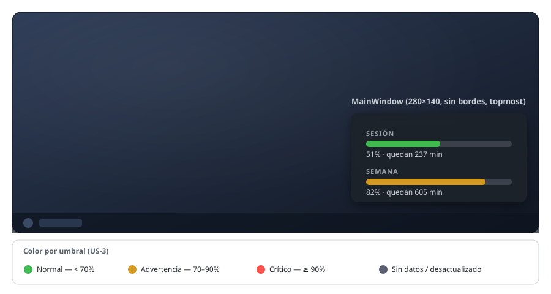
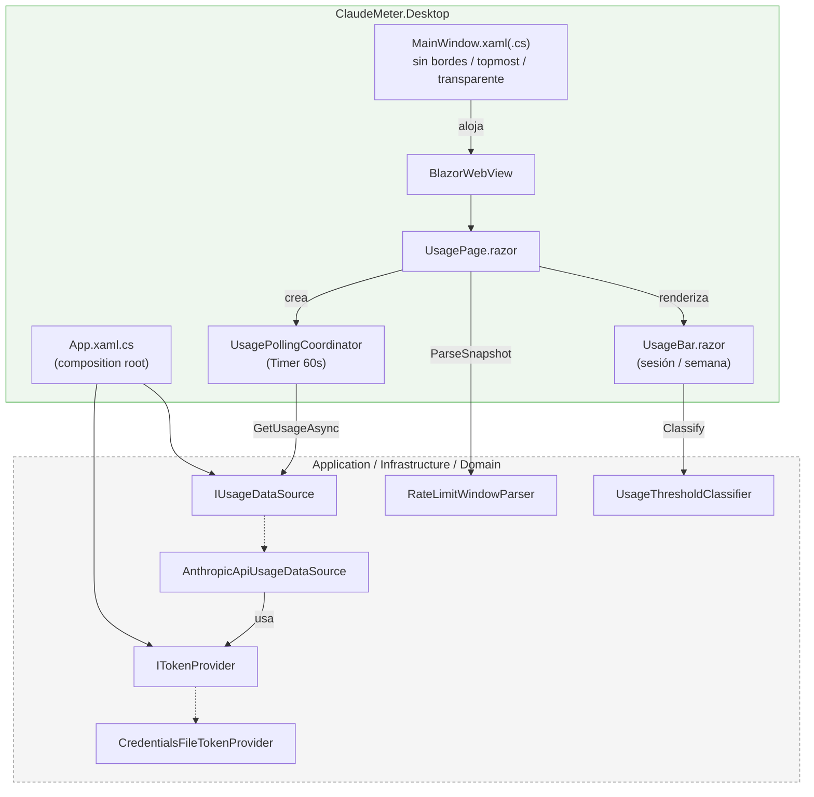

# ClaudeMeter .NET


Widget de escritorio (Blazor Hybrid: WPF + `BlazorWebView`) que muestra en tiempo real el consumo de cuota de Claude Code — sesión, semana, countdown hasta el reset — sin salir del escritorio.

> **Proyecto demo.** Además de ser un widget funcional, este repositorio sirve como caso de uso real del [SDLC Kit para Claude Code](https://github.com/AlejBlasco/claude-sdlc-kit): todo el desarrollo (análisis, diseño, implementación, documentación y testing) se lleva a través de sus comandos `/sdlc-*`.

## Vista previa



*Mockup ilustrativo (no una captura real) fiel a los colores y layout de `wwwroot/css/app.css`: ventana `280×140` sin bordes, siempre encima, anclada a la esquina inferior derecha con 16px de margen. Verde por debajo del 70%, ámbar entre 70-90%, rojo a partir del 90% — ver [`UsageThresholdClassifier`](./src/ClaudeMeter.Domain/Usage/UsageThreshold.cs).*

## Stack

WPF · BlazorWebView · MediatR · EF Core (SQLite, post-MVP) · xUnit / bUnit · Serilog

## Arquitectura

Clean Architecture de 4 capas, dependencia siempre hacia dentro (Desktop e Infrastructure dependen de Application; Application solo de Domain):

| Capa | Contenido |
|---|---|
| **Domain** | Núcleo puro sin dependencias externas: `UsageSnapshot`, `RateLimitWindow`, `MascotState`. |
| **Application** | Casos de uso vía MediatR + puertos pequeños: `ITokenProvider`, `IUsageDataSource`, `IUsageHistoryStore`. |
| **Infrastructure** | Adaptadores: `AnthropicApiUsageDataSource`, `CredentialsFileTokenProvider`, `SqliteUsageHistoryStore`, icono de bandeja. |
| **Desktop** | `MainWindow` WPF (sin bordes, topmost, transparente) + componentes Razor + composition root. |

Detalle completo de la arquitectura y del roadmap por fases (F0-F7) en [`CLAUDE.md`](./CLAUDE.md).



Diagrama completo (secuencia del ciclo de 60s, edge cases, cobertura de tests) en [`docs/sdlc/technical/f1-widget-visual-base.md`](./docs/sdlc/technical/f1-widget-visual-base.md).

## Estructura del repositorio

```
src/    código fuente (Domain, Application, Infrastructure, Desktop, Console)
test/   proyectos de test (xUnit, bUnit)
docs/   documentación generada por la pipeline SDLC
```

## Estado del proyecto

**F0 — validación por consola** (issues #1-#5, cerradas):

- Lectura del token OAuth desde `.credentials.json`.
- Llamada a la API de Anthropic con los headers OAuth correctos.
- Parseo de las cabeceras `anthropic-ratelimit-*` a `RateLimitWindow` — porcentaje consumido y minutos restantes.
- Bucle de consola que imprime sesión/semana cada 60s y sigue vivo ante errores de red o token inválido, sin caerse.

**F1 — primer widget visual** (issues [#6](https://github.com/AlejBlasco/claude-usage-widget/issues/6)-[#9](https://github.com/AlejBlasco/claude-usage-widget/issues/9), tratadas como un único ciclo SDLC):

- `MainWindow` WPF sin bordes, siempre encima y transparente fuera del `BlazorWebView`, anclada a la esquina inferior derecha.
- `UsagePage.razor` con dos barras de progreso (sesión/semana) reutilizando el mismo core de F0, sin reimplementar parseo ni llamada HTTP.
- Color por umbral verde/ámbar/rojo (`UsageThresholdClassifier`, función pura en `Domain`) — misma regla para ambas barras.
- Refresco automático cada 60s (`UsagePollingCoordinator`), con guard anti-solape y liberación limpia del timer al cerrar la ventana.
- 132 tests en la solución (31 nuevos en `ClaudeMeter.Desktop.Tests`, 16 en `ClaudeMeter.Domain.Tests`), 94-100% de cobertura en las clases de negocio nuevas.

Pendiente de validación manual (no automatizable por la pipeline SDLC, ver [`docs/sdlc/testing/f1-widget-visual-base.md`](./docs/sdlc/testing/f1-widget-visual-base.md)): comportamiento visual real de `MainWindow` en un equipo Windows, y estabilidad de memoria/handles en una ejecución prolongada (30-60 min).

Siguiente fase: **F2 — robustez** ([#10](https://github.com/AlejBlasco/claude-usage-widget/issues/10)-[#13](https://github.com/AlejBlasco/claude-usage-widget/issues/13)) — manejo de 401/403 con aviso claro, reintentos con backoff, logging estructurado (Serilog), `config.json` (intervalo/posición/chime) y arrastrar el widget con el ratón para reposicionarlo. El cierre directo desde el propio widget queda para F3 ([#17](https://github.com/AlejBlasco/claude-usage-widget/issues/17)), junto al icono de bandeja y el click-through. Roadmap completo por fases en [`CLAUDE.md`](./CLAUDE.md).

## Requisitos previos

- [.NET 8 SDK](https://dotnet.microsoft.com/download/dotnet/8.0).
- Windows, con Claude Code ya instalado y con sesión iniciada — el proyecto lee el token OAuth del mismo fichero que usa el CLI (`%USERPROFILE%\.claude\.credentials.json`). Sin ese fichero, el proyecto compila y testea igual, pero no hay datos reales que mostrar.

## Compilar y testear

```bash
dotnet build ClaudeMeter.sln
dotnet test ClaudeMeter.sln
```

## Ejecutar el widget (F1)

```bash
dotnet run --project src/ClaudeMeter.Desktop
```

Abre `MainWindow` sin bordes, siempre encima, anclada a la esquina inferior derecha del área de trabajo (ver [Vista previa](#vista-previa)). Con un `.credentials.json` válido, las barras de sesión/semana muestran porcentaje y color real, refrescándose solas cada 60s; sin token o con un 401/403, ambas barras muestran "No disponible" en vez de lanzar o dejar la ventana en blanco. No hay forma de cerrarla desde la propia ventana todavía — usa el Administrador de tareas hasta que llegue F3 (icono de bandeja + cierre directo desde el widget, [#17](https://github.com/AlejBlasco/claude-usage-widget/issues/17)).

## Probar la validación de F0 (consola)

`ClaudeMeter.Console` es el arnés de validación desechable de F0: confirma en texto plano que todo el pipeline (token → API → parseo → countdown) funciona de extremo a extremo, antes de construir cualquier UI. **No es parte del producto final** — F1 reutiliza el mismo core (`Application`/`Infrastructure`) directamente desde `ClaudeMeter.Desktop`, no desde este proyecto.

```bash
dotnet run --project src/ClaudeMeter.Console
```

Salida esperada, una línea nueva cada ~60 segundos:

```
[21:53:20] Sesión: 51% (237 min) | Semana: 48% (2347 min)
```

- Para detenerlo: `Ctrl+C` (F0 no tiene apagado controlado, es intencional).
- Si `.credentials.json` no existe/está corrupto, o el token es rechazado (401/403), se imprime un error claro en stderr y el bucle sigue con vida — nunca se cae ni intenta refrescar el token automáticamente.
- ⚠️ Cada iteración exitosa hace una llamada real a la API de Anthropic y consume cuota real de tu cuenta — no lo dejes corriendo indefinidamente sin necesidad.

---

## Configurar y usar con el SDLC Kit

Esta sección explica cómo instalar y configurar el [SDLC Kit](https://github.com/AlejBlasco/claude-sdlc-kit) —el conjunto de subagentes y comandos `/sdlc-*` de Claude Code— para trabajar en este proyecto, y cómo dejar operativo el MCP de GitHub que la pipeline usa para issues y milestones.

### 1. Descargar el SDLC Kit

```bash
git clone https://github.com/AlejBlasco/claude-sdlc-kit.git
```

Copia la carpeta `.claude/` del kit en la raíz de este repositorio (haciendo merge con la que ya existe aquí, sin sobrescribir ficheros que no vengan del kit):

```
claude-usage-widget/
├── .claude/
│   ├── sdlc.config.yaml
│   ├── agents/            business-analyst, software-architect, software-developer,
│   │                       technical-writer, qa-engineer, devops-engineer
│   ├── commands/           sdlc-analysis, sdlc-design, sdlc-development,
│   │                       sdlc-documentation, sdlc-testing, sdlc-implementation
│   └── skills/             skills específicas de cada agente
└── .github/
    └── ISSUE_TEMPLATE/      feature_request.md, bug_report.md
```

Reinicia/recarga Claude Code en este repo para que recoja los nuevos agentes y comandos.

### 2. Configurar el kit

La configuración vive en [`.claude/sdlc.config.yaml`](./.claude/sdlc.config.yaml). En este proyecto está fijada así:

| Clave | Valor | Significado |
|---|---|---|
| `xmlDocComments` | `es` | Idioma de los comentarios de documentación en código (XMLDoc) generados por el Software Developer. |
| `documentation` | `es` | Idioma de toda la documentación markdown generada por la pipeline. |
| `issueTemplates` | `en` | Idioma en el que están escritas las plantillas de `.github/ISSUE_TEMPLATE/` (no la lee ningún agente en tiempo de ejecución, solo documenta el idioma usado). |
| `testingCoverage` | `70` | Cobertura mínima de test que persigue el QA Engineer. |
| `paths.*` | `docs/sdlc/...`, `docs/functional` | Carpetas de salida de cada fase (requirements, design, development, technicalDocs, functionalDocs, testing, deployment). |

**Invariante duro**: ningún agente/comando del kit ejecuta nunca `git commit` ni `git push` — eso es siempre una acción manual del usuario.

### 3. Usar la pipeline

Cada comando acepta una ruta a un `.md` de la fase anterior (encadenando la pipeline), una URL a un work item (issue de GitHub, Azure DevOps, Jira...), o una descripción en texto libre:

```
/sdlc-analysis Los usuarios deben poder configurar el intervalo de polling
/sdlc-design docs/sdlc/requirements/polling-interval.md
/sdlc-development docs/sdlc/design/polling-interval.md
/sdlc-documentation docs/sdlc/development/polling-interval.md
/sdlc-testing docs/sdlc/development/polling-interval.md
```

Flujo natural: **análisis → diseño → desarrollo → (documentación y testing, en cualquier orden) → implementación**. `sdlc-implementation` prepara/revisa artefactos de despliegue (Compose, CI/CD, runbooks); nunca despliega nada él mismo.

### 4. Ficheros MCP del proyecto

[`.mcp.json`](./.mcp.json), en la raíz del repo, declara los servidores MCP a nivel de proyecto — se versiona en git, así que cualquiera que abra este repo con Claude Code hereda la misma configuración automáticamente. No debe contener secretos en claro: los valores sensibles se referencian como `${VARIABLE_DE_ENTORNO}` y Claude Code los resuelve desde el entorno al arrancar.

### 5. Configurar el MCP de GitHub (issues y milestones)

El kit usa el MCP oficial y remoto de GitHub para crear/gestionar issues y milestones desde la pipeline (p. ej. al cerrar preguntas abiertas de `sdlc-analysis`). Configuración actual en `.mcp.json`:

```json
{
  "mcpServers": {
    "github": {
      "type": "http",
      "url": "https://api.githubcopilot.com/mcp/",
      "headers": {
        "Authorization": "Bearer ${GITHUB_PERSONAL_ACCESS_TOKEN}",
        "X-MCP-Toolsets": "issues"
      }
    }
  }
}
```

El toolset está restringido a `issues` (que en el servidor de GitHub incluye también la gestión de milestones) — nada de pull requests, actions, etc. de momento.

**Para dejarlo operativo necesitas un token propio:**

1. Ve a [github.com/settings/personal-access-tokens/new](https://github.com/settings/personal-access-tokens/new).
2. **Resource owner**: tu usuario/organización. **Repository access**: "Only select repositories" → este repositorio.
3. **Permissions → Repository permissions → Issues**: `Read and write` (cubre issues y milestones). El resto en "No access"; `Metadata` queda en `Read-only` de forma obligatoria.
4. Genera el token (`github_pat_...`) y cópialo — solo se muestra una vez.
5. Guárdalo como variable de entorno de usuario, por ejemplo en PowerShell:
   ```powershell
   [System.Environment]::SetEnvironmentVariable("GITHUB_PERSONAL_ACCESS_TOKEN", "github_pat_...", "User")
   ```
6. Reinicia la terminal/Claude Code para que recoja la variable (las de nivel "User" no se propagan a procesos ya abiertos).

El token nunca se escribe en ningún fichero de este repositorio — solo vive en la variable de entorno de tu máquina.
