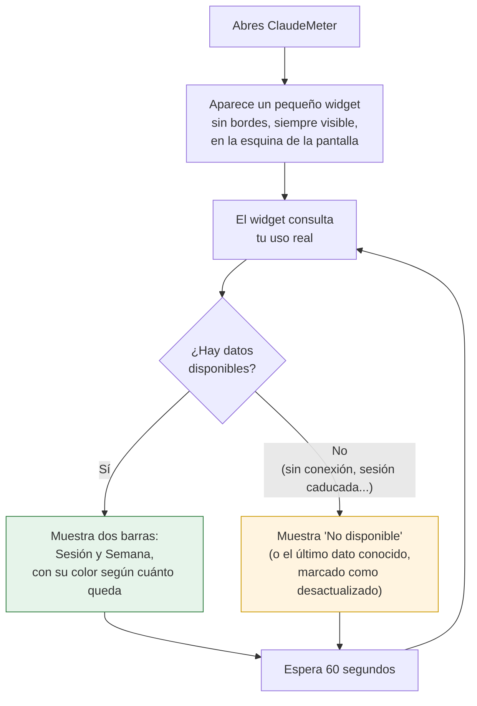

# F1 — Widget visual base — Documentación Funcional

## Qué hace esto

ClaudeMeter es un pequeño widget de escritorio para Windows que muestra, en
tiempo real, cuánto uso llevas consumido de tus límites de Claude Code (por
sesión y por semana). Hasta ahora, ese motor solo existía "por dentro": la
fase anterior del proyecto (F0) demostró que funcionaba, pero el resultado
se veía en una simple ventana de texto, sin ninguna interfaz visual.

Esta fase — **F1, "primer widget visual"** — es la que le pone cara al
proyecto. Reúne cuatro piezas de trabajo pequeñas y encadenadas que, juntas,
dan como resultado la primera versión visible y usable de ClaudeMeter:

- **Aparece como un widget de escritorio de verdad**, sin bordes ni barra de
  título, siempre visible por encima de las demás ventanas (como el reloj de
  un sistema o un widget de temperatura), y sin ocupar un hueco en la barra
  de tareas.
- **Muestra dos barras de progreso**, una para tu consumo de la sesión
  actual y otra para tu consumo de la semana, para que veas de un vistazo
  cuánta cuota te queda.
- **Cada barra cambia de color según lo cerca que estés del límite**: verde
  si vas holgado, ámbar si te estás acercando, rojo si estás a punto de
  agotar tu cuota — sin que tengas que leer ningún número para saberlo.
- **Se actualiza sola, cada 60 segundos**, sin que tengas que recargar ni
  tocar nada: el widget vuelve a consultar tu uso real y refresca las
  barras automáticamente mientras está abierto.

## Por qué importa

Esta fase transforma un motor invisible (F0) en algo que un usuario real
puede abrir, mirar de reojo mientras trabaja, y entender en un segundo sin
leer ni un número:

- **Información al instante, sin esfuerzo.** El color de cada barra basta
  para saber si puedes seguir trabajando tranquilo o si conviene frenar
  antes de quedarte sin cuota a mitad de una tarea importante.
- **Siempre a la vista, nunca en medio.** Al comportarse como un overlay de
  escritorio (sin bordes, siempre encima, sin ocupar la barra de tareas), el
  widget está disponible en todo momento sin competir por espacio ni por
  atención con las aplicaciones que realmente estás usando.
- **No hace falta hacer nada.** El refresco cada 60 segundos significa que
  la información que ves siempre está al día — no hay ningún botón de
  "actualizar" que se te pueda olvidar pulsar.
- **Se comporta con confianza incluso cuando algo falla.** Si en algún
  momento no se puede consultar tu uso (sin conexión, sesión caducada, un
  fallo puntual del servicio), el widget no se congela ni desaparece:
  muestra con claridad que no hay datos disponibles en ese momento (o, si ya
  tenía un dato válido anterior, lo mantiene visible marcado como
  "desactualizado") y sigue intentándolo automáticamente en el siguiente
  ciclo de 60 segundos.

Esta fase sienta la base visual sobre la que se construirán las siguientes
(tema claro/oscuro, icono en la bandeja del sistema, la "mascota" reactiva),
sin necesidad de volver a tocar el motor de consulta, que ya viene probado
de la fase anterior.

## Cómo funciona (perspectiva del usuario)

Desde que abres ClaudeMeter hasta que lo cierras, el ciclo que ves es
siempre el mismo, repitiéndose en segundo plano cada 60 segundos:

Los colores de las barras siguen siempre la misma regla, sin importar si es
la barra de sesión o la de semana:

| Color | Significa | Cuándo aparece |
|---|---|---|
| 🟢 Verde | Vas holgado | Menos del 70% de tu cuota consumida |
| 🟠 Ámbar | Empieza a acercarse el límite | Entre el 70% y el 90% consumido |
| 🔴 Rojo | Estás a punto de agotar la cuota | 90% o más consumido |
| ⚪ Sin color / "No disponible" | No hay un dato fiable ahora mismo | Falta el dato (p. ej. sesión caducada) |

## Qué puedes comprobar tú mismo

- El widget aparece **sin barra de título ni bordes**, se mantiene **siempre
  por encima** de otras ventanas, y no aparece en la barra de tareas.
- Las dos barras (**Sesión** y **Semana**) muestran un porcentaje y cambian
  de color siguiendo la tabla de arriba.
- Si dejas el widget abierto, el valor de las barras **cambia solo, cada
  minuto aproximadamente**, sin que tengas que hacer nada.
- Si en algún momento no hay conexión o tu sesión ha caducado, las barras lo
  indican con claridad ("No disponible" o un dato marcado como
  "desactualizado") — el widget nunca se congela ni se cierra por esto.
- Al cerrar el widget, deja de consumir recursos: no sigue haciendo
  comprobaciones en segundo plano una vez cerrado.

## Frequently Asked Questions

**¿Por qué el widget no tiene bordes ni barra de título?**
Es una decisión de diseño deliberada: se busca que se sienta como un
elemento del propio escritorio (parecido al reloj del sistema), no como una
ventana de aplicación normal que hay que gestionar, mover o cerrar como las
demás.

**¿Por qué la ventana no es completamente transparente?**
El área alrededor del contenido sí lo es. El contenido en sí (las barras y
sus etiquetas) se dibuja sobre un fondo oscuro intencional, por una
limitación técnica del motor que usa el widget para pintar ese contenido —
en la práctica, el resultado visual sigue siendo el de un pequeño panel
flotante sobre tu escritorio.

**¿Qué pasa si mi consumo cambia justo cuando el widget está a punto de
refrescar?**
Nada de lo que veas quedará mezclado: cada actualización sustituye por
completo a la anterior con el dato más reciente disponible en ese momento.
Si una actualización tarda más de lo normal, el widget espera a que termine
antes de lanzar la siguiente — nunca hay dos comprobaciones a la vez.

**¿Cuánto tarda en actualizarse el widget?**
Aproximadamente cada 60 segundos, de forma automática, mientras el widget
esté abierto. No hace falta recargar ni pulsar ningún botón.

**¿Qué pasa si cierro el widget?**
Deja de consultar tu uso inmediatamente: no quedan comprobaciones
programadas corriendo en segundo plano una vez cerrado.

**¿Esta fase ya incluye el icono en la bandeja del sistema, el tema oscuro o
la mascota animada?**
No. Esta fase entrega el primer widget visual funcional (ventana + barras +
colores + refresco automático). El icono de bandeja, el cambio de tema
claro/oscuro y la mascota reactiva llegan en una fase posterior del
proyecto, apoyándose en este mismo widget ya construido.

**¿Se ha comprobado que todo esto funciona correctamente?**
La lógica de qué mostrar en cada situación (porcentaje, color según umbral,
qué pasa si falta un dato, qué pasa tras varias actualizaciones seguidas) se
ha verificado con una batería amplia de pruebas automáticas, todas
superadas y muy por encima del mínimo exigido. Quedan pendientes dos
comprobaciones manuales finales, que solo pueden hacerse ejecutando la
aplicación real en un ordenador Windows: confirmar visualmente el aspecto
de la ventana (sin bordes, siempre encima, transparencia) y confirmar que,
tras dejar el widget varios minutos en marcha, no consume cada vez más
memoria ni recursos del sistema.
