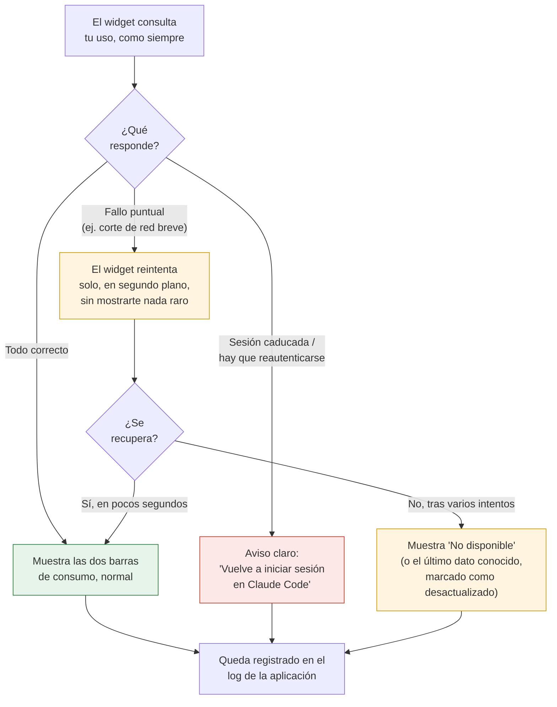

# F2 — Robustez, Ciclo A — Documentación Funcional

## Qué hace esto

La fase anterior (F1) le dio a ClaudeMeter su primera cara visible: un
widget de escritorio con dos barras de progreso que muestran cuánto uso
llevas consumido. Pero ese primer widget era, en el fondo, ingenuo: si tu
sesión caducaba, si la red fallaba un instante, o si algo iba mal en
segundo plano, no había forma de saber exactamente qué había pasado ni de
diagnosticarlo después.

Esta fase — **F2, "Robustez, Ciclo A"** — no añade funcionalidad visible
nueva sobre el consumo en sí, sino que hace que el widget que ya tienes se
comporte de forma fiable y comprensible cuando las cosas no salen a la
primera. Reúne tres mejoras pequeñas y encadenadas:

- **Un aviso claro cuando hay que volver a iniciar sesión.** Si tu token de
  acceso caduca o es rechazado, el widget ya no se queda mostrando datos
  viejos ni un simple "No disponible" ambiguo: muestra un mensaje explícito
  que te dice exactamente qué hacer.
- **Recuperación automática ante fallos de conexión puntuales.** Si hay un
  corte de red de un segundo o un problema momentáneo del servicio, el
  widget ya no muestra error inmediatamente: lo intenta de nuevo un par de
  veces antes de darse por vencido, sin que lo notes.
- **Un registro en disco de lo que va pasando.** El widget ahora deja un
  rastro (un fichero de texto en tu propio ordenador) de su actividad, para
  que se pueda diagnosticar un problema sin tener que reproducirlo en
  directo.

## Por qué importa

Estas tres mejoras resuelven, cada una, una situación concreta con la que un
usuario real se puede topar al dejar el widget abierto durante horas o días:

- **Ya no te confundes entre "sesión caducada" y "problema pasajero".**
  Antes, ambas situaciones se veían igual en el widget ("No disponible" o un
  dato "desactualizado"). Ahora, si el problema es que tienes que volver a
  autenticarte en Claude Code, el widget te lo dice con un mensaje distinto
  e inconfundible — no tienes que adivinar si el problema eres tú (sesión
  caducada) o algo temporal (la red).
- **El widget deja de "parpadear en rojo" por nada.** Un corte de red de
  medio segundo, algo muy habitual, ya no se traduce en un aviso de error
  inmediato que te haga dudar de si tu cuota está bien o mal. El widget
  reintenta discretamente antes de alarmarte, y solo muestra un problema
  real si el fallo persiste.
- **Cuando algo va mal, ahora hay algo que revisar.** Antes, si el widget
  fallaba de forma persistente, la única forma de investigar era volver a
  reproducir el problema mientras alguien miraba. Ahora queda un registro
  guardado en tu propio equipo, lo que hace mucho más fácil entender qué
  pasó, cuándo, y cuántas veces se reintentó antes de fallar.

En conjunto, estas tres mejoras hacen que ClaudeMeter se sienta como una
herramienta en la que se puede confiar dejándola abierta todo el día, en
lugar de un prototipo que hay que vigilar de cerca.

## Cómo funciona (perspectiva del usuario)

Lo que ves en el widget depende de qué tipo de problema (si lo hay) ocurre
al consultar tu uso. El widget distingue tres situaciones muy distintas y
reacciona de forma distinta a cada una:

Los tres caminos nunca se confunden entre sí: el aviso de "vuelve a iniciar
sesión" nunca aparece por un simple problema de red, y un problema de red
nunca se disfraza de "hay que reautenticarse".

## Qué puedes comprobar tú mismo

- Si tu sesión de Claude Code caduca (o si tu token deja de ser válido), el
  widget deja de mostrar las dos barras habituales y en su lugar muestra un
  mensaje claro invitándote a volver a iniciar sesión — no un simple "No
  disponible" ni un dato antiguo marcado como desactualizado.
- Ese mensaje aparece **incluso si el widget llevaba rato funcionando bien
  antes**: en cuanto detecta que hay que reautenticarse, sustituye lo que
  estaba mostrando por el aviso, sin mezclar ambas cosas.
- Ante un corte de conexión muy breve, el widget no muestra ningún error
  visible: sigue funcionando como si nada hubiera pasado, porque se
  recupera solo antes de que tengas ocasión de notarlo.
- Solo si el problema de conexión persiste más allá de unos pocos segundos,
  el widget muestra finalmente el aviso de "sin datos" (o el último dato
  conocido, marcado como desactualizado) — igual que ya hacía antes de esta
  fase, pero ahora dándole antes una oportunidad de recuperarse solo.
- En tu equipo, en la carpeta `%LOCALAPPDATA%\ClaudeMeter\logs`, aparece un
  fichero de registro con la actividad del widget (arranques, consultas de
  uso, avisos y errores), legible como texto plano, útil para diagnosticar
  un problema sin tener que reproducirlo en el momento.

## Frequently Asked Questions

**¿Qué diferencia hay entre "hay que reautenticarse" y "No disponible"?**
Son dos problemas completamente distintos y ahora se muestran de forma
distinta. "Hay que reautenticarse" significa que tu sesión en Claude Code ya
no es válida — solo tú, iniciando sesión de nuevo, lo puedes arreglar. "No
disponible" sigue reservado para otros problemas (por ejemplo, un fallo de
red que persiste más allá de los reintentos automáticos), donde no hace
falta que hagas nada: el widget seguirá intentándolo en el siguiente ciclo.

**¿El widget intenta arreglar la sesión caducada por mí?**
No, y es intencional: por seguridad, el widget nunca intenta renovar tu
sesión ni tu token de acceso por su cuenta. Solo te avisa con claridad de
que tienes que hacerlo tú mismo, volviendo a iniciar sesión en Claude Code.

**¿Cuántas veces reintenta el widget antes de rendirse?**
Ante un fallo puntual de conexión, lo intenta automáticamente un par de
veces más, con una pequeña espera creciente entre cada intento (unos
segundos en total). Si tras esos intentos sigue sin poder conectar, muestra
el aviso de "sin datos" como haría normalmente — nunca se queda reintentando
indefinidamente ni retrasa la siguiente actualización programada.

**¿Todos los fallos se reintentan igual?**
No. El widget distingue tres tipos de situación: un problema de conexión
pasajero (se reintenta solo), una sesión caducada (nunca se reintenta, se
avisa de inmediato porque reintentar no serviría de nada), y una respuesta
inesperada persistente del servicio (tampoco se reintenta, porque no es un
problema de conexión sino de contrato roto, y reintentar solo retrasaría
mostrarte el problema).

**¿Dónde puedo ver el registro de actividad y para qué sirve?**
Se guarda automáticamente en tu propio ordenador, en
`%LOCALAPPDATA%\ClaudeMeter\logs`, sin que tengas que hacer nada. No es algo
pensado para el uso diario normal, sino para el caso en que algo falle de
forma persistente y haga falta investigar qué ocurrió exactamente y cuándo.

**¿Esto cambia el aspecto o el funcionamiento normal del widget?**
No, cuando todo funciona bien no notarás ningún cambio: sigues viendo las
mismas dos barras de consumo, actualizándose cada 60 segundos, igual que en
la fase anterior. Los cambios de esta fase solo se notan cuando algo sale
mal — y precisamente por eso importan.

**¿Se ha comprobado que todo esto funciona correctamente?**
La lógica de cuándo mostrar cada aviso, cuándo reintentar y qué queda
registrado se ha verificado con una amplia batería de pruebas automáticas,
todas superadas y muy por encima del mínimo exigido. Quedan pendientes tres
comprobaciones finales que solo pueden hacerse ejecutando la aplicación real
en un ordenador Windows: provocar una sesión caducada de verdad y confirmar
que el aviso se ve bien, cortar la red unos segundos y confirmar que el
widget se recupera sin parpadeos, y revisar que el fichero de registro
aparece de verdad en el disco con contenido legible.
