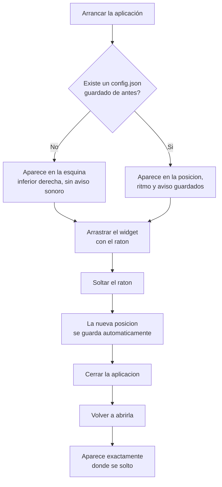

# F2 — Robustez, Ciclo B — Documentación Funcional

## Qué hace esto

Este ciclo añade dos mejoras al widget de escritorio de ClaudeMeter:

1. **Un fichero de configuración opcional (`config.json`)** que permite
   ajustar, sin tocar el código ni recompilar nada:
   - cada cuánto se actualiza el widget (por defecto, cada 60 segundos),
   - en qué posición de la pantalla aparece al arrancar,
   - si suena un aviso (chime) cuando el consumo de sesión o de semana entra
     en la zona roja (90% o más).
2. **Arrastrar el widget con el ratón** para moverlo a cualquier punto de la
   pantalla mientras está en uso, y que la aplicación recuerde esa posición
   la próxima vez que se abra.

## Por qué importa

Hasta ahora, el widget siempre aparecía en la misma esquina, con el mismo
ritmo de actualización, y sin ningún aviso sonoro cuando el consumo se
acercaba al límite. Cualquier ajuste exigía modificar el código y
recompilar la aplicación. Con este ciclo, la persona que usa el widget puede
adaptarlo a su propio flujo de trabajo (por ejemplo, moverlo a una esquina
que no le tape otra ventana, o pedir un aviso sonoro para no tener que
mirarlo constantemente) sin ningún conocimiento técnico.

## Cómo funciona (perspectiva de usuario)

- Si no existe ningún fichero de configuración, el widget se comporta como
  hasta ahora: aparece en la esquina inferior derecha, se actualiza cada
  minuto y no hace ningún ruido.
- Si el fichero de configuración existe pero tiene algún dato incorrecto o
  dañado, el widget no se rompe ni deja de arrancar: simplemente ignora esa
  parte y usa el valor por defecto correspondiente.
- Si la posición guardada ya no encaja en ningún monitor conectado (por
  ejemplo, se guardó con un segundo monitor que ahora está desconectado), el
  widget vuelve a aparecer en la esquina inferior derecha en vez de quedar
  fuera de la vista.
- Arrastrar el widget funciona simplemente con clic izquierdo mantenido +
  mover el ratón, desde cualquier punto visible del widget, y soltando donde
  se quiera dejarlo.

## Un problema real durante el desarrollo, ya resuelto

Durante las pruebas de esta funcionalidad en un ordenador real con Windows,
se descubrió que la primera versión del arrastre **no funcionaba en
absoluto**: el widget se quedaba completamente quieto al intentar moverlo, e
incluso dejaba de responder al ratón por completo. El motivo tenía que ver
con cómo el widget compone sus capas visuales para poder ser semitransparente
— un tipo de problema conocido y ya documentado en otros proyectos similares
que combinan una ventana de escritorio con contenido web incrustado. Se
corrigió durante la misma sesión, probando en vivo hasta confirmar que
funcionaba correctamente, y **ya está verificado de forma manual**: el
widget se puede arrastrar con normalidad y recuerda la posición al reiniciar
la aplicación. Este ajuste no cambia nada de lo que el usuario ve o hace —
solo hace que el arrastre, que ya se había pedido como parte de esta
funcionalidad, funcione de verdad.

## Frequently Asked Questions

**¿Tengo que crear el fichero de configuración a mano?**
No. Si no existe, el widget usa los valores actuales (posición por defecto,
actualización cada minuto, sin aviso sonoro). El fichero solo hace falta si
se quiere cambiar algo de ese comportamiento por defecto.

**¿Qué pasa si escribo algo mal en el fichero de configuración?**
Nada grave: el widget ignora únicamente la parte incorrecta y sigue
funcionando con el valor por defecto para esa parte concreta, sin dejar de
arrancar.

**¿Puedo mover el widget a cualquier parte de la pantalla, incluso a un
segundo monitor?**
Sí, mientras ese monitor siga conectado. Si luego se desconecta ese monitor,
el widget vuelve automáticamente a la esquina inferior derecha del monitor
principal en el siguiente arranque, en vez de quedar invisible fuera de la
pantalla.

**¿Se pierde la posición si arrastro el widget varias veces seguidas?**
No. Solo se guarda la posición final del último movimiento; no queda nunca
una posición "a medias" o mezclada entre dos arrastres.

**¿Qué pasa si el ordenador no puede guardar la nueva posición (por ejemplo,
por un problema de permisos o de espacio en disco)?**
El widget se queda en la nueva posición durante esa sesión (no se revierte el
movimiento), pero puede que no la recuerde la próxima vez que se abra. No
provoca ningún cierre inesperado de la aplicación.

**¿Cuándo suena el aviso (chime)?**
Solo si está activado en la configuración, y solo en el momento exacto en
que el consumo de sesión o de semana entra en la zona roja (90% o más). No
vuelve a sonar en cada actualización mientras se mantenga en rojo — solo si
baja de ese nivel y vuelve a subir.
