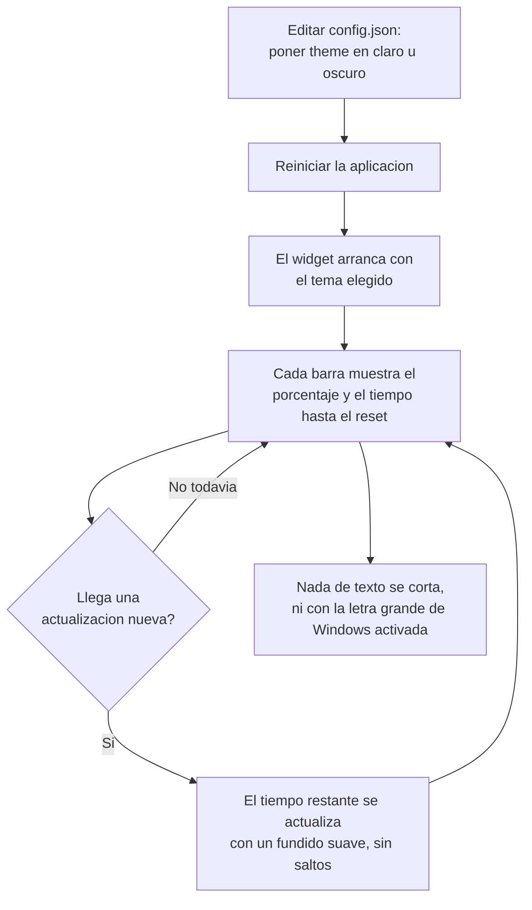

# F3 — UX + página Mascota, Ciclo A — Documentación Funcional

## Qué hace esto

Este ciclo añade dos mejoras visuales al widget de escritorio de
ClaudeMeter:

1. **Tema claro u oscuro.** El widget puede mostrarse con una paleta de
   colores oscura (la actual) o con una paleta clara nueva, a elección de
   quien lo usa.
2. **Countdown visible y animado.** Cada barra (sesión y semana) muestra
   ahora, además del porcentaje ya conocido, el tiempo que falta para que
   esa cuota se reinicie (por ejemplo, "Restablece en 4h 12m"). Cuando ese
   valor cambia en cada actualización, el número no salta bruscamente: se
   desliza y aparece con un pequeño fundido.

Durante el desarrollo de este ciclo también se encontró y corrigió un
problema real de recorte de texto (ver más abajo, "Un problema real durante
el desarrollo, ya resuelto").

## Por qué importa

Hasta ahora el widget solo existía en una paleta de colores oscura fija, sin
posibilidad de adaptarse al resto del escritorio de quien lo usa. Y aunque
el dato de "minutos hasta el reset" ya se calculaba internamente, nunca se
mostraba en ningún sitio — solo se veía el porcentaje de consumo, sin saber
cuánto había que esperar para que volviera a estar disponible.

Con este ciclo, el widget encaja visualmente con temas claros u oscuros del
sistema, y da una respuesta directa a la pregunta "¿cuánto me queda?" sin
necesidad de calcularlo a mano — con una animación suave que hace que cada
actualización se sienta viva en vez de un refresco brusco de pantalla.

## Cómo funciona (perspectiva de usuario)

- Si no se toca nada, el widget se comporta como hasta ahora: tema oscuro,
  igual que siempre.
- Para pasar a tema claro (o volver al oscuro), se edita el fichero de
  configuración del widget y se reinicia la aplicación — no existe todavía
  un botón dentro del propio widget para cambiarlo sobre la marcha (llegará
  más adelante, junto con el icono de bandeja del sistema).
- El tiempo restante hasta el reset aparece bajo cada barra, en un formato
  corto y fácil de leer (minutos, horas y minutos, o días y horas según lo
  que quede). Cuando cambia, la transición es suave, no un salto brusco de
  número a número.
- Cuando no hay ningún dato disponible todavía, no se muestra ningún
  countdown ni ninguna animación "fantasma" — se mantiene el aviso de "No
  disponible" ya existente.

## Un problema real durante el desarrollo, ya resuelto

Al añadir la nueva línea de tiempo restante, el contenido de cada barra
pasó a necesitar un poco más de espacio vertical del que tenía la ventana
del widget, que hasta ahora tenía un tamaño fijo. En un ordenador con la
opción de "Tamaño de texto" de Accesibilidad de Windows subida (una opción
para hacer el texto más grande en toda la pantalla), ese texto adicional se
recortaba visualmente y no se veía completo.

Se corrigió con un mecanismo nuevo: ahora el propio widget mide su
contenido real y ajusta la altura de su ventana automáticamente para que
nunca se recorte nada, creciendo hacia arriba desde el punto donde está
colocado (en vez de desplazar esa posición). Este ajuste ya está
implementado y **verificado a mano** ejecutando la aplicación real; no
cambia nada de lo que el usuario decide o configura — simplemente garantiza
que el texto siempre se vea completo, con cualquier tamaño de letra que
tenga configurado Windows.

## Frequently Asked Questions

**¿Cómo cambio entre tema claro y oscuro?**
Editando el fichero de configuración del widget (`config.json`) y
reiniciando la aplicación. Un selector dentro del propio widget llegará más
adelante, junto con el icono de bandeja del sistema.

**¿Qué pasa si escribo mal el valor del tema en el fichero de
configuración?**
Nada grave: el widget ignora el valor incorrecto y arranca con el tema
oscuro por defecto, sin dejar de funcionar.

**¿El countdown consume más batería o hace que el ordenador vaya más
lento?**
No debería — la animación se ha construido para tener un coste mínimo, igual
que el resto de animaciones ya existentes en el widget (por ejemplo, el
relleno de las barras de progreso).

**¿Qué pasa si todavía no hay ningún dato de consumo?**
No se muestra ningún countdown ni ninguna animación de un valor que no
existe — se mantiene el aviso de "No disponible" que ya existía.

**¿Puede el texto volver a cortarse en el futuro si se añade más
contenido?**
El mecanismo que corrigió el recorte no es específico de este ciclo: el
widget ajusta su altura automáticamente a cualquier contenido que se le
añada en el futuro, así que futuras pantallas del widget (como la próxima
"mascota" animada) se benefician del mismo ajuste automático sin trabajo
adicional.
