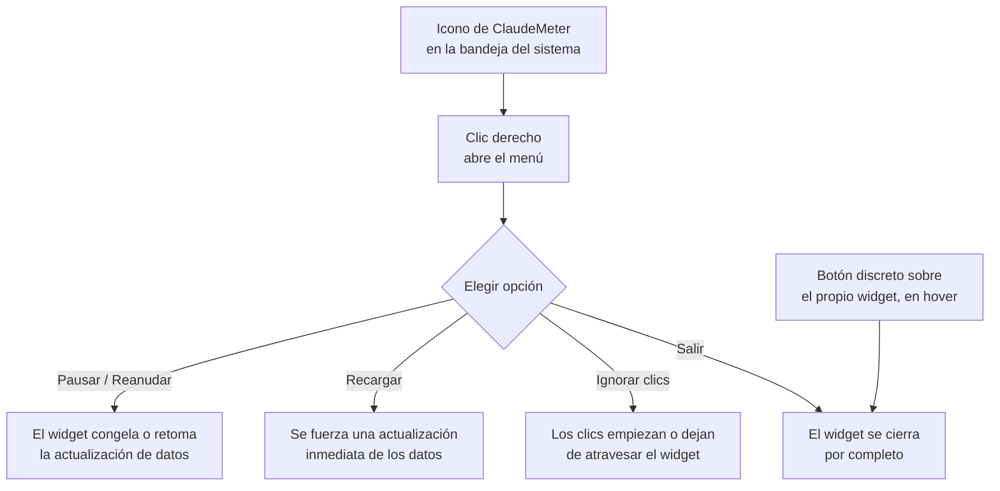

# F3 — UX + página Mascota, Ciclo B — Documentación Funcional

## Qué hace esto

Este ciclo añade dos formas nuevas de controlar el widget ClaudeMeter sin
depender del Administrador de tareas de Windows:

1. **Modo "Ignorar clics" (temporal):** el usuario puede hacer que el widget
   deje de reaccionar al ratón, de forma que los clics lo atraviesen y lleguen
   a la ventana que tiene debajo en el escritorio. El widget sigue visible y
   sigue actualizándose con normalidad — solo deja de "robar" el ratón.
2. **Icono en la bandeja del sistema**, con un menú que permite pausar y
   reanudar la actualización de datos, forzar una actualización inmediata,
   activar/desactivar el modo "Ignorar clics", y salir de la aplicación. Además,
   se añade un botón de cierre discreto directamente sobre el propio widget.

## Por qué importa

Hasta ahora, el widget siempre interceptaba el ratón sobre su área, lo que
podía estorbar si el usuario necesitaba interactuar con algo debajo de él en
esa misma zona de la pantalla. Y no existía ninguna forma normal de cerrarlo:
el único modo era matar el proceso desde el Administrador de tareas, algo
poco cómodo y poco descubrible para cualquier persona que no sea
desarrolladora. Con este ciclo, el usuario recupera control básico del
widget — pausarlo, refrescarlo, dejarlo "traslúcido" al ratón, o cerrarlo —
sin herramientas externas.

## Cómo funciona (perspectiva del usuario)

- **Al arrancar:** el widget se comporta exactamente igual que hasta ahora —
  interactivo, con el polling en marcha. Nada de lo nuevo empieza activado
  por defecto.
- **Pausar / Reanudar:** desde el menú de la bandeja, un único elemento hace
  de interruptor. Al pausar, el widget mantiene en pantalla el último dato
  conocido, marcándolo visualmente como "desactualizado" (el mismo aviso que
  ya existía para cuando hay un fallo de red pasajero); al reanudar, se
  actualiza de inmediato.
- **Recargar:** fuerza una actualización puntual sin esperar al siguiente
  ciclo automático, y sin afectar a si el widget está pausado o no.
- **Ignorar clics:** al activarlo, el usuario puede seguir viendo el widget
  actualizado, pero el ratón "pasa a través" de él como si no estuviera ahí.
  El propio menú de la bandeja muestra si está activado o desactivado. Para
  volver a interactuar con el widget (moverlo, cerrarlo) hay que desactivarlo
  primero desde ese mismo menú — mientras está activo, ningún gesto sobre el
  widget tiene efecto, así que "Salir" desde la bandeja es la única vía de
  cierre disponible en ese momento.
- **Cerrar:** hay dos caminos con el mismo resultado final — un botón
  discreto (visible solo al pasar el ratón por encima del widget) y la opción
  "Salir" del menú de la bandeja. Ambos cierran la aplicación por completo,
  sin dejar ningún proceso ni icono residual en la bandeja.

## Preguntas frecuentes

**¿El modo "Ignorar clics" y la pausa se recuerdan si reinicio el widget?**
No. Ambos son ajustes temporales de la sesión actual — cada vez que se
arranca el widget, empieza interactivo y con la actualización de datos
activa, igual que hoy.

**Si activo "Ignorar clics" y ya no puedo hacer clic en el widget, ¿cómo lo
recupero?**
Abriendo el menú de la bandeja (clic derecho sobre el icono) y volviendo a
seleccionar "Ignorar clics" para desactivarlo, o eligiendo directamente
"Salir" si lo que se quiere es cerrar el widget.

**¿Pausar detiene también las notificaciones sonoras (chime) del widget?**
Pausar detiene la actualización de datos; mientras está pausado no llegan
datos nuevos, así que tampoco se detectan nuevas transiciones que disparen
el aviso sonoro. Al reanudar, vuelve a funcionar con normalidad.

**¿Qué pasa si cierro el widget mientras "Ignorar clics" está activado?**
El botón de cierre sobre el propio widget no responderá (el ratón no llega a
él mientras el modo está activo), pero "Salir" desde el menú de la bandeja
siempre funciona, sin depender de ese modo.

**¿Puede quedar el icono "fantasma" en la bandeja después de cerrar?**
No debería: se libera explícitamente al cerrar por cualquiera de las dos
vías (botón directo o "Salir"), evitando el comportamiento típico de Windows
de dejar un icono visualmente residual hasta pasar el ratón por encima.
