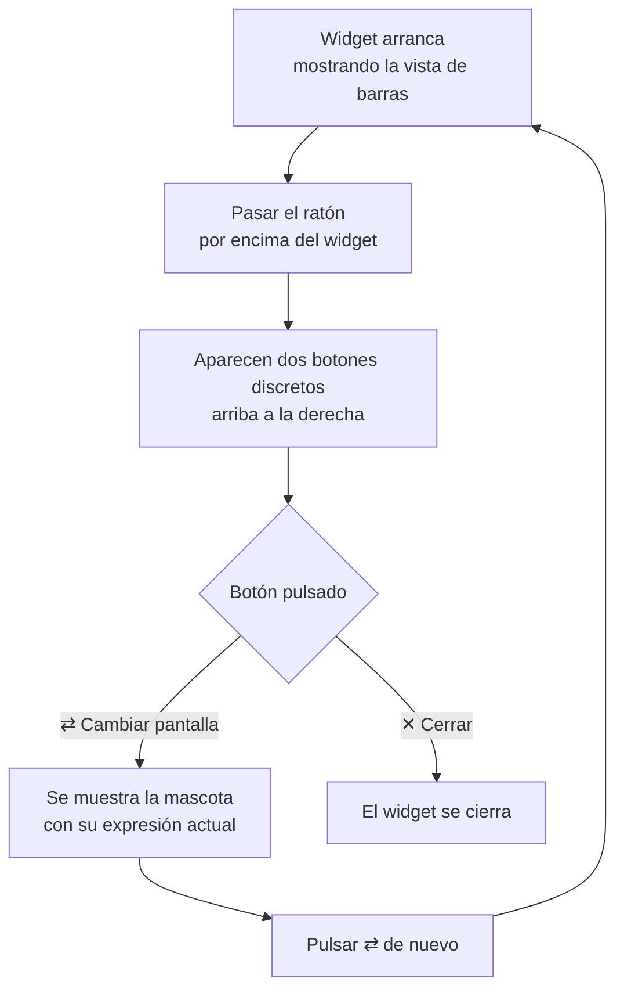

# F3 — UX + página Mascota, Ciclo C — Documentación Funcional

## Qué hace esto

Este ciclo cierra el bloque de mejoras de experiencia de usuario (F3) del
widget ClaudeMeter con dos novedades:

1. **Un botón para cambiar de pantalla (⇄):** el widget deja de mostrar
   únicamente las barras de consumo (Sesión/Semana). Ahora tiene una
   segunda pantalla, y un botón discreto permite alternar entre ambas.
2. **La mascota "Clawd":** una segunda forma de ver el consumo, mucho más
   visual que las barras — una carita con una expresión y una etiqueta de
   texto corta que reflejan de un vistazo si el consumo está tranquilo,
   empieza a preocupar, o está cerca del límite.

Además, se corrigieron dos detalles menores detectados al probar el widget
en un ordenador real, ya reflejados en el comportamiento actual: el botón
de cambio de pantalla no respondía al primer clic (ahora sí), y se movió de
la esquina superior izquierda a la derecha, junto al botón de cerrar.

## Por qué importa

Hasta ahora, el widget solo tenía una manera de mostrar el consumo: dos
barras de progreso con números. Es informativo, pero requiere leer y
entender esos números. La mascota da una alternativa de un solo vistazo,
sin necesidad de interpretar porcentajes — una carita tranquila, alerta, o
preocupada dice lo mismo de forma inmediata. Con el botón de cambio de
pantalla, el usuario elige qué vista prefiere en cada momento, sin que el
widget pierda de vista el dato que ya tenía mientras cambia de vista.

## Cómo funciona (perspectiva del usuario)

- **Vista inicial:** el widget siempre arranca mostrando las barras de
  Sesión/Semana, igual que hasta ahora. Nada cambia por defecto.
- **Cambiar de pantalla:** al pasar el ratón por encima del widget aparecen
  dos botones discretos en la esquina superior derecha — el de cerrar (✕) y,
  a su izquierda, el de cambiar de pantalla (⇄). Un clic en ⇄ alterna entre
  la vista de barras y la mascota, y otro clic vuelve a la anterior. El
  cambio es instantáneo: no se pierde el dato de consumo ya mostrado ni se
  reinicia la actualización periódica.
- **La mascota — qué significa cada expresión:**

  | Expresión | Qué significa |
  |---|---|
  | 😌 Todo tranquilo | El consumo (de sesión y de semana) está en un nivel bajo, sin motivo de atención. |
  | 😬 Cerca del aviso | Al menos una de las dos medidas (sesión o semana) ha entrado en la zona intermedia de aviso. |
  | 😱 Cerca del límite | Al menos una de las dos medidas está cerca de agotarse — se muestra este estado con independencia de cómo esté la otra medida, porque es la situación más urgente de las dos. |
  | 😶 Sin datos | Todavía no se ha podido obtener ningún dato de consumo, o se ha perdido el acceso (credencial caducada) — no se muestra "todo tranquilo" por error cuando en realidad no hay información real. |

- **Todo lo demás sigue igual:** el tema claro/oscuro, el conteo animado, la
  posibilidad de arrastrar el widget, el ajuste automático de tamaño, el
  modo "ignorar clics", el icono de la bandeja del sistema (pausar,
  reanudar, recargar, salir) y el cierre directo funcionan exactamente
  igual que en los ciclos anteriores, sin importar qué pantalla — barras o
  mascota — esté visible en ese momento.

## Preguntas frecuentes

**¿La mascota usa datos históricos o solo el consumo actual?**
Solo el consumo actual. La mascota refleja el último dato conocido en cada
momento, sin recordar el histórico de sesiones anteriores.

**Si cambio a la vista de mascota, ¿el widget deja de actualizarse?**
No. La actualización periódica sigue funcionando igual en ambas vistas;
cambiar de pantalla no la pausa ni la reinicia.

**¿Por qué a veces no veo el botón de cambiar de pantalla?**
Los dos botones (cambiar de pantalla y cerrar) solo aparecen al pasar el
ratón por encima del widget, para no ocupar espacio visual el resto del
tiempo. Si solo hay una vista disponible, el botón de cambio de pantalla
tampoco se muestra, porque no habría a qué cambiar.

**¿Por qué antes el botón de cambiar de pantalla no respondía al hacer
clic?**
Era un problema de coordinación interna entre dos mecanismos del widget que
tenían que decidir, en el mismo instante, si ese clic era "mover la
ventana" o "cambiar de pantalla" — hasta ahora "mover la ventana" ganaba
siempre esa carrera. Ya está corregido: el botón responde al primer clic.

**¿La mascota reemplaza a las barras de consumo, o conviven?**
Conviven. Son dos formas de ver el mismo dato — la que el usuario prefiera
en cada momento, alternando libremente entre ambas.
