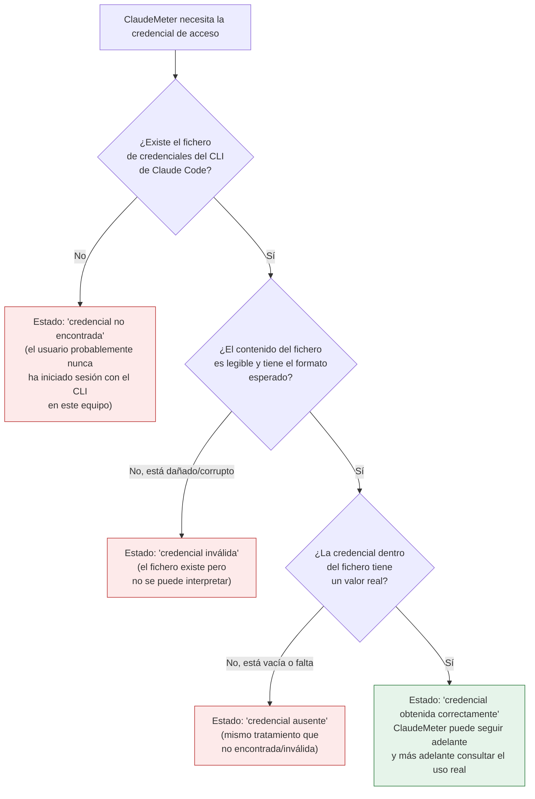

# [F0] Leer token desde .credentials.json — Documentación Funcional

## Qué hace esto

ClaudeMeter es un pequeño widget de escritorio para Windows que va a mostrar,
en tiempo real, cuánto uso llevas consumido de tus límites de Claude Code
(por sesión y por semana), con una cuenta atrás y una "mascota" visual que
reacciona a ese consumo.

Para poder mostrar esos datos, ClaudeMeter necesita antes identificarse ante
el servicio de Claude — es decir, necesita una credencial de acceso. Esta
pieza concreta se encarga de un único paso, muy anterior a todo lo visual:
**leer la credencial de acceso que la herramienta de línea de comandos de
Claude Code ya guardó en el ordenador** cuando el usuario inició sesión con
ella, para que ClaudeMeter pueda reutilizarla sin pedirle al usuario que
vuelva a iniciar sesión ni que introduzca nada manualmente.

El resto de la aplicación (la parte que llamará al servicio de Claude, la que
calculará los minutos restantes, la que pinta la pantalla) no necesita saber
dónde vive ese fichero de credenciales ni cómo está escrito por dentro — solo
recibe una respuesta clara: "aquí tienes la credencial" o "no se ha podido
obtener, y esta es la razón".

## Por qué importa

Sin una credencial de acceso, ClaudeMeter no puede hacer absolutamente nada
más: no puede consultar el uso, no puede calcular countdowns, no puede pintar
nada útil en pantalla. Es el primer eslabón de toda la cadena del proyecto
(fase "F0 — Núcleo de validación" del plan de trabajo), y todo lo que viene
después (el widget visual, las alertas de colores, la mascota animada)
depende de que este paso funcione de forma fiable.

Igual de importante es que este paso **nunca deje la aplicación en un estado
roto o con un mensaje de error críptico** cuando algo no está en su sitio: si
el usuario nunca ha usado la herramienta de línea de comandos de Claude Code
en ese ordenador, o si el fichero de credenciales se ha dañado por cualquier
motivo, la aplicación debe poder reconocerlo de forma clara y controlada, en
lugar de bloquearse o mostrar un fallo inesperado.

## Cómo funciona (perspectiva del usuario / de la aplicación)

Desde el punto de vista de quien usa la aplicación, hay cuatro situaciones
posibles cuando ClaudeMeter intenta obtener la credencial:

En cualquiera de los tres escenarios "no favorables" (credencial no
encontrada, credencial inválida, credencial ausente/vacía), la aplicación
recibe una respuesta clara y distinguible entre sí, en vez de bloquearse o
mostrar un fallo genérico. Esto significa que, en fases posteriores del
proyecto, el widget podrá mostrarle al usuario un aviso apropiado a cada
situación (por ejemplo, sugerirle que abra el CLI de Claude Code para
iniciar sesión si la credencial no se encuentra) en lugar de un mensaje de
error técnico sin sentido para él.

Un detalle importante para tranquilidad del usuario: en ningún caso, ni
siquiera cuando algo falla, la aplicación revela el contenido del fichero ni
el valor de la credencial en ningún mensaje — evita así exponer información
sensible incluso al diagnosticar un problema.

Esta pieza **no hace nada más**: no se conecta todavía al servicio de Claude,
no calcula cuánto uso queda ni pinta ninguna pantalla. Es, literalmente, el
primer paso de una cadena de pasos independientes; los siguientes (llamar al
servicio, calcular la cuenta atrás, mostrarlo en pantalla) se construyen en
fases posteriores del proyecto sobre esta base ya validada.

## Preguntas frecuentes

**¿Tengo que introducir mi usuario y contraseña en ClaudeMeter?**
No. ClaudeMeter reutiliza la sesión que ya existe porque el usuario inició
sesión previamente con la herramienta de línea de comandos de Claude Code.
No hay ninguna pantalla de login dentro de ClaudeMeter en esta fase.

**¿Qué pasa si nunca he usado el CLI de Claude Code en este ordenador?**
ClaudeMeter detecta que no existe ninguna credencial guardada y lo trata como
un estado explícito y controlado ("no encontrada"), sin bloquearse. La
recomendación en ese caso, cuando la interfaz visual esté disponible, será
iniciar sesión primero con el CLI de Claude Code.

**¿Y si el fichero de credenciales está dañado?**
También se reconoce como un estado explícito y distinguible ("inválida"). No
provoca un cierre inesperado de la aplicación.

**¿ClaudeMeter guarda o modifica mi credencial de alguna forma?**
No. Esta pieza únicamente lee la credencial que ya existe; no la modifica, no
la renueva y no la mueve de sitio. La renovación automática de credenciales
está deliberadamente fuera del alcance de esta fase y de las inmediatamente
siguientes: si la credencial deja de ser válida más adelante (expira o es
rechazada por el servicio), el plan del proyecto es avisar claramente al
usuario en vez de intentar renovarla por su cuenta.

**¿Esto ya hace que el widget muestre datos de uso?**
Todavía no. Esto es el cimiento necesario: una vez que ClaudeMeter puede
obtener la credencial de forma fiable, la siguiente fase del proyecto conecta
esa credencial con el servicio de Claude para consultar el uso real y
mostrarlo en el widget.
