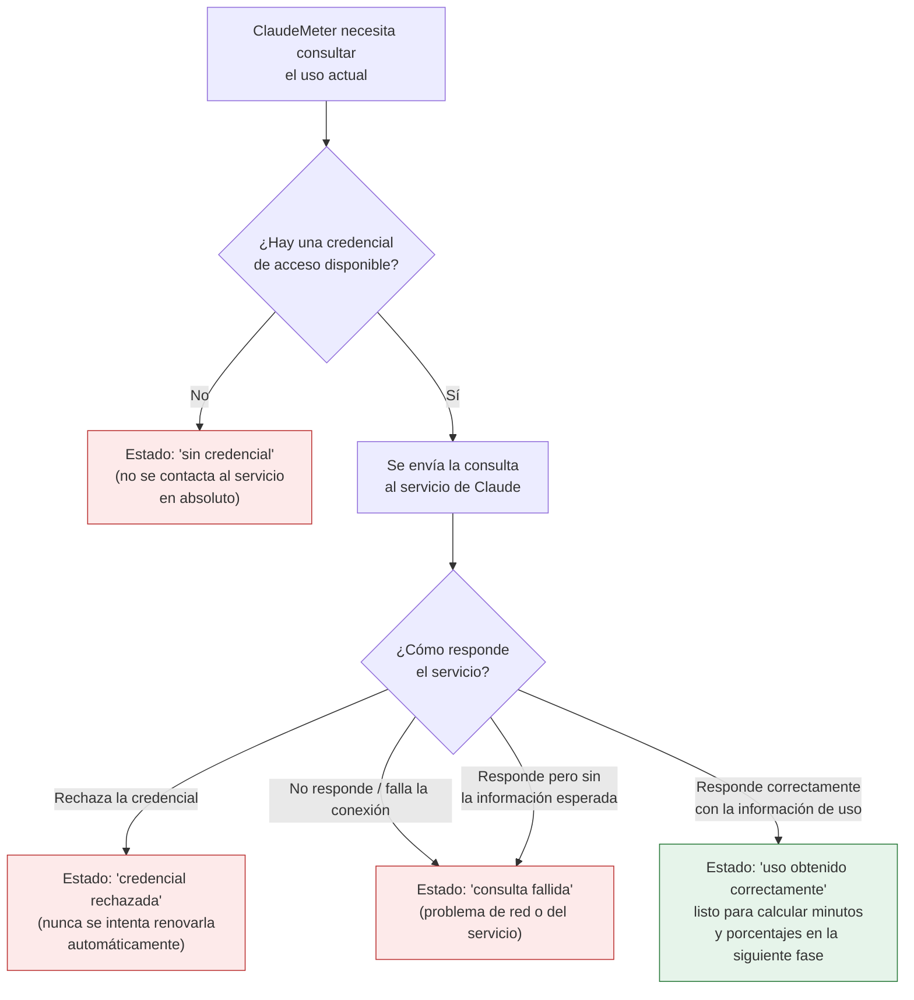

# [F0] Llamada HTTP con headers OAuth correctos — Documentación Funcional

## Qué hace esto

ClaudeMeter es un pequeño widget de escritorio para Windows que va a mostrar,
en tiempo real, cuánto uso llevas consumido de tus límites de Claude Code
(por sesión y por semana), con una cuenta atrás y una "mascota" visual que
reacciona a ese consumo.

En la pieza anterior, ClaudeMeter aprendió a leer la credencial de acceso ya
guardada en el ordenador. Esta pieza da el siguiente paso: **usar esa
credencial para preguntarle al servicio de Claude cuánto uso lleva
consumido la cuenta**, y traer de vuelta esa información en crudo, tal y
como la devuelve el servicio.

Es, literalmente, el momento en que ClaudeMeter "habla" por primera vez con
el servicio de Claude. Todavía no calcula minutos restantes ni porcentajes
legibles, ni pinta nada en pantalla — eso llega en la siguiente fase del
proyecto. Lo que sí garantiza es que esa conversación con el servicio se
haga correctamente y que cualquier problema (credencial rechazada, el
servicio no responde, un fallo de conexión) se reconozca de forma clara en
vez de romper la aplicación.

## Por qué importa

Sin esta pieza, ClaudeMeter podría tener la credencial en la mano pero
nunca llegaría a saber cuánto uso hay realmente consumido — se quedaría a
medio camino. Es el segundo eslabón de la fase "F0 — Núcleo de validación"
del plan de trabajo, y todo lo que viene después (las barras de progreso
con colores, la cuenta atrás, la mascota animada) depende de que esta
conversación con el servicio funcione de forma fiable.

También importa lo que **no** hace, de forma deliberada: si la credencial
es rechazada por el servicio, ClaudeMeter nunca intenta arreglarlo por su
cuenta ni pedir una nueva credencial en tu nombre — simplemente lo
reconoce y, en fases futuras, se lo mostrará al usuario con claridad para
que actúe él. Y cada consulta al servicio tiene un coste mínimo real (forma
parte de tu cuota de uso), así que esta pieza está pensada para consultar
de la forma más económica posible.

## Cómo funciona (perspectiva del usuario / de la aplicación)

Cada vez que ClaudeMeter necesita una foto actualizada del uso, sigue estos
pasos:

En cualquiera de los tres escenarios "no favorables" (sin credencial,
credencial rechazada, consulta fallida), la aplicación recibe una respuesta
clara y distinguible entre sí, igual que ocurría al leer la credencial. Esto
permitirá que, en fases posteriores, el widget muestre un aviso apropiado a
cada situación en lugar de un mensaje de error técnico sin sentido para el
usuario.

Detalles importantes para tranquilidad del usuario:

- Si no hay credencial disponible, **no se realiza ninguna consulta al
  servicio** — se evita gastar cuota de uso en una consulta que sabemos de
  antemano que fallaría.
- Si la credencial es rechazada, ClaudeMeter nunca intenta renovarla ni
  volver a iniciar sesión por su cuenta — eso queda siempre en manos del
  usuario, a través de la herramienta de línea de comandos de Claude Code.
- Cada consulta que sí llega a realizarse se hace de la forma más económica
  posible, para minimizar el impacto en la cuota real de uso del usuario.

Esta pieza **no hace nada más**: no calcula todavía minutos restantes ni
porcentajes, ni pinta ninguna pantalla. Es el segundo paso de una cadena de
pasos independientes; el cálculo de la cuenta atrás y la representación
visual se construyen en fases posteriores del proyecto sobre esta base ya
validada.

## Preguntas frecuentes

**¿ClaudeMeter consume mi cuota de uso solo por mostrarme el widget?**
Sí, en una cantidad mínima: cada vez que consulta el uso, esa propia
consulta cuenta como un uso muy pequeño del servicio. Está diseñada para
ser lo más económica posible, pero no es gratuita — es un coste conocido y
aceptado del propio diseño del servicio.

**¿Qué pasa si mi credencial deja de ser válida mientras uso ClaudeMeter?**
ClaudeMeter lo reconoce como un estado explícito ("credencial rechazada") y
nunca intenta renovarla por su cuenta. En fases futuras, se avisará al
usuario con claridad para que vuelva a iniciar sesión con la herramienta de
línea de comandos de Claude Code.

**¿Qué pasa si no tengo conexión a internet o el servicio de Claude está
caído?**
Se reconoce como "consulta fallida", un estado distinto al de credencial
rechazada, sin bloquear ni cerrar la aplicación.

**¿Esto ya me muestra cuánto uso llevo consumido?**
Todavía no de forma legible. Esta pieza obtiene la información en bruto
directamente del servicio; la siguiente fase del proyecto la traduce a
minutos restantes, porcentajes y colores (verde/ámbar/rojo) y la muestra en
el widget.

**¿Se ha podido comprobar esto ya con una cuenta real?**
La lógica está completamente probada de forma automática (39 pruebas
automáticas superadas, con una cobertura del 100% del código nuevo), pero
la comprobación final contra el servicio real de Claude con una cuenta
real queda pendiente de que el usuario la ejecute manualmente, ya que
requiere su propia credencial personal.
