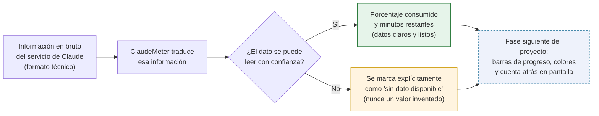

# [F0] Parsear headers anthropic-ratelimit-* a minutos/porcentaje — Documentación Funcional

## Qué hace esto

ClaudeMeter es un pequeño widget de escritorio para Windows que va a mostrar,
en tiempo real, cuánto uso llevas consumido de tus límites de Claude Code
(por sesión y por semana), con una cuenta atrás y una "mascota" visual que
reacciona a ese consumo.

En la pieza anterior, ClaudeMeter aprendió a "hablar" con el servicio de
Claude y traer de vuelta la información de uso, pero en bruto — tal y como la
entrega el servicio, en un formato técnico pensado para programas, no para
personas. Esta pieza da el siguiente paso: **traducir esa información en
bruto a dos datos claros y listos para mostrar — "cuánto porcentaje de tu
límite llevas consumido" y "cuántos minutos quedan hasta que se renueve"**.

Es, en esencia, el traductor entre "lo que dice el servicio" y "lo que un
usuario puede entender de un vistazo". Todavía no pinta nada en pantalla —
ninguna barra de progreso, ningún color, ningún número visible — eso llega en
la siguiente fase del proyecto (el primer widget visual). Lo que sí garantiza
esta pieza es que esa traducción sea siempre fiable: nunca inventa un dato
cuando no lo tiene, y nunca hace que la aplicación falle por un dato
inesperado o incompleto.

## Por qué importa

Sin esta pieza, ClaudeMeter tendría la información de uso en la mano pero no
podría convertirla en algo útil para el usuario: seguiría siendo un texto
técnico ilegible, no un porcentaje ni una cuenta atrás. Es el tercer y último
eslabón de la fase "F0 — Núcleo de validación" del plan de trabajo: con esta
pieza completa, ya existe toda la lógica necesaria para que la siguiente fase
(el primer widget visual, con sus barras de progreso en verde/ámbar/rojo y su
cuenta atrás) simplemente la muestre en pantalla, sin tener que calcular nada
por su cuenta.

También importa lo que esta pieza garantiza de forma explícita para evitar
confusiones o datos engañosos:

- Si un dato no se puede interpretar con confianza (por ejemplo, porque el
  servicio cambia ligeramente el formato en el futuro, o porque llega
  incompleto), ClaudeMeter nunca se inventa un valor de relleno como "0%" o
  "0 minutos" que pudiera hacer pensar al usuario que su límite está a cero
  cuando en realidad el dato simplemente no está disponible. Lo marca de
  forma explícita como "sin dato", para que el widget pueda avisarlo
  claramente en vez de mostrar algo engañoso.
- Si por algún motivo el tiempo restante calculado cae justo entre dos
  minutos (por ejemplo, "quedan 4 minutos y 10 segundos"), ClaudeMeter
  siempre redondea hacia arriba ("5 minutos") en vez de hacia abajo. Es una
  decisión deliberada de seguridad: es preferible que el usuario espere un
  poco más de lo estrictamente necesario a que crea que su límite ya se ha
  renovado cuando en realidad todavía no.
- Esta traducción nunca "rompe" la aplicación, pase lo que pase con el dato
  de entrada — ni con datos ausentes, ni con formatos inesperados, ni con
  valores fuera de rango.

## Cómo funciona (perspectiva del usuario / de la aplicación)

Cada vez que ClaudeMeter ya tiene la información en bruto del servicio (fruto
de la pieza anterior), la convierte en los dos datos legibles que la interfaz
necesitará mostrar:

Esta traducción se hace por separado para cada uno de los dos límites que
ClaudeMeter vigila (el de la sesión actual, de 5 horas, y el semanal, de 7
días): un problema al leer el dato de uno de los dos nunca afecta al otro. Por
ejemplo, si el límite semanal llegara con un dato incompleto pero el de la
sesión actual está perfectamente disponible, el usuario seguiría viendo la
información de su sesión con total normalidad.

Detalles importantes para tranquilidad del usuario:

- Si el servicio no ha podido consultarse en absoluto (por falta de
  credencial, por un rechazo del servicio, o por un fallo de conexión — los
  casos ya cubiertos por la pieza anterior), esta traducción tampoco falla:
  simplemente reconoce que no hay ningún dato que traducir para ninguno de
  los dos límites.
- El porcentaje de uso mostrado siempre proviene de un único dato de origen
  fiable, nunca de una mezcla de dos datos que podrían no coincidir entre sí
  — evitando así cualquier ambigüedad sobre qué número es "el correcto".
- Todo este cálculo es instantáneo y ocurre en el propio ordenador del
  usuario: no supone ninguna consulta adicional al servicio de Claude, por lo
  que no tiene ningún coste extra en la cuota de uso.

## Frequently Asked Questions

**¿Esto ya me muestra el porcentaje y los minutos en el widget?**
Todavía no de forma visible. Esta pieza calcula esos dos datos internamente y
los deja listos; la siguiente fase del proyecto (el primer widget visual) es
la que los pinta en pantalla con barras de progreso, colores y una cuenta
atrás animada.

**¿Qué pasa si el servicio de Claude cambia el formato de esta información en
el futuro?**
ClaudeMeter no fallará ni mostrará un dato incorrecto: si un dato deja de
poder interpretarse con el formato esperado, se marca como "sin dato
disponible" en vez de mostrar un número inventado o erróneo. Eso sí,
significaría que ese dato en concreto dejaría de calcularse hasta que se
actualice ClaudeMeter para reconocer el nuevo formato.

**¿Por qué a veces podría faltar el porcentaje o los minutos restantes?**
Puede ocurrir si el servicio no ha podido consultarse en absoluto (por
ejemplo, sin conexión), o si el dato recibido no tiene un formato que
ClaudeMeter pueda interpretar con total confianza. En cualquiera de los dos
casos, ClaudeMeter prefiere decir claramente "no lo sé" antes que arriesgarse
a mostrar un número que podría ser incorrecto.

**¿Por qué a veces la cuenta atrás podría redondear hacia arriba?**
Es una decisión deliberada: si quedan, por ejemplo, 4 minutos y 10 segundos,
ClaudeMeter mostrará "5 minutos" en vez de "4". Es preferible esperar unos
segundos de más a creer que el límite ya se ha renovado cuando todavía no lo
ha hecho.

**¿Esto consume cuota de uso adicional de mi cuenta?**
No. Esta pieza solo traduce información que ya se obtuvo previamente del
servicio — no realiza ninguna consulta nueva ni adicional.

**¿Se ha comprobado que esto funciona correctamente?**
Sí, mediante una batería amplia de pruebas automáticas que cubren tanto los
casos normales (porcentajes válidos, cuentas atrás correctas) como los casos
límite (datos ausentes, formatos inesperados, valores fuera de rango) — todas
superadas antes de dar por completada esta pieza.
