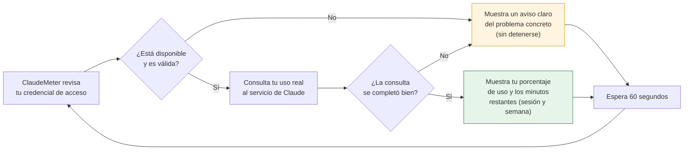

# [F0] Bucle de polling con salida por consola cada 60s — Documentación Funcional

## Qué hace esto

ClaudeMeter es un pequeño widget de escritorio para Windows que muestra, en
tiempo real, cuánto uso llevas consumido de tus límites de Claude Code (por
sesión y por semana), con una cuenta atrás y una "mascota" visual que
reacciona a ese consumo.

Hasta ahora, cada pieza construida (leer la credencial, hablar con el
servicio de Claude, traducir la respuesta a un porcentaje y unos minutos)
se había probado por separado, como piezas sueltas de un mecanismo. Esta
pieza es la que **las conecta todas por primera vez, de principio a fin, y
las deja funcionando solas de forma continua**: cada 60 segundos, sin
intervención de nadie, ClaudeMeter lee tu credencial, consulta tu uso real y
muestra el resultado.

No hay todavía ninguna ventana, ninguna barra de progreso ni ningún color —
esta pieza solo escribe el resultado en una ventana de texto sencilla
(una consola). Esa parte visual llega en la siguiente fase del proyecto. Lo
que esta pieza demuestra es que **el motor entero funciona de verdad, con
datos reales**, antes de invertir tiempo en construir la interfaz visual
encima de él.

## Por qué importa

Esta es la última pieza de la fase "F0 — Núcleo de validación": el
fundamento invisible sobre el que se construirá todo lo demás. Con esta
pieza completa, queda demostrado que:

- ClaudeMeter puede leer tu credencial de Claude Code correctamente.
- Puede consultar tu uso real al servicio de Claude.
- Puede traducir esa respuesta en un porcentaje y una cuenta atrás
  comprensibles.
- Puede repetir todo este proceso de forma indefinida, cada minuto, sin
  detenerse ni necesitar que nadie lo reinicie.

Validar esto ahora, con una simple ventana de texto, es mucho más rápido y
seguro que descubrir un problema del "motor" después de haber construido
toda la interfaz visual encima. A partir de aquí, la siguiente fase del
proyecto (el primer widget visual, con barras de progreso en verde, ámbar o
rojo) puede apoyarse con confianza en este mismo motor, ya probado, sin tener
que volver a validar que la parte invisible funciona.

**La garantía más importante que aporta esta pieza es la resistencia a
fallos.** Un widget que se cierra o se congela ante el primer problema no
sirve de nada. Esta pieza demuestra que, pase lo que pase, ClaudeMeter sigue
funcionando:

- Si no hay conexión a internet, o el servicio de Claude tarda demasiado en
  responder, o falla temporalmente: se muestra un aviso claro de que algo no
  funcionó en ese momento concreto, y ClaudeMeter lo vuelve a intentar
  automáticamente al minuto siguiente — nunca se detiene ni se cierra.
- Si tu credencial de acceso ha caducado o ya no es válida: se muestra un
  aviso claro indicando exactamente eso, sin que ClaudeMeter intente arreglarlo
  por su cuenta iniciando sesión de nuevo en tu nombre (algo que, por
  seguridad, esta aplicación nunca hace). El aviso te indica que debes
  renovar la credencial tú mismo.
- Si el archivo de credenciales no existe o no se puede leer: igual que en
  los casos anteriores, se muestra un aviso claro y ClaudeMeter sigue
  funcionando con normalidad, listo para mostrar tu uso en cuanto la
  credencial vuelva a estar disponible.

En ningún caso un problema puntual hace que ClaudeMeter deje de funcionar.

## Cómo funciona (perspectiva del usuario)

Cada 60 segundos, mientras ClaudeMeter está en marcha, ocurre siempre el
mismo ciclo:

En la práctica, esto significa que si dejas ClaudeMeter corriendo, verás una
línea de información nueva aproximadamente cada minuto, de forma indefinida,
sin tener que reiniciar nada tú mismo. Solo se detiene si tú lo cierras
manualmente — todavía no existe un botón de pausa ni un icono en la bandeja
del sistema; eso llega también en una fase posterior del proyecto.

## Frequently Asked Questions

**¿Ya puedo ver el widget visual con barras y colores?**
Todavía no. Esta pieza demuestra que el motor interno funciona de principio a
fin, mostrando el resultado en una simple ventana de texto. La interfaz
visual (la ventana del widget, sus barras de progreso, los colores de
aviso) es la siguiente fase del proyecto, y se construirá encima de este
mismo motor ya probado.

**¿Qué pasa si se corta mi conexión a internet mientras ClaudeMeter está
funcionando?**
Verás un aviso claro indicando que no se pudo consultar el servicio en ese
momento. ClaudeMeter no se cierra ni se congela: en el siguiente ciclo
(un minuto después) lo vuelve a intentar automáticamente, y en cuanto la
conexión se recupere, volverá a mostrar tu uso con normalidad.

**¿Qué pasa si mi sesión de Claude Code caduca?**
ClaudeMeter te lo indicará con un mensaje claro y distinto de los demás
errores, dejando explícito que no intentará iniciar sesión de nuevo por su
cuenta — por seguridad, esa acción siempre debe hacerla la persona usuaria.
El resto del programa sigue funcionando con normalidad; en cuanto renueves
tu sesión, la siguiente comprobación volverá a mostrar tu uso correctamente.

**¿Se detiene ClaudeMeter si ocurre un error inesperado?**
No. Cualquier problema, incluso uno no previsto de antemano, se muestra como
un aviso y el programa continúa funcionando en el siguiente ciclo. Esta
resistencia a fallos es precisamente lo que esta pieza demuestra de forma
explícita.

**¿Esto consume cuota de mi cuenta de Claude?**
Sí, cada consulta exitosa realizada cada 60 segundos consume una cantidad
muy pequeña de la cuota de tu cuenta — es el coste inevitable de comprobar tu
uso en tiempo real. Es un coste ya asumido y aceptado como parte del
funcionamiento normal de ClaudeMeter.

**¿Se ha comprobado que esto funciona correctamente?**
La lógica de decisión (qué mostrar en cada situación: éxito, sin conexión,
credencial caducada, error inesperado) se ha verificado con una batería
amplia de pruebas automáticas, todas superadas. Queda pendiente, además, una
comprobación manual final con una cuenta real, dejando ClaudeMeter en marcha
unos minutos para confirmar visualmente que todo el ciclo se comporta como
se espera con datos reales.

**¿Qué significa que esta fase "cierra F0"?**
El proyecto se construye por fases. La primera fase (F0) consistía en
validar, sin ninguna interfaz visual todavía, que todo el "motor" interno
funciona de verdad de principio a fin. Con esta pieza, esa fase queda
completa: a partir de aquí, el trabajo se centra en construir la ventana y
los elementos visuales del widget (fase F1), apoyándose en este mismo motor
ya demostrado y sin tener que volver a validarlo desde cero.
