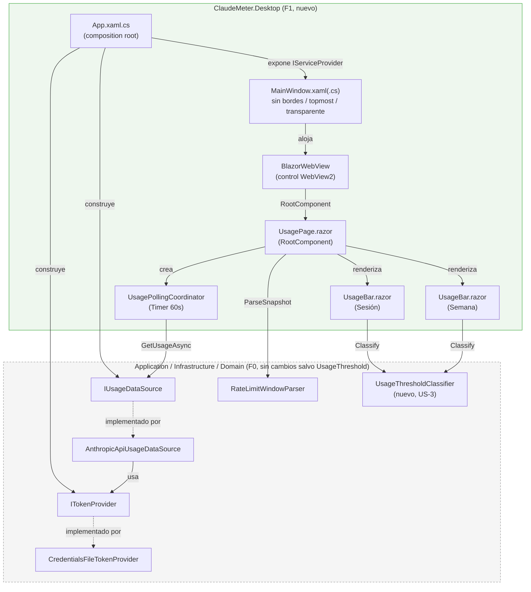
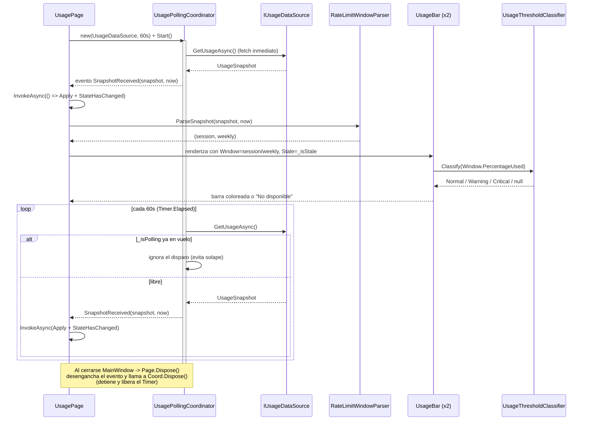

# F1 — Widget visual base — Documentación Técnica

## Overview

**F1 — Widget visual base** agrupa las issues de GitHub **#6, #7, #8 y #9**
(US-1..US-4), tratadas como un único ciclo SDLC según decisión del usuario.
Convierte `ClaudeMeter.Desktop` de scaffolding WPF puro a la primera versión
visual real del widget: una ventana sin bordes, siempre encima y con fondo
transparente fuera del contenido Razor, que aloja un `BlazorWebView` con dos
barras de progreso (sesión y semana) coloreadas por umbral y refrescadas
automáticamente cada 60 segundos.

F1 **no toca** `ClaudeMeter.Application` ni `ClaudeMeter.Infrastructure`:
reutiliza tal cual el núcleo ya validado en F0 (`ITokenProvider` →
`IUsageDataSource` → `RateLimitWindowParser`). El único cambio fuera de
`ClaudeMeter.Desktop` es un tipo nuevo en `ClaudeMeter.Domain`
(`UsageThreshold`/`UsageThresholdClassifier`, US-3), lógica pura sin
dependencias, igual de "limpia" que `RateLimitWindowParser`.

Referencias fuente de este documento:
`docs/sdlc/requirements/f1-widget-visual-base.md`,
`docs/sdlc/design/f1-widget-visual-base.md`,
`docs/sdlc/development/f1-widget-visual-base.md`,
`docs/sdlc/testing/f1-widget-visual-base.md`, y el código real bajo
`src/ClaudeMeter.Domain/Usage/UsageThreshold.cs` y `src/ClaudeMeter.Desktop/`.

## Architecture

Piezas nuevas de F1 (de fuera hacia dentro) y cómo encajan con los puertos ya
existentes de Application/Infrastructure (F0, sin cambios):

| Pieza | Capa | Issue/US | Responsabilidad |
|---|---|---|---|
| `App.xaml.cs` | Desktop | US-1 (#6) | Composition root: construye `HttpClient`, `ITokenProvider`, `IUsageDataSource` y `AddWpfBlazorWebView()` a mano (sin contenedor de terceros) |
| `MainWindow.xaml(.cs)` | Desktop | US-1 (#6) | Ventana sin bordes/topmost/transparente, aloja el `BlazorWebView` cuyo `RootComponent` es `UsagePage` |
| `Pages/UsagePage.razor` | Desktop | US-2/US-4 (#7, #9) | Componente raíz: crea su propio `UsagePollingCoordinator`, aplica cada `UsageSnapshot` con `RateLimitWindowParser`, renderiza dos `UsageBar` |
| `Pages/UsageBar.razor` | Desktop | US-2/US-3 (#7, #8) | Componente hijo reutilizado para sesión/semana: barra + etiqueta + color, única fuente de la regla de umbral |
| `Polling/UsagePollingCoordinator.cs` | Desktop | US-4 (#9) | Clase C# plana (sin Blazor/WPF) que envuelve un `System.Timers.Timer` de 60s sobre `IUsageDataSource.GetUsageAsync` |
| `Domain.Usage.UsageThreshold` / `UsageThresholdClassifier` | Domain | US-3 (#8) | Función pura que clasifica `PercentageUsed` en `Normal`/`Warning`/`Critical`/`null` |



Puntos clave:

- `UsagePollingCoordinator` se crea **una instancia nueva por cada
  `UsagePage`**, nunca como singleton de DI, para que su ciclo de vida quede
  atado 1:1 al del componente (evita fugas al cerrar `MainWindow`).
- `UsageBar` es la **única fuente** de la regla de umbral: tanto la barra de
  sesión como la de semana llaman a `UsageThresholdClassifier.Classify`, sin
  lógica duplicada (AC de US-3).
- `UsageThreshold`/`UsageThresholdClassifier` viven deliberadamente en
  `ClaudeMeter.Domain.Usage`, no en Desktop: es lógica pura sin dependencia
  de UI, y `CLAUDE.md` ya prevé que F3 (`MascotState`) reutilizará la misma
  regla de umbral sin duplicarla.
- El `.csproj` de `ClaudeMeter.Desktop` migró de `Sdk="Microsoft.NET.Sdk"` a
  `Sdk="Microsoft.NET.Sdk.Razor"`, con `<RootNamespace>ClaudeMeter.Desktop</RootNamespace>`
  explícito (necesario para que el SDK de Razor infiera correctamente el
  namespace `ClaudeMeter.Desktop.Pages` de los `.razor` en `Pages/`) y
  `<PackageReference Include="Microsoft.AspNetCore.Components.WebView.Wpf" Version="8.0.100" />`.

### Colisión de nombres `ClaudeMeter.Application` vs. `System.Windows.Application`

Todo el composition-root code de Desktop sigue la misma norma defensiva:
`App` se declara como `App : System.Windows.Application` (nunca solo
`Application`), ningún fichero de Desktop añade `using ClaudeMeter.Application;`
a secas (solo el namespace hijo `ClaudeMeter.Application.Abstractions`, que no
trae el identificador `Application` al alcance), y toda referencia a la
aplicación activa se escribe cualificada como
`System.Windows.Application.Current` (usado en `MainWindow.xaml.cs`). Por el
mismo motivo, `UsagePollingCoordinator.cs` usa `System.Timers.Timer`
completamente cualificado, sin `using System.Timers;`, para no reabrir una
ambigüedad futura con `System.Threading.Timer`.

## Key Components

### `App.xaml.cs` — composition root (US-1)

`OnStartup` construye a mano, sin contenedor de terceros (mismo estilo que
`ClaudeMeter.ConsoleApp.Program` de F0), un `HttpClient` compartido y un
`IServiceCollection` con `AddWpfBlazorWebView()` + `ITokenProvider`
(`CredentialsFileTokenProvider`) + `IUsageDataSource`
(`AnthropicApiUsageDataSource`) como singletons, expuestos vía
`IServiceProvider Services`. `OnExit` libera el `HttpClient`. No hay MediatR
en F1 (ver rationale en Design): `IUsageDataSource.GetUsageAsync` es un paso
directo sin orquestación adicional que lo justifique todavía.

### `MainWindow.xaml(.cs)` (US-1)

`WindowStyle="None"` + `AllowsTransparency="True"` + `Background="Transparent"`
+ `Topmost="True"` + `ResizeMode="NoResize"` + `ShowInTaskbar="False"`,
tamaño fijo `280×140`. `MainWindow.xaml.cs` asigna
`BlazorWebViewHost.Services` desde `((App)System.Windows.Application.Current).Services`
y posiciona la ventana en la esquina inferior derecha del área de trabajo
(`SystemParameters.WorkArea`) con un margen de 16px. Aloja un único
`BlazorWebView` cuyo `RootComponent` es `Pages.UsagePage` sobre el selector
`#app`.

**Limitación de "airspace" (heredada, aceptada):** `BlazorWebView` aloja un
control nativo (WebView2), que pinta su propio rectángulo de forma opaca
salvo que el host llame a una API nativa adicional
(`CoreWebView2Controller.DefaultBackgroundColor` con alfa 0), fuera de
alcance de F1. Por eso `wwwroot/css/app.css` fija un fondo oscuro opaco
intencional (`#20232aee`) **dentro** del `BlazorWebView`; la transparencia
real de `AllowsTransparency` solo se aprecia **alrededor** del control, tal
como exige el AC ("fondo transparente fuera del contenido Razor").

### `Polling/UsagePollingCoordinator.cs` (US-4)

Clase `sealed`, `IDisposable`, sin ninguna dependencia de Blazor ni WPF —
reutilizable sin cambios por `MascotPage.razor` en F3. Envuelve un
`System.Timers.Timer(interval)` con `AutoReset = true`:

- `Start()` dispara un primer fetch inmediato (`_ = PollAsync()`) y arranca
  el timer para los siguientes ciclos.
- `PollAsync()` tiene un guard `_isPolling` (bandera `volatile`) que ignora
  un segundo disparo mientras el anterior sigue en vuelo — garantiza que
  nunca se solapan dos llamadas HTTP en paralelo, ni se mezclan dos
  `UsageSnapshot` (AC de US-4).
- Cualquier excepción de `IUsageDataSource.GetUsageAsync` (distinta de
  `OperationCanceledException`) se traga como red de seguridad última: no se
  levanta el evento `SnapshotReceived` y el timer sigue vivo para el
  siguiente ciclo — ninguna capa inferior debería lanzar para los casos
  esperados (`UsageSnapshot` ya modela "sin datos" sin excepción), igual que
  en `UsagePollingLoop` de F0.
- `Dispose()` desengancha el handler, detiene y libera el `Timer`; es
  idempotente (llamarlo dos veces no lanza).
- Miembros `internal` (`PollOnceForTestsAsync`, `IsRunningForTests`),
  visibles vía `InternalsVisibleTo` hacia `ClaudeMeter.Desktop.Tests`, para
  que los tests no dependan de esperar 60s reales.

### `Pages/UsagePage.razor` (US-2 + US-4)

`RootComponent` del `BlazorWebView`. En `OnInitialized` crea su propio
`UsagePollingCoordinator` (intervalo 60s) y lo arranca. Cada
`SnapshotReceived` llega desde el hilo del `Timer`, **fuera del contexto de
sincronización de Blazor**, por lo que se envuelve en `InvokeAsync` (mismo
requisito documentado por Microsoft para `System.Timers.Timer.Elapsed`).

Lógica de `Apply(snapshot, now)`:

- `snapshot.IsSuccess` → reemplaza `_session`/`_weekly` con el resultado de
  `RateLimitWindowParser.ParseSnapshot`, limpia `_isStale`, marca
  `_hasEverSucceeded = true`.
- Fallo (`TokenUnavailable`/`Unauthorized`/`RequestFailed`) **con** un éxito
  previo → conserva el último `_session`/`_weekly` válido, marca `_isStale = true`.
- Fallo **sin** ningún éxito previo → muestra directamente `RateLimitWindow.Unavailable`
  (estado "sin datos" de US-2/US-3).

`Dispose()` desengancha el evento y libera el `UsagePollingCoordinator`,
deteniendo el timer subyacente al desmontarse el componente (p. ej. al
cerrar `MainWindow`).

**Carrera benigna documentada:** si `MainWindow` se cierra mientras una
respuesta HTTP está en vuelo, `OnSnapshotReceived` puede intentar invocar
`InvokeAsync` sobre un componente ya desmontado. El cuerpo del callback
envuelve `Apply`/`StateHasChanged` en un
`try/catch (Exception ex) when (ex is ObjectDisposedException or InvalidOperationException)`
que ignora esa excepción — el timer ya fue detenido por `Dispose()` antes de
que el renderer se destruya, así que no hay fuga real, solo la última
respuesta en vuelo sin nada más que hacer con ella.

### `Pages/UsageBar.razor` (US-2 + US-3)

Componente hijo `Title`/`Window` (`RateLimitWindow`)/`Stale` (parámetros).
Renderiza una barra `<div>` + `width` dinámico en CSS (no `<progress>`
nativo — decisión de Design por la fragilidad de recolorear `<progress>`
entre motores dentro de WebView2/Chromium embebido). Si
`Window.PercentageUsed` es `null`, muestra `"No disponible"` en estado
neutro en vez de la barra. El color se calcula **exclusivamente** vía
`UsageThresholdClassifier.Classify(Window.PercentageUsed)`, mapeado a clase
CSS (`green`/`amber`/`red`/`neutral`) — única función de umbral para ambas
barras.

### `Domain.Usage.UsageThreshold` / `UsageThresholdClassifier` (US-3)

```csharp
public static UsageThreshold? Classify(double? percentageUsed)
{
    if (percentageUsed is not { } value) return null;
    if (value >= CriticalThreshold) return UsageThreshold.Critical; // >= 90
    return value >= WarningThreshold ? UsageThreshold.Warning : UsageThreshold.Normal; // [70,90) / <70
}
```

Función pura, sin dependencias externas, sin acceso a reloj ni E/S — mismo
estándar que `RateLimitWindowParser`. `null` → `null` (ningún umbral de
color aplica al estado "sin datos"). Fronteras exactas sin ambigüedad: `70`
→ `Warning`, `90` → `Critical`.

## Data Flow / Sequence

Ciclo de refresco de 60s de `UsagePage`, desde el montaje del componente
hasta el repintado de las barras:



## Edge Cases & Error Handling

| Escenario | Tratamiento |
|---|---|
| `UsageSnapshot.Status = Success` con ambos `PercentageUsed` | Dos barras con su porcentaje y color de umbral |
| `PercentageUsed = null` en una ventana (header no parseable) | Esa barra muestra "No disponible" en estado neutro, sin lanzar |
| `Status ∈ {TokenUnavailable, Unauthorized, RequestFailed}` sin éxito previo | Ambas barras "No disponible" (mismo tratamiento para los tres estados) |
| Igual, pero **con** un éxito previo | Se conserva el último valor válido, marcado "(desactualizado)" |
| Dos ciclos consecutivos con éxito | Se muestra siempre el `UsageSnapshot` más reciente, sin mezcla, gracias al guard `_isPolling` |
| Llamada HTTP que tarda más que el intervalo de 60s | El guard `_isPolling` ignora el siguiente disparo del timer — nunca dos llamadas en paralelo |
| Excepción no controlada de `IUsageDataSource` | Capturada en `PollAsync` (red de seguridad última); no se levanta `SnapshotReceived`, el timer sigue vivo |
| `MainWindow` se cierra con una respuesta HTTP en vuelo | Carrera benigna: `try/catch` en `OnSnapshotReceived` ignora `ObjectDisposedException`/`InvalidOperationException`; el timer ya se detuvo en `Dispose()` |
| Componente `UsagePage` se desmonta | `Dispose()` desengancha el evento y libera el `UsagePollingCoordinator` (timer detenido, sin llamadas HTTP pendientes programadas) |

Sin cambios en la política de seguridad heredada de F0: ni `App.xaml.cs` ni
ningún componente de F1 intenta refrescar el token OAuth ante 401/403; el
token nunca se expone en la UI ni se registra (F1 no añade logging todavía,
eso es F2).

## Testing Strategy / Cobertura

Suite de tests (fase `sdlc-testing`, `docs/sdlc/testing/f1-widget-visual-base.md`):

- **31/31 tests correctos** en `ClaudeMeter.Desktop.Tests` (bUnit 2.11.3,
  clase base `BunitContext`/`Render<T>`, migrado de `Microsoft.NET.Sdk` a
  `Microsoft.NET.Sdk.Razor`), **16/16** tests nuevos en
  `ClaudeMeter.Domain.Tests` para `UsageThresholdClassifier`.
- **132 tests correctos en total** en la solución completa
  (`dotnet test ClaudeMeter.sln`), `dotnet build -c Release`
  (`TreatWarningsAsErrors`) sin advertencias.
- Cobertura por clase de negocio nueva de F1:
  - `UsageThresholdClassifier`: **100% líneas / 100% ramas**.
  - `UsageBar`: **100% líneas / 100% ramas**.
  - `UsagePage`: **94.33% líneas / 87.5% ramas**.
  - `UsagePollingCoordinator` (incluida la máquina de estados `async` de
    `PollAsync`): **100% líneas / 100% ramas**.
  - Todas por encima del `testingCoverage: 70` configurado en
    `.claude/sdlc.config.yaml`.

### Exclusiones y gaps aceptados (no accidentales)

- **`App.xaml.cs` / `MainWindow.xaml(.cs)`: 0% de cobertura automática,
  exclusión deliberada.** Son composition root y chrome de ventana WPF real
  (`WindowStyle`, `AllowsTransparency`, `Topmost`, cálculo de posición desde
  `SystemParameters.WorkArea`) que requieren una `System.Windows.Application`/`Window`
  real en un hilo STA con sesión de escritorio — algo que xUnit/bUnit no
  pueden ejercitar de forma significativa. Quedan cubiertos únicamente por
  validación manual (ver más abajo).
- **`UsagePage.OnSnapshotReceived`, rama del `catch (ObjectDisposedException or InvalidOperationException)`:**
  gap aceptado. Es la carrera benigna documentada arriba; provocarla de
  forma determinista exigiría manipular por reflexión el estado interno del
  motor de bUnit/Blazor, un test frágil que probaría más el motor de test
  que el propio componente.
- **`UsagePage.IsPollingActiveForTests`, rama `_coordinator is null` del `?.`:**
  gap aceptado — `_coordinator` siempre se asigna en `OnInitialized` antes de
  que ningún camino real de bUnit pueda leer esta propiedad; es una guarda
  defensiva estándar, no lógica de negocio sin cubrir.

## Limitaciones conocidas / validaciones manuales pendientes

- **Airspace de WebView2 (US-1):** limitación de plataforma inherente, sin
  alternativa dentro de alcance de F1 — solo el área **fuera** del
  `BlazorWebView` es realmente transparente; el propio control sigue siendo
  un rectángulo opaco (fondo oscuro intencional `#20232aee`).
- **Validación manual pendiente (US-1):** confirmar visualmente, en un
  equipo Windows real, que `MainWindow` aparece sin bordes/barra de título,
  permanece topmost sobre otras ventanas, y que el fondo es realmente
  transparente fuera del contenido Razor. Ningún agente de este pipeline
  puede verificar renderizado real de WPF/WebView2 de forma automática.
- **Validación manual pendiente (US-4):** dejar la aplicación corriendo un
  periodo extendido (30-60 minutos) contra la API real o un mock de larga
  duración, y confirmar que no se acumulan timers ni llamadas HTTP
  crecientes, y que el proceso libera el timer/handles al cerrar la ventana.
  Los tests de `UsagePollingCoordinatorTests` (guard anti-solape, `Dispose()`
  detiene el timer inmediatamente) son la mitigación automatizable más
  cercana, pero no sustituyen esta validación de proceso de larga duración.
- Posición/tamaño de `MainWindow` siguen fijos en código (280×140, esquina
  inferior derecha, margen 16px); la configurabilidad (`config.json`) es F2.
- Ningún logging estructurado (Serilog) todavía — F2.

## Extension points

- `UsagePollingCoordinator` es una clase C# plana sin `@code` de Blazor:
  reutilizable sin cambios por `MascotPage.razor` en F3 (que, según
  `CLAUDE.md`, debe "estar dirigido solo por el snapshot actual").
- `UsageThreshold`/`UsageThresholdClassifier` en `Domain.Usage` ya está listo
  para que `MascotState` (F3) reutilice la misma regla de umbral sin
  duplicarla.
- Un futuro `BleUsageSink` (F7) deberá seguir implementando `IUsageDataSource`
  con el mismo contrato "no data" (nunca excepciones para el caso esperado),
  sin tocar `UsagePollingCoordinator` ni `UsagePage`/`UsageBar`.
- Reintentos con backoff, `config.json` (intervalo/posición/chime) y logging
  estructurado son alcance de F2, no de F1.
