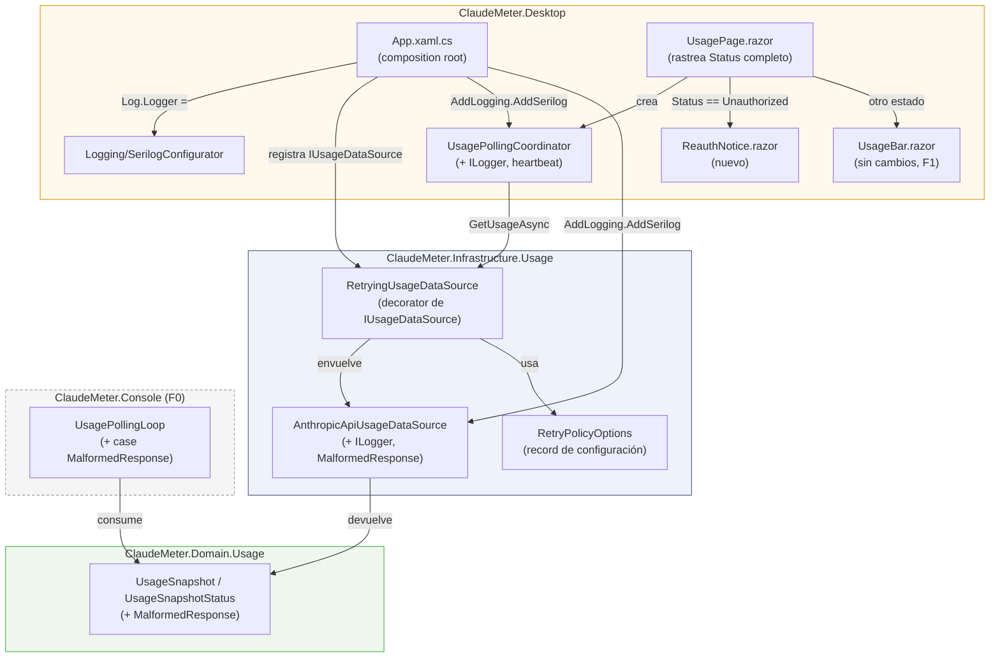
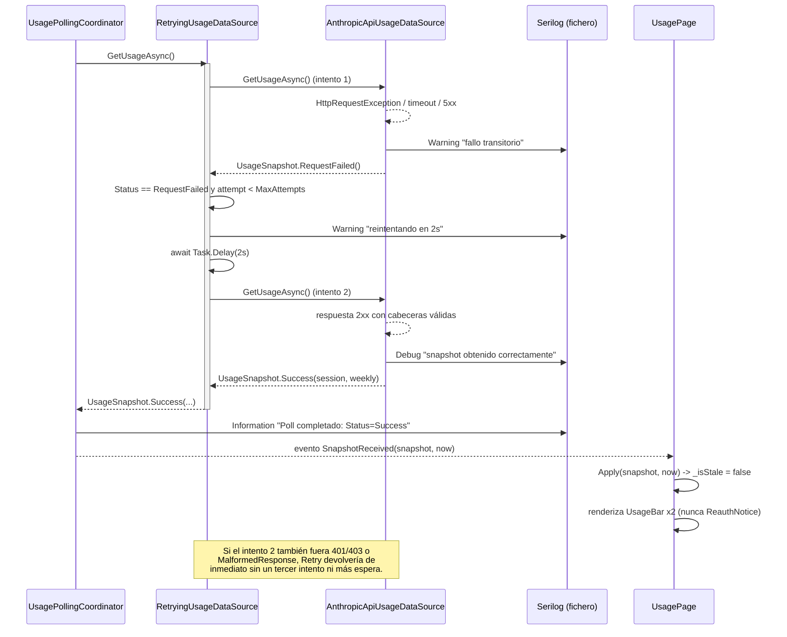
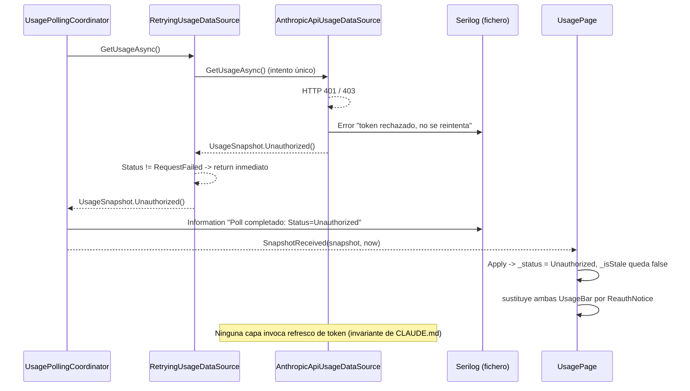

# F2 — Robustez, Ciclo A — Documentación Técnica

## Overview

**F2 — Robustez, Ciclo A** agrupa las issues de GitHub **#10, #11 y #12**
(US-1..US-3), tratadas como un único ciclo SDLC con cadena de dependencia
interna **#10 → #11 → #12**. Añade a ClaudeMeter tres capacidades de
robustez sobre el widget visual ya entregado en F1:

- **US-1 (#10):** un aviso explícito y visualmente distinto en la UI cuando
  la API devuelve 401/403 ("hay que volver a autenticarse"), en vez de dejar
  el dato "desactualizado" o el estado genérico "No disponible".
- **US-2 (#11):** una política de reintento con backoff exponencial ante
  fallos transitorios (red, timeout, 5xx), con un modelo explícito de **3
  categorías de reintentabilidad**.
- **US-3 (#12):** logging estructurado con Serilog, persistido en
  `%LOCALAPPDATA%\ClaudeMeter\logs`, trazando tanto el ciclo normal de poll
  como cada intento/reintento de US-2.

F2 no añade ninguna capa nueva ni rompe la separación reading/calling/
computing/rendering que exige `CLAUDE.md`: toca 4 piezas existentes de forma
acotada y añade 4 piezas nuevas, todas en Domain/Infrastructure/Desktop
(ningún cambio en `ClaudeMeter.Application`).

Referencias fuente de este documento:
`docs/sdlc/requirements/f2-robustez-ciclo-a.md`,
`docs/sdlc/design/f2-robustez-ciclo-a.md`,
`docs/sdlc/development/f2-robustez-ciclo-a.md`,
`docs/sdlc/testing/f2-robustez-ciclo-a.md`, y el código real bajo
`src/ClaudeMeter.Domain/Usage/UsageSnapshot.cs`,
`src/ClaudeMeter.Infrastructure/Usage/`, `src/ClaudeMeter.Desktop/` y
`src/ClaudeMeter.Console/Polling/UsagePollingLoop.cs`.

## Architecture

| Pieza | Capa | Issue/US | Responsabilidad |
|---|---|---|---|
| `UsageSnapshot` / `UsageSnapshotStatus` | Domain | US-2 (#11) | Nuevo estado `MalformedResponse`, separado de `RequestFailed` |
| `AnthropicApiUsageDataSource` (modificado) | Infrastructure | US-2/US-3 | Sigue siendo la única clase que "llama a la API"; devuelve `MalformedResponse()` para 2xx sin cabeceras, y registra cada intento HTTP vía `ILogger<T>` |
| `RetryPolicyOptions` (nuevo) | Infrastructure | US-2 (#11) | `record` de configuración del backoff (`Default`: 3 intentos, 2s→4s, techo 10s) |
| `RetryingUsageDataSource` (nuevo) | Infrastructure | US-2 (#11) | Decorator de `IUsageDataSource` que aplica el modelo de 3 categorías de reintento |
| `SerilogConfigurator` (nuevo) | Desktop | US-3 (#12) | Fábrica testeable del `Serilog.ILogger`, sink de fichero con directorio inyectable |
| `App.xaml.cs` (modificado) | Desktop | US-2/US-3 | Composition root: inicializa Serilog, conecta `Microsoft.Extensions.Logging`, compone `AnthropicApiUsageDataSource` envuelto por `RetryingUsageDataSource` como único `IUsageDataSource` registrado |
| `UsagePollingCoordinator` (modificado) | Desktop | US-3 (#12) | Gana `ILogger<T>` para heartbeat `Information` por tick; sin cambios de temporización/guarda |
| `UsagePage.razor` (modificado) + `ReauthNotice.razor` (nuevo) | Desktop | US-1 (#10) | `UsagePage` rastrea el `UsageSnapshotStatus` completo y sustituye ambas `UsageBar` por `ReauthNotice` cuando es `Unauthorized` |
| `UsagePollingLoop` (`ClaudeMeter.Console`, modificado) | Consola (F0) | US-2 | Nuevo `case MalformedResponse`, reutiliza `RenderRequestFailed` |

Puntos clave:

- **Ningún cambio en `ClaudeMeter.Application`.** El ciclo completo se
  resuelve con un nuevo estado de Domain y adaptadores/decoradores de
  Infrastructure/Desktop, consistente con la regla de sustituibilidad de
  `IUsageDataSource` que `CLAUDE.md` ya exige para F7 (`BleUsageSink`).
- `AnthropicApiUsageDataSource` se registra en DI como **tipo concreto**, no
  como `IUsageDataSource`; es `RetryingUsageDataSource` quien se expone como
  el único `IUsageDataSource` real de la aplicación — ni `UsagePollingCoordinator`
  ni `UsagePage.razor` saben que existe un decorator de por medio.
- Solo Desktop (composition root) referencia Serilog/el sink de fichero;
  Infrastructure solo conoce `Microsoft.Extensions.Logging.Abstractions`
  (`ILogger<T>`), preservando Clean Architecture.

## Key Components

### `UsageSnapshotStatus.MalformedResponse` (Domain)

Nuevo miembro de enum, separado de `RequestFailed`. `RequestFailed` pasa a
significar **únicamente** fallo transitorio (red, timeout, 5xx — categoría
1 del modelo de reintento); `MalformedResponse` cubre el caso "2xx sin las
cabeceras `anthropic-ratelimit-unified-*` esperadas" (categoría 3). Ver
`src/ClaudeMeter.Domain/Usage/UsageSnapshot.cs`.

**Por qué un miembro de enum y no un campo `FailureReason: string?`:**
mantiene el mismo criterio ya aplicado a `Unauthorized`/`TokenUnavailable`
en F0/F1 — estados explícitos de dominio en vez de *string matching*. Con
esto, `RetryingUsageDataSource` reduce su decisión de reintento a una única
comparación de enum (`snapshot.Status != UsageSnapshotStatus.RequestFailed`),
sin ningún objeto "causa" adicional que sincronizar, y sin acoplar el
decorator a detalles HTTP crudos (rompería el contrato de sustituibilidad
Liskov que `IUsageDataSource` ya exige).

### `AnthropicApiUsageDataSource` (Infrastructure, modificado)

Sigue siendo la única clase que "llama a la API": no gana ninguna
responsabilidad de reintento. Cambios: (a) devuelve
`UsageSnapshot.MalformedResponse()` en vez de `RequestFailed()` para 2xx sin
cabeceras; (b) recibe `ILogger<AnthropicApiUsageDataSource>` y registra cada
intento HTTP individual con el detalle que solo esta clase conoce (excepción
de red, código de estado, sin exponer nunca el token).

### `RetryingUsageDataSource` (Infrastructure, nuevo)

Decorator de `IUsageDataSource` (`src/ClaudeMeter.Infrastructure/Usage/RetryingUsageDataSource.cs`).
Implementa el modelo de 3 categorías: reintenta únicamente
`RequestFailed`, devolviendo cualquier otro estado (`Success`,
`TokenUnavailable`, `Unauthorized`, `MalformedResponse`) de inmediato, sin
ningún `Task.Delay`. Nunca lanza: se limita a propagar el último
`UsageSnapshot` no exitoso devuelto por la fuente envuelta.

Tiene dos constructores: el público usa `Task.Delay` real; uno `internal`
(visible vía `InternalsVisibleTo` hacia `ClaudeMeter.Infrastructure.Tests`)
recibe una función de espera inyectable, para que los tests simulen varios
reintentos sin esperar segundos reales.

**Por qué el backoff vive aquí y no en `AnthropicApiUsageDataSource` ni en
`UsagePollingCoordinator` (decisión central de Design, delegada
explícitamente por Requirements):**

- Frente a meterlo en `AnthropicApiUsageDataSource`: mezclaría "traducir una
  respuesta HTTP" con "orquestar reintentos", ensanchando una clase
  deliberadamente estrecha que ya tiene su propia suite de tests centrada en
  el mapeo HTTP→`UsageSnapshot`.
- Frente a meterlo en `UsagePollingCoordinator`: mezclaría "temporizar cada
  60s" con "reintentar con backoff", dos políticas temporales distintas en
  la misma clase, y complicaría razonar sobre cuánto puede tardar un tick
  frente a la guarda `_isPolling` ya existente.
- Un decorator preserva la regla de `CLAUDE.md` ("reading the token, calling
  the API, computing the countdown, and rendering are separate classes —
  don't collapse them") de la forma más literal: se añade una clase nueva y
  pequeña ("decidir si reintentar un `IUsageDataSource` ya existente"), no
  se hace crecer una responsabilidad existente. Como el backoff ocurre
  *dentro* de la única llamada `await GetUsageAsync()` que la guarda
  `_isPolling` de `UsagePollingCoordinator` ya serializa, esa guarda cubre
  correctamente toda la secuencia de reintentos sin ningún cambio
  estructural en el coordinador — solo gana logging.
- Es el mismo patrón de sustituibilidad que `CLAUDE.md` ya exige para F7
  (`BleUsageSink` debe encajar en Infrastructure sin tocar Domain/
  Application): un decorator de `IUsageDataSource` es "una fuente de datos
  más" desde el punto de vista del consumidor.

**Por qué backoff hecho a mano (`Task.Delay` + multiplicador) y no Polly:**
la política es deliberadamente simple (~30 líneas, una condición binaria
"reintentable sí/no" + backoff exponencial con techo). Introducir Polly
sería ceremonia sin beneficio real hoy — mismo criterio que F1 aplicó para
rechazar MediatR prematuramente. Candidata real a reconsiderar en F5
(multi-cuenta, varias fuentes a la vez) si la resiliencia crece en
complejidad.

### `RetryPolicyOptions` (Infrastructure, nuevo)

`record` de configuración: `MaxAttempts`, `InitialDelay`,
`BackoffMultiplier`, `MaxDelay`. `RetryPolicyOptions.Default` fija 3
intentos totales, 2s → 4s de espera (backoff ×2), techo 10s (nunca
alcanzado con estos valores) — peor caso ~6s de espera adicional además del
tiempo de las 3 llamadas HTTP, muy por debajo del intervalo de poll de 60s.
No es configurable desde `config.json` en este ciclo (issue #13,
explícitamente fuera de alcance).

### `SerilogConfigurator` (Desktop, nuevo)

`src/ClaudeMeter.Desktop/Logging/SerilogConfigurator.cs`. Fábrica estática
`CreateLogger(string? logDirectory = null)`, separada deliberadamente de la
asignación al `Log.Logger` estático global (que hace únicamente
`App.xaml.cs.OnStartup`). Configura `MinimumLevel.Information`,
`Enrich.FromLogContext`, y un sink de fichero (`Serilog.Sinks.File`) con
rotación diaria (`RollingInterval.Day`) y retención de 7 días
(`retainedFileCountLimit: 7`, mitiga el riesgo de I/O sin límite marcado en
Requirements). `DefaultLogDirectory()` calcula
`%LOCALAPPDATA%\ClaudeMeter\logs` sin escribir nada.

Al devolver un `Serilog.ILogger` normal (no tocar el `Log.Logger` estático),
un test puede construirlo apuntando a un directorio temporal, escribir,
volcar (`Dispose`) y comprobar el fichero, sin contaminar estado global
entre tests — es el mecanismo que satisface el AC de US-3 de que "la
configuración de Serilog es verificable sin escribir logs reales en el
`%LOCALAPPDATA%` de la máquina de CI".

### `App.xaml.cs` (Desktop, modificado — composition root)

`OnStartup` inicializa `Log.Logger = SerilogConfigurator.CreateLogger()`,
conecta el puente a `Microsoft.Extensions.Logging`
(`services.AddLogging(b => b.AddSerilog(Log.Logger, dispose: false))`), y
compone la cadena real de `IUsageDataSource`:
`AnthropicApiUsageDataSource` registrado como tipo concreto,
`RetryingUsageDataSource` (con `RetryPolicyOptions.Default`) como el único
`IUsageDataSource` expuesto vía DI. `OnExit` llama a `Log.CloseAndFlush()`
(garantiza el volcado del sink de fichero), además del
`_httpClient?.Dispose()` ya existente de F1.

### `UsagePollingCoordinator` (Desktop, modificado)

Gana `ILogger<UsagePollingCoordinator>` en el constructor. `Start()`
registra un `Information` de arranque; `PollAsync()` registra un
`Information` de heartbeat por tick (`Status={Status}`), un único log por
invocación, sin ruido por cada tick de 60s. El `catch` de última instancia
(antes silencioso en F1) ahora registra `LogError` con la excepción. Sin
cambios en `_isPolling` ni en la temporización.

### `UsagePage.razor` + `ReauthNotice.razor` (Desktop)

`UsagePage.razor` ahora recuerda el último `UsageSnapshotStatus` completo
(campo `_status`), no solo `IsSuccess`. Cuando `_status == Unauthorized`, el
`@if` de nivel superior sustituye por completo las dos `UsageBar` por un
único componente `ReauthNotice` — nunca se muestran juntas. En `Apply()`, la
rama `Unauthorized` nunca marca `_isStale = true` (AC 3 de US-1: un 401/403
no es un dato desactualizado, es una credencial inválida).

`ReauthNotice.razor` (`src/ClaudeMeter.Desktop/Pages/ReauthNotice.razor`) es
markup puro (icono ⚠ + mensaje "Vuelve a iniciar sesión en Claude Code para
seguir viendo tu consumo."), sin `@code`, reutilizando la paleta de alerta
ya usada para el umbral `red` (`.usage-reauth__icon { color: #f85149; }` en
`wwwroot/css/app.css`).

**Por qué sustituir las barras en vez de superponer un banner:** el "so
that" del propio US-1 es explícito — el usuario debe saber que hay que
reautenticarse "en lugar de ver datos rancios o el widget colgado". Mostrar
las barras (aunque sea con datos previos) junto al aviso contradice ese
objetivo. Extraerlo como componente propio (en vez de un `@if` inline en
`UsagePage.razor`) sigue el mismo patrón ya usado para `UsageBar` en F1
(aislar responsabilidad de render + testeable con bUnit en aislamiento).

### `UsagePollingLoop` (`ClaudeMeter.Console`, F0 — adición puntual)

Añade `case UsageSnapshotStatus.MalformedResponse` al `switch` *statement*
de `Render`, reutilizando `IUsagePollingRenderer.RenderRequestFailed` — no
se añade ningún método de renderer nuevo. Desde la consola (fuera del
alcance funcional de este ciclo), un contrato de API roto y un fallo de red
se muestran igual ("no se pudieron obtener datos ahora mismo"); la
distinción fina solo importa para decidir si reintentar (US-2,
Infrastructure) y para el log (US-3), no para el texto de consola.

## El modelo de 3 categorías de reintentabilidad (US-2)

| Categoría | Estados | Tratamiento |
|---|---|---|
| **1 — Reintentable** | `RequestFailed` (red, timeout, 5xx) | Backoff exponencial hasta `MaxAttempts`; tras agotarlo, se propaga el último `RequestFailed()` |
| **2 — No reintentable, accionable por el usuario** | `TokenUnavailable`, `Unauthorized` (401/403) | Nunca se reintenta — solo un login manual del usuario lo arregla; van directos al aviso de US-1 |
| **3 — No reintentable, tipo bug/contrato roto** | `MalformedResponse` (2xx sin cabeceras) | Nunca se reintenta — no es un fallo de red, reintentar solo retrasaría mostrar el problema |

`RetryingUsageDataSource` implementa esto con una única condición
(`snapshot.Status != UsageSnapshotStatus.RequestFailed` → return inmediato),
porque `Success` también cae, sin cambios de comportamiento, en la misma
rama "no reintentar" que las categorías 2 y 3.

## Data Flow / Sequence

Ciclo de un poll con un fallo transitorio seguido de éxito, mostrando dónde
se sitúan el backoff y cada punto de logging:

Camino alternativo (401/403, categoría 2 — US-1):

## Niveles de logging (US-3)

Un evento se registra exactamente una vez, en la clase con el detalle más
rico sobre él — evita el ruido excesivo ya marcado como riesgo en
Requirements:

| Nivel | Cuándo | Dónde |
|---|---|---|
| `Debug` | Éxito HTTP individual | `AnthropicApiUsageDataSource` (filtrado por `MinimumLevel.Information` en producción) |
| `Information` | Arranque; heartbeat por tick de poll | `UsagePollingCoordinator` |
| `Warning` | Fallo transitorio individual; aviso de reintento en curso; `TokenUnavailable` | `AnthropicApiUsageDataSource`, `RetryingUsageDataSource` |
| `Error` | `Unauthorized`; `MalformedResponse`; reintentos agotados; excepción no controlada en el poll | `AnthropicApiUsageDataSource`, `RetryingUsageDataSource`, `UsagePollingCoordinator` |

`TokenUnavailable` se registra deliberadamente en `Warning`, no `Error`: es
un estado esperable antes del primer login, no necesariamente un fallo real
— a diferencia de `Unauthorized` (token presente pero rechazado por la API).
Ningún mensaje de log incluye el token ni cabeceras `Authorization`.

## Edge Cases & Error Handling

| Escenario | Tratamiento |
|---|---|
| Fallo transitorio (red/timeout/5xx) que se recupera dentro de `MaxAttempts` | `RetryingUsageDataSource` reintenta con backoff 2s→4s; el usuario nunca ve un estado de error para esa iteración |
| `MaxAttempts` fallos transitorios consecutivos | Se propaga `RequestFailed()` como estado de error visible (mismo tratamiento "sin datos"/"(desactualizado)" de F1); el siguiente ciclo de poll de 60s no se bloquea |
| 2xx sin cabeceras `anthropic-ratelimit-unified-*` | `MalformedResponse()` inmediato, sin pasar por el retry |
| 401/403 | `Unauthorized()` inmediato, sin reintentar, nunca refresco de token; `UsagePage` sustituye las barras por `ReauthNotice` |
| Token no disponible (`TokenUnavailable`) | Sin llamada HTTP, `Warning`, sin reintentar; UI muestra "No disponible" (sin cambios respecto a F1) |
| `Unauthorized` recibido tras un éxito previo (`_hasEverSucceeded == true`) | Igual: `ReauthNotice` sustituye las barras, nunca el sufijo "(desactualizado)" |
| Secuencia de reintentos que tarda más que el intervalo de poll de 60s | Mitigado por diseño: peor caso ~6s con `RetryPolicyOptions.Default`, muy por debajo de 60s; la guarda `_isPolling` ya existente en `UsagePollingCoordinator` cubre toda la secuencia sin cambios estructurales |
| Volumen de logging | Un evento, un log; rotación diaria + retención de 7 días acotan el I/O |

## Cobertura de tests y gaps aceptados

Suite de tests (fase `sdlc-testing`, `docs/sdlc/testing/f2-robustez-ciclo-a.md`):

- **162/162 tests correctos** en la solución completa (`dotnet test
  ClaudeMeter.sln`): 61 `ClaudeMeter.Domain.Tests`, 20
  `ClaudeMeter.Console.Tests`, 42 `ClaudeMeter.Infrastructure.Tests`, 39
  `ClaudeMeter.Desktop.Tests`. `dotnet build -c Release`
  (`TreatWarningsAsErrors`) sin advertencias.
- Cobertura por clase de negocio nueva/modificada de F2 (todas ≥ el
  `testingCoverage: 70` configurado en `.claude/sdlc.config.yaml`):
  - `RetryingUsageDataSource`, `RetryPolicyOptions`,
    `AnthropicApiUsageDataSource`, `UsageSnapshot`, `UsagePollingLoop`,
    `UsagePollingCoordinator`: **100% líneas / 100% ramas.**
  - `UsagePage`: **95.3% líneas / 91.7% ramas** (sube respecto al
    94.33%/87.5% de F1 gracias a la rama nueva `Unauthorized`).
  - `SerilogConfigurator`: **100% líneas / 50% ramas.**
  - `ReauthNotice`: sin entrada propia en `coverage.cobertura.xml`.

Gaps aceptados, no accidentales:

- **`SerilogConfigurator`, rama `logDirectory ?? DefaultLogDirectory()`
  cuando `logDirectory` es `null`.** El propio AC de US-3 exige que la
  suite no escriba logs reales en el `%LOCALAPPDATA%` de CI; ejercitar esa
  rama invocaría `Directory.CreateDirectory` y escribiría fuera del
  directorio temporal de test en cualquier máquina, incluida CI.
  `DefaultLogDirectory()` en sí (el cálculo de la ruta, sin escribir nada)
  sí está cubierto al 100% por separado.
- **`ReauthNotice` sin entrada en el informe de cobertura** — Coverlet no
  genera entrada de clase para un componente Razor puramente de markup, sin
  `@code`, a diferencia de `UsageBar`/`UsagePage`. Se considera una
  limitación de instrumentación, no una ausencia de tests: 5 tests (3
  directos en `ReauthNoticeTests`, 2 indirectos vía `UsagePageTests`)
  ejercitan su renderizado real bajo bUnit.
- **`App.xaml.cs`/`MainWindow.xaml(.cs)`** — exclusión heredada de F1, sin
  cambios de alcance: composition root WPF real, no ejercitable por xUnit/
  bUnit; cubierto solo por revisión de código y por la validación manual de
  la Definition of Done.
- **`UsagePage.OnSnapshotReceived`, carrera benigna** y
  **`UsagePage.IsPollingActiveForTests`, rama `_coordinator is null`** —
  mismos gaps ya aceptados en F1, sin relación con el código nuevo de F2.

## Desviaciones respecto al diseño

1. **2 de los 5 paquetes NuGet nuevos no siguen la serie `8.0.x` asumida
   por el diseño.** El diseño delegaba en Development confirmar el último
   patch estable de `8.0.x` en `api.nuget.org` para los 5 paquetes. Al
   verificarlo se encontró que `Serilog` y `Serilog.Sinks.File` versionan
   de forma independiente al ciclo de .NET:
   - `Serilog` → **4.4.0** (núcleo; nunca ha existido una serie `8.x`).
   - `Serilog.Sinks.File` → **7.0.0** (la versión `8.0.0` solo existe como
     prerelease, nunca publicada estable).
   - `Serilog.Extensions.Logging` → **8.0.0**, `Microsoft.Extensions.Logging`
     → **8.0.1**, `Microsoft.Extensions.Logging.Abstractions` → **8.0.3**
     (estos 3 sí siguen `8.0.x` tal cual asumía el diseño).

   Comprobación mecánica de packaging, no un cambio de arquitectura —
   documentada con comentario junto a cada `PackageReference` en los
   `.csproj`, con la URL exacta de verificación.

2. **`src/ClaudeMeter.Console/Program.cs` no estaba listado como consumidor
   en la sección "Compatibilidad hacia atrás" del diseño.** El diseño
   identificaba como consumidores del constructor modificado de
   `AnthropicApiUsageDataSource` únicamente "el composition root de Desktop
   y ambos proyectos de test", pero `ClaudeMeter.Console` (F0) tiene su
   propio composition root que también instancia esta clase directamente.
   Omisión menor del análisis de impacto del diseño, corregida pasando
   `NullLogger<AnthropicApiUsageDataSource>.Instance`
   (`Microsoft.Extensions.Logging.Abstractions`, ya disponible
   transitivamente vía `ClaudeMeter.Infrastructure`) — F0/Console no tiene
   infraestructura de logging propia (Serilog se introdujo solo para
   `ClaudeMeter.Desktop`).

3. **`using System.IO;` explícito en `SerilogConfigurator.cs`,** no
   mostrado en el snippet del diseño — el conjunto de *implicit usings* de
   `Microsoft.NET.Sdk.Razor` no incluye `System.IO`. Corrección mecánica de
   compilación, no un cambio de diseño (mismo tipo de ajuste ya documentado
   por F1 para `System.Net.Http`).

Adicionalmente, y de forma esperada por el propio proceso: Development dejó
deliberadamente el build de test roto (19 errores `CS7036` por los cambios
de firma de constructor en `AnthropicApiUsageDataSource` y
`UsagePollingCoordinator`), ya anticipado en la sección "Compatibilidad
hacia atrás" del diseño, para que `sdlc-testing` lo resolviera junto con la
escritura de los tests nuevos. `sdlc-testing` corrigió los 19 errores como
paso mecánico previo y confirmó el build completo sin errores ni
advertencias.

## Limitaciones conocidas

- **3 validaciones manuales pendientes en la Definition of Done**, ninguna
  automatizable por este pipeline:
  - **US-1:** confirmar en un equipo Windows real, invalidando el token
    local o simulando un 401/403 de larga duración, que `ReauthNotice`
    aparece en la UI real (WPF/WebView2) y es visualmente distinguible de
    "No disponible".
  - **US-2:** confirmar, cortando la conectividad de red brevemente (menos
    de ~6s) mientras la aplicación real está corriendo, que el widget se
    recupera solo tras el reintento sin parpadeo visible; y que un corte
    mayor sí muestra el fallo tras 3 intentos.
  - **US-3:** confirmar que el fichero de log aparece realmente en
    `%LOCALAPPDATA%\ClaudeMeter\logs` tras ejecutar la aplicación real, y
    que su contenido es legible/estructurado.
- `RetryPolicyOptions.Default` no es configurable desde `config.json`
  (issue #13, explícitamente fuera de alcance de este ciclo).
- El costo/cuota real de los reintentos de US-2 contra la API de Anthropic
  real sigue sin validar en producción (mitigado por diseño con los valores
  de `RetryPolicyOptions.Default`, pendiente de la validación manual).

## Extension points

- `RetryingUsageDataSource` envuelve cualquier `IUsageDataSource`: un futuro
  `BleUsageSink` (F7) podría reutilizar la misma política de reintento sin
  cambios, si algún día la necesitara.
- `UsageSnapshotStatus.MalformedResponse` deja precedente para futuros
  estados de dominio explícitos en vez de campos de "razón"/string.
- `SerilogConfigurator.CreateLogger(logDirectory)` ya admite un directorio
  inyectable; si `config.json` (issue #13) llegase a exponer la ruta de
  logs como opción de usuario, el punto de extensión ya existe.
- Los niveles de log y el modelo de 3 categorías quedan documentados como
  contrato estable para que F4/F5 (historial, multi-cuenta) puedan añadir
  nuevas fuentes/estados sin romper la clasificación existente.
