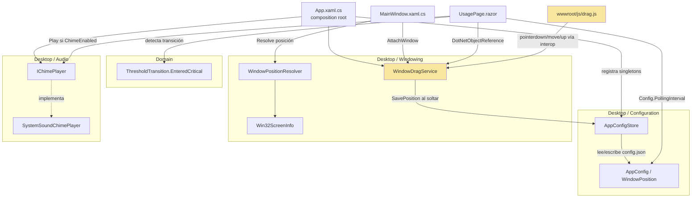

# F2 — Robustez, Ciclo B — Documentación Técnica

## Overview

Este ciclo cierra la issue única **#13** del milestone F2, implementando dos
capacidades sobre el widget ya existente (F0/F1/F2-Ciclo A): **US-1**, un
`config.json` opcional que permite configurar el intervalo de polling, la
posición inicial de la ventana y si suena un chime al entrar en umbral
crítico; y **US-2**, arrastrar el widget con el ratón y persistir la nueva
posición para el siguiente arranque. Añade una pieza nueva en Domain
(`ThresholdTransition`) y siete piezas nuevas en Desktop (`Configuration/`,
`Windowing/`, `Audio/`), sin tocar Application ni Infrastructure.

**Importante para quien lea `docs/sdlc/design/f2-robustez-ciclo-b.md`:** ese
documento describe el arrastre como `Window.DragMove()` invocado vía JS
interop desde un `mousedown`. **Ese mecanismo no es el que quedó
implementado.** La validación manual en un equipo Windows real encontró que
no funcionaba, y se sustituyó por el mecanismo descrito en la sección
"Mecanismo de arrastre real" más abajo. El resto del diseño (`AppConfig`/
`AppConfigStore`, `WindowPositionResolver`/`Win32ScreenInfo`,
`ThresholdTransition`, `IChimePlayer`) sí se implementó tal cual el design
doc.

## Architecture



## Key Components

- **`ThresholdTransition`** (`src/ClaudeMeter.Domain/Usage/ThresholdTransition.cs`)
  — función pura, hermana de `UsageThresholdClassifier` (F1). `EnteredCritical(previous, current)`
  es `true` solo cuando `current == Critical` y `previous != Critical`
  (incluyendo `previous == null`, primera lectura ya en rojo). No guarda
  estado; el llamador (`UsagePage`) conserva el umbral anterior.
- **`AppConfig` / `WindowPosition`** (`Desktop/Configuration/AppConfig.cs`) —
  records inmutables. `AppConfig.Default` = 60s / sin posición / chime
  desactivado.
- **`AppConfigStore`** (`Desktop/Configuration/AppConfigStore.cs`) — único
  lector/escritor de `%LOCALAPPDATA%\ClaudeMeter\config.json` vía
  `System.Text.Json`. `Load()` nunca lanza: JSON corrupto o ilegible → default
  completo; un campo concreto fuera de rango (p. ej. intervalo ≤0) → solo ese
  campo cae a su default, con `Warning` en el log. `Save()`/`SavePosition()`
  escriben de forma atómica (`config.json.tmp` + `File.Move(overwrite: true)`)
  y nunca lanzan: un fallo de E/S se registra como `Error` y se traga.
- **`WindowPositionResolver`** (`Desktop/Windowing/WindowPositionResolver.cs`)
  — función pura, sin `Window` ni Win32 real: decide `(Left, Top)` a partir de
  la posición configurada (si cabe entera en alguna pantalla conectada) o el
  fallback a la esquina inferior derecha del monitor **principal**.
- **`Win32ScreenInfo`** (`Desktop/Windowing/Win32ScreenInfo.cs`) — adaptador
  `internal` sobre `EnumDisplayMonitors`/`GetMonitorInfo` de `user32.dll`
  (P/Invoke directo, sin `UseWindowsForms`). Única pieza, junto con
  `MainWindow`, no testeada automáticamente.
- **`WindowDragService`** (`Desktop/Windowing/WindowDragService.cs`) —
  singleton sin `Window` en el constructor (se "adjunta" vía
  `AttachWindow(this)` desde `MainWindow`, porque `Window` no existe todavía
  cuando `App.OnStartup` construye el `IServiceCollection`). Expone tres
  métodos `[JSInvokable]`: `BeginDrag()` (hoy solo un guard/log de "ventana no
  adjunta"), `DragDelta(deltaX, deltaY)` (aplica el delta a `Window.Left`/`Top`
  en cada `pointermove`) y `EndDrag()` (persiste la posición final vía
  `AppConfigStore.SavePosition`).
- **`IChimePlayer` / `SystemSoundChimePlayer`** (`Desktop/Audio/`) —
  abstracción de una línea sobre `System.Media.SystemSounds.Exclamation.Play()`,
  para que bUnit pueda sustituirla por `FakeChimePlayer` sin reproducir audio
  real.
- **`wwwroot/js/drag.js`** — módulo JS que captura el gesto completo de
  arrastre y lo reenvía a `WindowDragService` por interop (ver siguiente
  sección).

## Mecanismo de arrastre real (desviación respecto al diseño)

El design doc especifica `Window.DragMove()` invocado desde
`[JSInvokable] BeginDrag()` al detectar un `mousedown` en JS. **Ese mecanismo
no funcionaba en absoluto**: el widget permanecía estático al intentar
arrastrarlo, y los clics ni siquiera llegaban al contenido Razor. La
validación manual (equipo Windows real, `dotnet run`) depuró en vivo y
encontró **tres causas encadenadas**, cada una descubierta al arreglar la
anterior y volver a probar. Se documentan con detalle porque son errores
fáciles de repetir en cualquier combinación WPF + `BlazorWebView`.

**1. `Window.DragMove()` es incompatible con `BlazorWebView`/WebView2.**
WebView2 aloja su propio proceso de renderizado (Chromium fuera de proceso),
que retiene la captura de ratón a nivel de sistema operativo durante el
gesto. El `ReleaseCapture()` interno de `DragMove()` solo libera la captura
que tiene el hilo de WPF, nunca la del proceso de WebView2 — el bucle nativo
de movimiento que `DragMove()` intenta iniciar (vía `WM_SYSCOMMAND`/`SC_MOVE`)
nunca recibe los `WM_MOUSEMOVE` posteriores. `DragMove()` no lanza ninguna
excepción; simplemente la ventana no se mueve.

*Fix:* arrastre gestionado íntegramente en JavaScript. En cada evento de
movimiento se calcula un delta y se reenvía por JS interop a
`WindowDragService.DragDelta(double deltaXDeviceUnits, double deltaYDeviceUnits)`,
que convierte el delta de píxeles de dispositivo a unidades independientes
del dispositivo vía `PresentationSource.CompositionTarget.TransformFromDevice`
y lo suma a `Window.Left`/`Window.Top`. `EndDrag()` persiste la posición
final vía `AppConfigStore.SavePosition` (sin cambios respecto al diseño en
esta parte). `BeginDrag()` se conserva solo como guard/log de "ventana no
adjunta todavía".

**2. Mouse Events normales (`mousedown`/`mousemove`/`mouseup`, sin captura
explícita) tampoco funcionaban.** En cuanto el cursor salía del área de
280×140px del widget — casi inmediato, porque la ventana todavía no se ha
movido en el instante en que el usuario empieza a mover el ratón más rápido
de lo que el interop puede seguir — WebView2 dejaba de recibir `mousemove`,
porque el sistema operativo ya no se los entregaba a esa ventana (el puntero
está físicamente fuera de sus límites).

*Fix:* Pointer Events (`pointerdown`/`pointermove`/`pointerup`) con
`setPointerCapture()` explícito sobre `document.documentElement` (ver
`src/ClaudeMeter.Desktop/wwwroot/js/drag.js`), que engancha la captura de
ratón a nivel de sistema operativo y sigue entregando eventos al elemento
aunque el cursor salga de los límites visibles del widget.

**3. Incluso con eso arreglado, los clics no llegaban en absoluto al
contenido de WebView2** (síntoma: "el widget parece estar encima de todo pero
no responde a nada"). Bug documentado, no específico de este proyecto:
[dotnet/maui#9024](https://github.com/dotnet/maui/issues/9024) y
[MicrosoftEdge/WebView2Feedback#997](https://github.com/MicrosoftEdge/WebView2Feedback/issues/997).
Causa raíz: con `AllowsTransparency="True"` en `MainWindow` (ya fijado desde
F1), WPF compone la ventana mediante `UpdateLayeredWindow`, y el sistema
operativo decide si un clic pertenece a la ventana según el valor alfa del
píxel renderizado en ese punto — **antes** de que WPF llegue a ejecutar su
propio hit-test interno. Un `<Rectangle Fill="Transparent"/>` (alfa
exactamente 0) no soluciona nada, porque sigue teniendo alfa 0.

*Fix real* (`src/ClaudeMeter.Desktop/MainWindow.xaml`): un
`<Rectangle Fill="#01000000"/>` (alfa 1/255, visualmente imperceptible)
colocado detrás del `BlazorWebView`, del mismo tamaño que el `Grid` raíz
(280×140px). Al tener alfa ≥1 en vez de 0, el sistema operativo trata todo
ese rectángulo como opaco a efectos de hit-test, y el clic llega
correctamente al `WebView2`. Esto **no** introduce ningún click-through real
(sigue sin existir — deliberadamente fuera de alcance hasta que F3 implemente
la issue #16); simplemente corrige que, antes de este fix, el widget entero
era accidentalmente click-through sin que nadie lo hubiera pedido.

Archivos finales afectados por esta desviación:
`wwwroot/js/drag.js` (reescrito), `Windowing/WindowDragService.cs` (reescrito
— ya no bloquea ni llama a `DragMove()`), `MainWindow.xaml` (el `Rectangle`
añadido), `Pages/UsagePage.razor` (try/catch permanente alrededor de
`claudeMeterDrag.init`, defensa real no diagnóstico temporal), y
`test/ClaudeMeter.Desktop.Tests/Windowing/WindowDragServiceTests.cs`
(actualizado a los métodos nuevos `DragDelta`/`EndDrag`).

El documento de diseño **no se ha actualizado** y sigue describiendo
`DragMove()` en su Technology Choices y Data Model — tratarlo como histórico
para la parte de arrastre, no como la implementación real.

## Data Flow / Sequence — Arrastre completo

```mermaid
sequenceDiagram
    participant User as Usuario (ratón)
    participant JS as drag.js
    participant WDS as WindowDragService
    participant Win as Window (MainWindow)
    participant Store as AppConfigStore

    User->>JS: pointerdown (botón izq.)
    JS->>JS: root.setPointerCapture(pointerId)
    JS->>WDS: invokeMethodAsync('BeginDrag')
    WDS-->>WDS: guard: si _window null, Warning + return

    loop mientras se mueve el ratón
        User->>JS: pointermove
        JS->>JS: delta = movementX/Y * devicePixelRatio
        JS->>WDS: invokeMethodAsync('DragDelta', dx, dy)
        WDS->>WDS: CheckAccess() / Dispatcher.Invoke si hace falta
        WDS->>WDS: deltaDips = TransformFromDevice(dx, dy)
        WDS->>Win: Left += deltaDips.X; Top += deltaDips.Y
    end

    User->>JS: pointerup
    JS->>JS: root.releasePointerCapture(pointerId)
    JS->>WDS: invokeMethodAsync('EndDrag')
    WDS->>Win: lee Left, Top actuales
    WDS->>Store: SavePosition(Left, Top)
    Store->>Store: Load() + with{Position=...} + Save() atómico (.tmp + Move)
```

## Esquema de `config.json`

Ruta por defecto: `%LOCALAPPDATA%\ClaudeMeter\config.json`.

```json
{
  "pollingIntervalSeconds": 60,
  "chimeEnabled": false,
  "windowPosition": {
    "left": 1200.0,
    "top": 800.0
  }
}
```

- Los 3 campos son opcionales de forma independiente; cualquiera ausente usa
  su valor por defecto sin log (fichero parcial escrito a mano por el
  usuario).
- `windowPosition` ausente/`null` ⇒ esquina inferior derecha del monitor
  principal. Presente pero fuera de todos los monitores conectados ⇒ mismo
  fallback (`WindowPositionResolver`).
- Unidades de `windowPosition`: unidades independientes del dispositivo (1/96",
  igual que `Window.Left`/`Window.Top` de WPF) — sin conversión adicional en
  `AppConfigStore`.
- `pollingIntervalSeconds` ≤0, `NaN` o `Infinity` ⇒ solo ese campo cae a 60s,
  con `Warning`; el resto de campos válidos del mismo fichero se respetan.

## Edge Cases & Error Handling

| Caso | Comportamiento |
|---|---|
| Sin `config.json` | `AppConfig.Default` (60s / sin posición / chime off), arranque normal, sin crear el fichero como efecto secundario de solo leer |
| JSON sintácticamente inválido o `null` literal | `AppConfig.Default` completo, `Warning` en log |
| Un campo concreto fuera de rango (intervalo ≤0, posición con eje no numérico) | Solo ese campo cae a default; el resto de campos válidos del mismo fichero se conservan |
| Posición configurada fuera de todos los monitores conectados | Fallback a esquina inferior derecha del monitor **principal**, no a otro monitor disponible |
| Fallo de E/S al guardar tras soltar el arrastre (permisos, disco lleno) | El reposicionamiento en memoria de la sesión actual no se revierte; `Error` en log; la aplicación no se cae |
| Dos arrastres consecutivos en la misma sesión | `config.json` refleja siempre el último `EndDrag()` completado (escritura atómica `.tmp` + `File.Move`, sin mezcla de coordenadas) |
| `BeginDrag`/`DragDelta`/`EndDrag` invocados antes de `AttachWindow` | No lanzan; `BeginDrag` registra `Warning` una vez, `DragDelta` ignora en silencio (se dispararía en cada `pointermove`), `EndDrag` no persiste nada |
| Fallo al registrar `claudeMeterDrag.init` (JS interop) | `try/catch` permanente en `UsagePage.OnAfterRenderAsync`; se registra `Error` y el widget sigue funcionando sin arrastre en esa sesión, en vez de romper el render |
| Fallo transitorio de red (`RequestFailed`) mientras el último estado era Crítico | No resetea `_previousSessionThreshold`/`_previousWeeklyThreshold` (evaluado solo dentro de `snapshot.IsSuccess`); el chime no vuelve a sonar al recuperarse sin una transición real |
| Chime en transición a Crítico repetida (Crítico→Crítico) | No vuelve a sonar; solo una nueva transición no-Crítico→Crítico lo dispara de nuevo |

## Extension points

- Un nuevo campo de configuración se añade en `AppConfigDto` (con su
  resolución de default/validación en `AppConfigStore`) sin tocar
  `WindowPositionResolver` ni el resto de Desktop.
- `WindowPositionResolver` no conoce el origen de `IReadOnlyList<Rect>`:
  `Win32ScreenInfo` podría sustituirse (p. ej. por
  `System.Windows.Forms.Screen.AllScreens` si F3 activa `UseWindowsForms` para
  el icono de bandeja) sin romper la lógica de decisión ya testeada.
- `ThresholdTransition` es candidata a reutilizarse desde `MascotPage.razor`
  de F3 si también necesita reaccionar a transiciones de umbral.
- La interacción entre el listener de arrastre (a nivel de `document`) y el
  futuro click-through de F3 (#16) queda pendiente de revisión en el diseño
  de esa fase — no resuelta aquí.

## Tests / Cobertura

- **216/216 tests correctos**: 77 `ClaudeMeter.Domain.Tests`, 20
  `ClaudeMeter.Console.Tests`, 42 `ClaudeMeter.Infrastructure.Tests`, 77
  `ClaudeMeter.Desktop.Tests`.
- Cobertura 94-100% en las clases nuevas de lógica pura (`ThresholdTransition`,
  `AppConfig`, `AppConfigStore`, `WindowPositionResolver`); 90-95.9% en
  `UsagePage`.
- Gaps aceptados y documentados (no automatizables): `WindowDragService`
  (requiere una `Window` real en hilo STA con sesión de escritorio real —
  solo se testean los guards de "sin ventana adjunta" de `BeginDrag`/
  `DragDelta`/`EndDrag`), `SystemSoundChimePlayer` (audio real), `Win32ScreenInfo`/
  `MainWindow`/`App` (monitor/chrome WPF real).
- Las validaciones manuales de US-1 y US-2 de la Definition of Done se
  completaron en esta sesión sobre un equipo Windows real; la de US-2 es la
  que motivó las tres correcciones descritas arriba.
