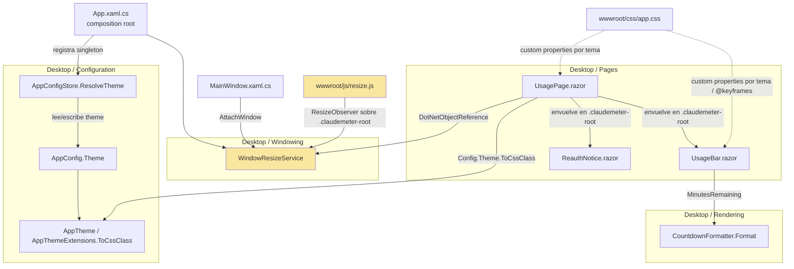
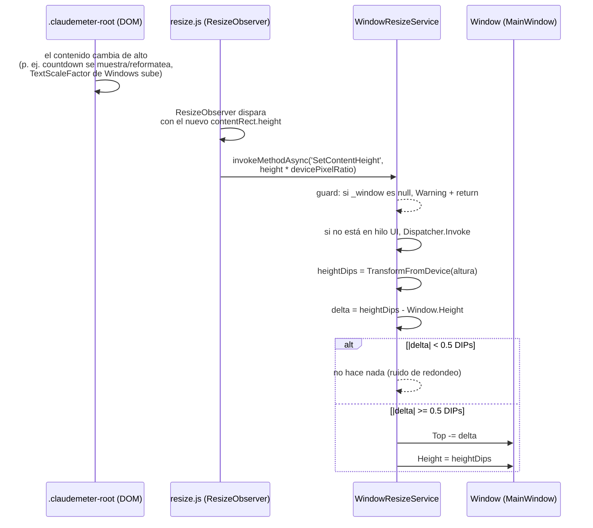
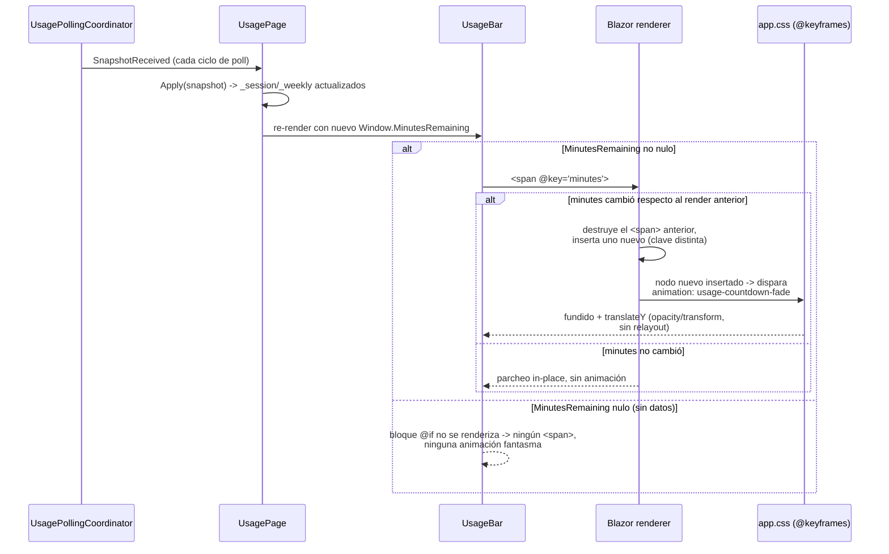

# F3 — UX + página Mascota, Ciclo A — Documentación Técnica

## Overview

Este ciclo cierra dos issues independientes del milestone **F3 — UX +
página Mascota**: **US-1** (issue #14, tema claro/oscuro) y **US-2** (issue
#15, animación del countdown hasta el reset de cuota). Todo el trabajo vive
en `ClaudeMeter.Desktop`, extendiendo dos patrones ya establecidos
(`AppConfig`/`AppConfigStore` de F2/Ciclo B, y las transiciones CSS puras ya
usadas por `.usage-bar__fill`) — Domain, Application e Infrastructure no se
tocan.

Durante la validación manual de este mismo ciclo (posterior al documento de
diseño original) se encontró y corrigió un bug real de recorte de texto,
resuelto con una pieza nueva y reutilizable: `WindowResizeService` +
`wwwroot/js/resize.js`, un mecanismo de autoajuste de la altura de ventana al
contenido real. Se documenta en detalle en su propia sección más abajo, con
el mismo criterio ya usado para la desviación del mecanismo de arrastre de
F2/Ciclo B.

## Architecture



## Key Components

- **`AppTheme` / `AppThemeExtensions`** (`Desktop/Configuration/AppConfig.cs`)
  — enum de dos valores (`Dark`, `Light`) más `ToCssClass()`, única fuente de
  verdad del mapeo enum → clase CSS (`"theme-dark"` / `"theme-light"`).
  Cualquier página Razor futura (p. ej. `MascotPage`, Ciclo C) la reutiliza
  sin duplicar el mapeo.
- **`AppConfig.Theme`** — nuevo campo del record `AppConfig`, por defecto
  `AppTheme.Dark` (paleta actual sin cambios). El parámetro lleva valor por
  defecto en la propia firma del constructor posicional (`AppTheme Theme =
  AppTheme.Dark`) — ver "Desviación respecto al Data Model del diseño" más
  abajo.
- **`AppConfigStore.ResolveTheme(string?)`** — extiende el mismo patrón ya
  usado para `pollingIntervalSeconds`/`chimeEnabled`: campo ausente → default
  en silencio; `"dark"`/`"light"` case-insensitive → tema correspondiente;
  cualquier otra cadena → default + `Warning`, sin lanzar. Un valor JSON de
  tipo incorrecto (p. ej. `"theme": 5`) nunca llega a `ResolveTheme`: la
  deserialización de `System.Text.Json` sobre `AppConfigDto.Theme` (tipado
  `string?`) lanza `JsonException` antes, y cae al `catch` ya existente de
  `Load()` — el fichero **completo** vuelve a sus valores por defecto, no
  solo el tema (mismo comportamiento heredado que cualquier otro campo con
  tipo JSON incorrecto en este fichero, no una regresión de este ciclo).
- **`CountdownFormatter`** (`Desktop/Rendering/CountdownFormatter.cs`, nuevo)
  — función pura `Format(int minutesRemaining) → string`: `<=0` → `"0m"`;
  `<1h` → `"{m}m"`; `<1d` → `"{h}h {m}m"`; `>=1d` → `"{d}d {h}h"`. Sin
  dependencias externas ni acceso al reloj, mismo estándar que
  `RateLimitWindowParser` (Domain). Vive en Desktop, no en Domain, por ser
  una decisión de presentación (igual criterio que el mapeo severidad→color
  de `UsageBar`).
- **`UsagePage.razor`** — envuelve todo su contenido (`ReauthNotice` o
  `.usage-widget`) en `<div class="claudemeter-root
  @Config.Theme.ToCssClass()">`, un único punto de aplicación del tema que
  cubre las dos superficies de UI existentes hoy. `Config.Theme` se resuelve
  una única vez en el arranque (`App.xaml.cs`), sin recarga en caliente.
- **`UsageBar.razor`** — añade un `<span class="usage-bar__countdown"
  @key="minutes">` con el texto de `CountdownFormatter.Format(minutes)`,
  renderizado solo cuando `Window.MinutesRemaining` no es `null`. El
  atributo `@key="minutes"` fuerza a Blazor a destruir y recrear el nodo en
  cada cambio de valor (en vez de parchear el texto in-place), lo que
  dispara de forma nativa la animación `@keyframes usage-countdown-fade`
  definida en `app.css` (`opacity`/`transform`, compuestas por el navegador
  sin relayout).
- **`wwwroot/css/app.css`** — custom properties por tema
  (`--bg-color`, `--text-color`, `--color-normal/-warning/-critical/-neutral`,
  etc.) definidas en dos bloques `.claudemeter-root.theme-dark` /
  `.claudemeter-root.theme-light`; `html, body` conservan su fondo oscuro
  hardcodeado como fallback pre-render (antes de que Blazor monte
  `UsagePage` y aplique la clase de tema real).
- **`WindowResizeService` / `wwwroot/js/resize.js`** (nuevos, ver sección
  dedicada) — mecanismo de autoajuste de `Window.Height` a la altura real
  del contenido Razor.

## Mecanismo de autoajuste de altura (pieza añadida tras el diseño original)

Ni el documento de requisitos ni el de diseño de este ciclo mencionan esta
pieza: nació de un bug real encontrado durante la **validación manual** de
US-2, no de ninguna Acceptance Criterion pre-existente. Se documenta con
detalle porque introduce un mecanismo nuevo en el proyecto, pensado para ser
reutilizado por cualquier pantalla futura que añada contenido al
`BlazorWebView` (p. ej. `MascotPage` en el Ciclo C).

**Síntoma.** Al añadir la línea de countdown (US-2), el contenido de cada
`UsageBar` pasó a necesitar más alto del que cabía en la ventana WPF de
tamaño fijo (280×140px, heredada de F1). Con el "Tamaño de texto" de
Accesibilidad de Windows subido, el contenido se recortaba visualmente.

**Causa raíz (no es simplemente "falta espacio").** WebView2 aplica el
`TextScaleFactor` de Accesibilidad de Windows como un **zoom sobre el
contenido**, incluso cuando el CSS usa `font-size` en píxeles fijos — un
factor de escala variable en tiempo de ejecución, imprevisible en tiempo de
compilación, por lo que fijar una altura de ventana mayor a mano no es una
solución real (cualquier valor fijo sigue siendo insuficiente para algún
`TextScaleFactor` posible). Además, la cadena de `height: 100%` encadenada
desde `html` → `body` → `#app` → `.claudemeter-root` → `.usage-widget`
significaba que **el contenido nunca podía reportar una necesidad de más
espacio que la ventana actual**: cada elemento de la cadena estaba clavado
al 100% del contenedor padre, que a su vez estaba clavado al tamaño de
ventana vigente. Ese problema circular habría hecho inútil cualquier
mecanismo de detección de tamaño (`ResizeObserver` incluido) si no se
corregía primero — el contenido jamás podía crecer más allá del tamaño que
ya tenía la ventana, así que nunca había "un cambio de altura" que observar.

**Solución, en el orden en que se aplicó:**

1. Se eliminó la cadena de `height: 100%` en `wwwroot/css/app.css` (`html`,
   `body`, `#app`, `.claudemeter-root`, `.usage-widget`, `.usage-reauth` ya
   no fijan altura), para que el contenido tenga su altura natural/intrínseca
   y pueda, por tanto, reportar un cambio real.
2. **`wwwroot/js/resize.js`** (nuevo): un `ResizeObserver` observa
   `.claudemeter-root` y, en cada cambio de `contentRect.height`, reenvía el
   valor (multiplicado por `window.devicePixelRatio`, en píxeles de
   dispositivo) a .NET vía `invokeMethodAsync('SetContentHeight', …)`.
3. **`Windowing/WindowResizeService.cs`** (nuevo): singleton "adjuntado" a
   la `Window` real vía `AttachWindow(this)` desde `MainWindow`, mismo
   patrón ya usado por `WindowDragService` (F2/Ciclo B), porque el objeto
   `Window` no existe todavía cuando `App.OnStartup` construye el
   `IServiceCollection`. Expone `[JSInvokable] SetContentHeight(double
   contentHeightDeviceUnits)`:
   - si `_window` es `null` (el `ResizeObserver` puede dispararse antes de
     que `MainWindow` termine de adjuntarse), registra `Warning` y no hace
     nada;
   - si se invoca fuera del hilo de UI (`Dispatcher.CheckAccess()` falso —
     el interop de Blazor no garantiza el hilo de despacho de WPF),
     reintenta vía `Dispatcher.Invoke`;
   - convierte el valor recibido de píxeles de dispositivo a unidades
     independientes de dispositivo (DIPs) con
     `PresentationSource.CompositionTarget.TransformFromDevice`, igual
     transformación que ya usa `WindowDragService` para los deltas de
     arrastre;
   - calcula `delta = alturaDips - Window.Height` y, si supera un umbral de
     0.5 DIPs (evita ajustes en bucle por redondeo), **ancla el borde
     inferior**: `Window.Top -= delta; Window.Height = alturaDips`. El
     widget "crece hacia arriba" en vez de desplazar el punto donde el
     usuario lo dejó (por defecto en la esquina inferior derecha, o
     arrastrado manualmente — F2/Ciclo B).
4. **Cableado**: `App.xaml.cs` registra `WindowResizeService` como
   singleton; `MainWindow.xaml.cs` lo adjunta a la ventana real
   (`AttachWindow`) en el constructor, igual que `WindowDragService`;
   `UsagePage.razor` registra el listener JS
   (`claudeMeterResize.init(_resizeServiceRef)`) en
   `OnAfterRenderAsync(firstRender)`, con el mismo `try/catch` defensivo ya
   usado para `claudeMeterDrag.init`; `wwwroot/index.html` añade
   `<script src="js/resize.js">`.

## Data Flow / Sequence — Autoajuste de altura



## Data Flow / Sequence — Animación del countdown



## Esquema de `config.json` (campo nuevo)

```json
{
  "pollingIntervalSeconds": 60,
  "chimeEnabled": false,
  "theme": "light",
  "windowPosition": { "left": 1200.0, "top": 800.0 }
}
```

- `theme` es opcional, independiente del resto de campos (mismo criterio que
  `chimeEnabled`/`pollingIntervalSeconds`): ausente → `"dark"` sin log;
  `"dark"`/`"light"` (case-insensitive) → tema correspondiente; cualquier
  otro valor de cadena → `"dark"` + `Warning`; tipo JSON no-cadena → el
  fichero completo cae a valores por defecto (comportamiento heredado, no
  específico de `theme`).
- Se resuelve una única vez en el arranque (`App.xaml.cs`); no hay recarga
  en caliente en este ciclo — editar `theme` en caliente requiere reiniciar
  la aplicación para que se aplique.

## Desviación respecto al Data Model del diseño

El documento de diseño (`docs/sdlc/design/f3-ux-mascota-ciclo-a.md`) muestra
`AppConfig.Theme` como un parámetro posicional **obligatorio**. La
implementación real le da un valor por defecto en la propia firma
(`AppTheme Theme = AppTheme.Dark`): dos construcciones posicionales de
`AppConfig` ya existentes en `AppConfigStoreTests.cs` (anteriores a este
ciclo) no pasaban `Theme`, y a `sdlc-development` le está explícitamente
prohibido tocar ficheros de test — sin el valor por defecto, `dotnet build`
en Release (`TreatWarningsAsErrors`) habría fallado por argumento
obligatorio ausente. El valor por defecto coincide exactamente con
`AppConfig.Default.Theme` (`Dark`), así que no cambia ningún comportamiento
en tiempo de ejecución. `sdlc-testing` actualizó posteriormente esas dos
construcciones para pasar `Theme` de forma explícita (más claro), sin
revertir el valor por defecto.

## Edge Cases & Error Handling

| Caso | Comportamiento |
|---|---|
| `config.json` sin campo `theme` | `AppTheme.Dark`, sin log — paleta idéntica a la de antes de este ciclo |
| `theme` con cadena no reconocida (`"blue"`, `""`, `"oscuro"`) | Cae a `Dark`, `Warning` en log, arranque normal sin excepción |
| `theme` con tipo JSON incorrecto (p. ej. un número) | `JsonException` durante la deserialización del DTO → **todo** `config.json` cae a `AppConfig.Default` (no solo el tema), `Warning` en log — mismo comportamiento heredado de cualquier campo con tipo incorrecto |
| `MinutesRemaining == null` (sin datos / `RateLimitWindow.Unavailable`) | El bloque del countdown no se renderiza en absoluto — ningún `<span>`, ninguna animación disparada |
| `MinutesRemaining` llega a `0` | `CountdownFormatter.Format(0) == "0m"`, se renderiza con su transición animada normal (mismo camino que cualquier otro valor) |
| `SetContentHeight` invocado antes de `AttachWindow` (`ResizeObserver` dispara antes de que `MainWindow` termine de construirse) | No lanza; `Warning` en log; la llamada se ignora — el próximo disparo del `ResizeObserver` (tras `AttachWindow`) sí surte efecto |
| `SetContentHeight` invocado fuera del hilo de UI de WPF | Reintenta vía `Dispatcher.Invoke`, sin excepción |
| Cambio de altura menor a 0.5 DIPs (ruido de redondeo entre píxeles de dispositivo y DIPs) | Se ignora — evita ajustes en bucle imperceptibles |
| Fallo al registrar `claudeMeterResize.init` (JS interop) | `try/catch` permanente en `UsagePage.OnAfterRenderAsync` (mismo patrón que `claudeMeterDrag.init`); se registra `Error` y el widget sigue funcionando sin autoajuste de altura en esa sesión |

## Extension points

- `.claudemeter-root` es el único punto de aplicación del tema hoy; cuando
  el Ciclo B introduzca `ScreenNavigator`/`IWidgetScreen` (issue #18), ese
  componente pasará a ser el punto natural para aplicar
  `.claudemeter-root`/`Config.Theme.ToCssClass()` una única vez, en vez de
  que cada `IWidgetScreen` (incluida la futura `MascotPage`) lo repita — un
  ajuste de una línea, no un rediseño.
- Un tercer tema se añadiría con un nuevo miembro de `AppTheme`, su rama en
  `AppThemeExtensions.ToCssClass()` y un tercer bloque de custom properties
  en `app.css` — sin tocar `UsagePage`/`UsageBar`.
- El mecanismo de autoajuste de altura (`WindowResizeService` + `resize.js`)
  observa `.claudemeter-root` en general, no nada específico de
  `UsagePage`: cualquier pantalla futura que renderice dentro de ese
  contenedor (p. ej. `MascotPage`) queda cubierta automáticamente sin
  cambios adicionales, siempre que no reintroduzca una cadena de `height:
  100%` fija en su propio árbol de estilos.

## Tests / Cobertura

- **258/258 tests correctos** en la solución completa (77
  `ClaudeMeter.Domain.Tests`, 20 `ClaudeMeter.Console.Tests`, 42
  `ClaudeMeter.Infrastructure.Tests`, 119 `ClaudeMeter.Desktop.Tests`).
  `dotnet build ClaudeMeter.sln -c Release` (`TreatWarningsAsErrors`)
  compila sin advertencias ni errores.
- Cobertura 95.94%–100% en las seis clases nuevas/modificadas de este ciclo
  (`CountdownFormatter`, `AppConfig`, `AppThemeExtensions`, `AppConfigStore`,
  `UsageBar`, `UsagePage`) — muy por encima del 70% objetivo
  (`testingCoverage` en `.claude/sdlc.config.yaml`).
- `WindowResizeService`: line-rate 29.16%, branch-rate 8.33% — gap aceptado
  y documentado, mismo criterio ya usado para `WindowDragService` (F2/Ciclo
  B). Solo el guard de "sin ventana adjunta" es alcanzable de forma
  determinista sin una `System.Windows.Window` real en un hilo STA con
  sesión de escritorio real; el cálculo de `delta`, la escritura sobre
  `Window.Top`/`Height` y `ToDeviceIndependentPixels` requieren esa ventana
  real.
- No verificable por bUnit (requiere WebView2/render real): el contraste
  visual efectivo de la paleta clara, la animación CSS del countdown en sí
  (solo se verifica el mecanismo `@key` que la dispara), y el efecto real
  del autoajuste de altura con `TextScaleFactor` de Windows alto. Cubiertos
  por la validación manual descrita en la Definition of Done del ciclo.
