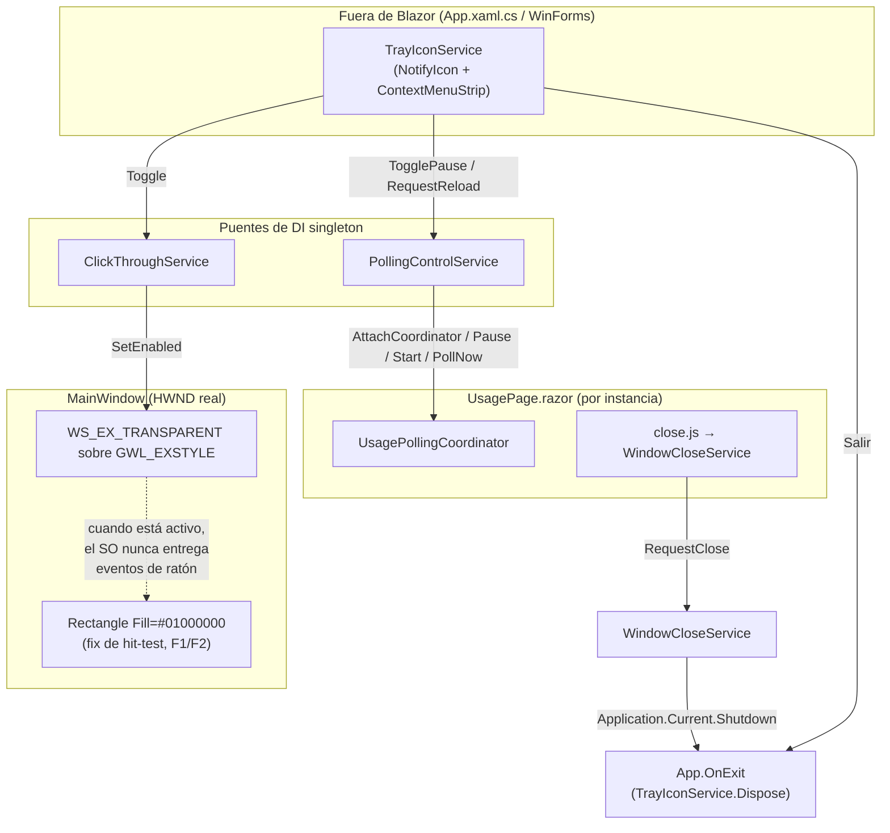

# F3 — UX + página Mascota, Ciclo B — Documentación Técnica

## Overview

Este ciclo añade a `ClaudeMeter.Desktop` dos capacidades de interacción sobre
la ventana ya existente (`MainWindow`), sin tocar Domain, Application ni
Infrastructure: **click-through temporal** (US-1, issue #16 — los clics
pueden atravesar el widget hacia la ventana de debajo) e **icono de bandeja
con control de ciclo de vida** (US-2, issue #17 — Pausar/Reanudar, Recargar,
el propio interruptor de click-through y Salir, más un botón de cierre
directo sobre la propia ventana). Cuatro piezas nuevas (`ClickThroughService`,
`WindowCloseService`, `PollingControlService`, `TrayIconService`) y dos
extensiones (`UsagePollingCoordinator.Pause()`/`PollNow()`,
`UsagePage.razor`) implementan ambas historias reutilizando patrones ya
establecidos en F2/Ciclo B y F3/Ciclo A en vez de introducir mecanismos
nuevos.

## Architecture

Todo el trabajo vive en `ClaudeMeter.Desktop`. Se reutilizan tres patrones ya
existentes: "servicio singleton de DI + `AttachWindow(Window)`" (igual que
`WindowDragService`/`WindowResizeService`) para `ClickThroughService` y
`WindowCloseService`; "JS interop → `[JSInvokable]` → servicio de Desktop"
para el cierre directo; y un puente nuevo, `PollingControlService`, que
conecta el icono de bandeja (fuera de Blazor, en `App.xaml.cs`) con la
instancia real de `UsagePollingCoordinator` que crea cada `UsagePage`
(instancia por componente, deliberadamente no un singleton de DI).



## Key Components

- **`Windowing/ClickThroughService.cs`** — alterna el bit `WS_EX_TRANSPARENT`
  (`0x00000020`) del estilo extendido (`GWL_EXSTYLE`, `-20`) del `HWND` real
  de `MainWindow`, vía P/Invoke a `user32.dll`
  (`GetWindowLongPtr`/`SetWindowLongPtr`, con *shim* a `GetWindowLong32`/
  `SetWindowLong32` cuando `IntPtr.Size != 8`). Lee el estilo actual y aplica
  OR/AND-NOT en vez de sobrescribirlo, porque `MainWindow` ya tiene otros
  bits puestos por WPF (`WS_EX_LAYERED` por `AllowsTransparency="True"`,
  `WS_EX_TOPMOST` por `Topmost="True"`). `IsEnabled = false` por defecto y no
  toca la ventana hasta el primer `SetEnabled(true)`. Expone `Toggle()` y el
  evento `StateChanged`, y un `SetEnabledForTests` interno que permite
  simular una transición de estado sin `HWND` real.

- **`Windowing/WindowCloseService.cs`** — expone `[JSInvokable] RequestClose()`,
  invocado desde `close.js`. Si el `Dispatcher` de `MainWindow` no es el hilo
  actual, se reencola con `Dispatcher.Invoke`; luego llama a
  `System.Windows.Application.Current.Shutdown()`.

- **`Polling/PollingControlService.cs`** — singleton de DI, puente entre el
  icono de bandeja y el `UsagePollingCoordinator` real que posee cada
  `UsagePage` (instancia por componente, nunca singleton — decisión ya fijada
  en F2/Ciclo B). `AttachCoordinator`/`DetachCoordinator` (mismo verbo que
  `AttachWindow`) enlazan/desenlazan la instancia; `TogglePause()`/`Pause()`/
  `Resume()`/`RequestReload()` delegan en `UsagePollingCoordinator.Pause()`/
  `Start()`/`PollNow()`; `IsPaused` y el evento `PauseStateChanged`
  sincronizan el texto del menú de bandeja.

- **`Polling/UsagePollingCoordinator.cs`** (modificado) — `Pause()` detiene
  el `System.Timers.Timer` interno sin `Dispose()` (la instancia sigue viva);
  `PollNow()` dispara `PollAsync()` fuera de la cadencia del timer,
  reutilizando el guard `_isPolling` ya existente (si ya hay un poll en
  vuelo, es un no-op silencioso); `Start()` cubre "Reanudar" tal cual —
  dispara un fetch inmediato y reinicia el timer, sin necesitar un método
  `Resume()` separado. `PollOnceForTestsAsync()` ahora delega en `PollNow()`.

- **`Tray/TrayIconService.cs`** — única clase de Desktop que referencia
  `System.Windows.Forms`. El constructor solo construye
  `NotifyIcon`+`ContextMenuStrip` (los cuatro ítems: "Pausar"/"Reanudar",
  "Recargar", "Ignorar clics", "Salir") y suscribe eventos, sin tocar
  `Visible` — así es instanciable en xUnit sin sesión de escritorio real.
  `Initialize()` (llamada única desde el final de `App.OnStartup`) resuelve
  el icono real y activa `Visible = true`. `Dispose()` desuscribe los dos
  eventos y oculta/libera el `NotifyIcon`.

- **`Pages/UsagePage.razor`** (modificado) — en `OnInitialized()` adjunta su
  `UsagePollingCoordinator` recién creado a `PollingControlService` y se
  suscribe a `PauseStateChanged`; en `OnAfterRenderAsync` registra
  `claudeMeterClose.init`; renderiza `<button class="claudemeter-close">`
  siempre presente, fuera del `@if`/`else` (también visible sobre
  `ReauthNotice`); al pausar marca `_isStale = true` reutilizando el
  criterio visual "(desactualizado)" ya existente, sin introducir un tercer
  estado visual.

## Convivencia de `WS_EX_TRANSPARENT` con el fix de hit-test de F1/F2

`MainWindow.xaml` ya aplica, desde F1/F2, un `<Rectangle Fill="#01000000" />`
(alfa 1/255, imperceptible) para resolver un problema conocido de WPF +
WebView2 (`dotnet/maui#9024`, `MicrosoftEdge/WebView2Feedback#997`): una
ventana con transparencia real (alfa 0) compuesta vía `UpdateLayeredWindow`
hace que el SO trate como click-through, de forma **involuntaria**, cualquier
píxel cuyo alfa sea cero, antes incluso de que WPF llegue a hacer su propio
hit-test. El `Rectangle` fuerza a que el SO considere opaco todo el área del
widget, para que `BlazorWebView` reciba el ratón con normalidad por defecto.

`ClickThroughService` opera en una capa Win32 **distinta y anterior** a esa:
`WS_EX_TRANSPARENT` es un bit del estilo extendido de la ventana, no una
propiedad de composición por píxel. Cuando está activo, el SO no entrega
**ningún** mensaje de ratón (`WM_MOUSEMOVE`, `WM_LBUTTONDOWN`, etc.) al
`HWND`, con independencia total del alfa de cada píxel — el hit-test por
alfa de `UpdateLayeredWindow` (el que el `Rectangle` corrige) ni siquiera
llega a evaluarse, porque el mensaje nunca sale de la cola del SO hacia esa
ventana. Los dos mecanismos, por tanto, no se contradicen ni se pisan:
- El `Rectangle` (`#01000000`) resuelve el caso *no deseado* de
  click-through-por-alfa que aparecía **siempre**, incluso con
  `WS_EX_TRANSPARENT` desactivado.
- `WS_EX_TRANSPARENT` añade un click-through **deseado y explícito**, activable
  /desactivable en tiempo de ejecución, que se superpone por encima de ese
  fix sin necesitar tocarlo ni revertirlo. Al desactivar `WS_EX_TRANSPARENT`,
  el comportamiento vuelve exactamente al de hoy (interactivo, gracias al
  `Rectangle`) sin ninguna intervención adicional.

Consecuencia directa (AC de US-1): mientras `WS_EX_TRANSPARENT` está activo,
ni el arrastre (`WindowDragService`, `drag.js`) ni el cierre directo
(`WindowCloseService`, `close.js`) necesitan ninguna guarda explícita de
"no actuar en modo click-through" — el SO nunca entrega el evento de ratón a
`MainWindow`, así que esos listeners JS simplemente no se disparan.

## Decisión: `NotifyIcon` + `UseWindowsForms=true` frente a `Hardcodet.NotifyIcon.Wpf`

`ClaudeMeter.Desktop.csproj` añade `<UseWindowsForms>true</UseWindowsForms>`
para poder usar `System.Windows.Forms.NotifyIcon`/`ContextMenuStrip`/
`ToolStripMenuItem`. Esto no añade ningún `PackageReference` nuevo:
`System.Windows.Forms`/`System.Drawing.Common` llegan como parte del
framework compartido `Microsoft.WindowsDesktop.App`, ya referenciado por
`UseWPF=true`. Rationale real (ya anticipado por el propio documento de
diseño de F2/Ciclo B): ese documento dejó escrito explícitamente que
`System.Windows.Forms.Screen.AllScreens` se usaría en F2/Ciclo B y que
`UseWindowsForms` "se reconsiderará en F3, que según CLAUDE.md necesitará de
todos modos un icono de bandeja (`NotifyIcon` es la vía estándar para esa
función en WPF), momento en el que `UseWindowsForms` pasaría a estar
justificado por una necesidad real adicional" — ese momento es este ciclo.
La alternativa evaluada, `Hardcodet.NotifyIcon.Wpf` 2.0.1, es 100% WPF/XAML
y evitaría `UseWindowsForms`, pero introduciría una dependencia NuGet de
terceros sin necesidad funcional no cubierta por la opción del SDK — se
descartó por ese motivo. `NotifyIcon` y WPF comparten el mismo bucle de
mensajes Win32 subyacente (el `Dispatcher` de WPF) en el mismo hilo STA, sin
necesitar `System.Windows.Forms.Application.Run()` adicional.

El icono real se resuelve con
`Icon.ExtractAssociatedIcon(Environment.ProcessPath!)` (el icono ya embebido
en `ClaudeMeter.Desktop.exe`), con `SystemIcons.Application` como *fallback*
si la extracción lanza `ArgumentException`/`IOException` — no existe ningún
asset `.ico` propio en el repositorio; diseñar uno queda fuera de alcance.

## Data Flow / Sequence

Flujo de "Pausar desde la bandeja" (equivalente para "Reanudar", que reutiliza
el mismo `TogglePause()`):

```mermaid
sequenceDiagram
    participant U as Usuario
    participant Tray as TrayIconService
    participant PCS as PollingControlService
    participant UPC as UsagePollingCoordinator
    participant Page as UsagePage.razor

    U->>Tray: Clic en "Pausar" (ContextMenuStrip)
    Tray->>PCS: TogglePause()
    PCS->>PCS: IsPaused == false -> Pause()
    PCS->>UPC: Pause()
    UPC->>UPC: _timer.Stop()
    PCS->>PCS: IsPaused = true
    PCS-->>Tray: PauseStateChanged
    Tray->>Tray: _pauseResumeItem.Text = "Reanudar"
    PCS-->>Page: PauseStateChanged
    Page->>Page: OnPauseStateChanged() (vía InvokeAsync)
    Page->>Page: _isStale = true; StateHasChanged()
    Note over Page: UsageBar muestra "(desactualizado)"\nsin perder el último snapshot válido
```

Flujo de cierre, con las dos vías convergiendo en el mismo punto de salida:

```mermaid
sequenceDiagram
    participant U as Usuario
    participant Btn as botón .claudemeter-close (close.js)
    participant WCS as WindowCloseService
    participant Tray as TrayIconService ("Salir")
    participant App as App (WPF Application)

    alt Cierre directo desde MainWindow
        U->>Btn: click (modo interactivo, sin click-through)
        Btn->>WCS: RequestClose() [JSInvokable]
        WCS->>App: Application.Current.Shutdown()
    else "Salir" desde la bandeja
        U->>Tray: Clic en "Salir"
        Tray->>App: Application.Current.Shutdown()
    end
    App->>App: OnExit(e)
    App->>Tray: TrayIconService.Dispose()
    Tray->>Tray: NotifyIcon.Visible = false; Dispose()
    App->>App: _httpClient?.Dispose(); Log.CloseAndFlush()
```

## Edge Cases & Error Handling

- **Servicio invocado antes de adjuntar `MainWindow`:** `ClickThroughService.SetEnabled`
  y `WindowCloseService.RequestClose` no lanzan si `_window` es `null` —
  registran `LogWarning` y son no-op, mismo patrón defensivo que
  `WindowDragService`.
- **`RequestClose()` desde un hilo no UI:** reencola vía
  `_window.Dispatcher.Invoke(RequestClose)` antes de llamar a `Shutdown()`.
- **Icono de bandeja huérfano al salir:** las tres vías de cierre (botón
  directo, "Salir" de bandeja, cualquier otro camino de cierre de WPF)
  convergen en `Application.Current.Shutdown()` → `App.OnExit`, que llama a
  `TrayIconService.Dispose()` (oculta y libera el `NotifyIcon`) antes de
  `Log.CloseAndFlush()` — un único punto de salida, sin lógica duplicada
  entre el botón de cierre y el ítem "Salir".
- **Colisión de arrastre con el botón de cierre:** `close.js` llama a
  `event.stopPropagation()` en el `pointerdown` del propio botón, antes de
  que burbujee hasta `document.documentElement` donde `drag.js` escucha —
  sin este `stopPropagation()`, cada clic en el botón dispararía también
  `WindowDragService.BeginDrag()`/`EndDrag()` (un arrastre de longitud cero).
- **`TrayIconService.Initialize()` no puede extraer el icono:** captura
  `ArgumentException`/`IOException`, registra `LogWarning` y usa
  `SystemIcons.Application` como *fallback* — nunca lanza.
- **`PollingControlService` sin coordinador adjunto** (p. ej. el icono de
  bandeja invocado en una ventana temporal de arranque/cierre):
  `Pause()`/`Resume()`/`RequestReload()` son no-op silenciosos.
- **Pausa/click-through como estado en memoria, no persistido:** ninguno de
  los dos se guarda en `config.json`/`AppConfig` — la aplicación arranca
  siempre con el polling activo y el click-through desactivado,
  independientemente del estado en el que se cerrara la sesión anterior
  (decisión de Requirements, documentada como valor por defecto).

## Resultado de tests y cobertura

`dotnet test ClaudeMeter.sln`: **298/298 correctos, 0 fallos** (159 en
`ClaudeMeter.Desktop.Tests`, incluyendo 37 tests nuevos/modificados de este
ciclo). `dotnet build ClaudeMeter.sln -c Release` (`TreatWarningsAsErrors`)
compila sin advertencias.

Cobertura por clase nueva/modificada de este ciclo:

| Clase | Line-rate | Branch-rate | Estado |
|---|---|---|---|
| `PollingControlService` | 100% | 100% | Por encima del 70% objetivo |
| `UsagePollingCoordinator` | 100% | 100% | Por encima del 70% objetivo |
| `TrayIconService` | 78% | 100% | Por encima del 70% objetivo |
| `UsagePage` | 96.66% | 84.61% | Por encima del 70% objetivo |
| `ClickThroughService` | 52% | 21.42% | **Gap aceptado** (ver abajo) |
| `WindowCloseService` | 53.84% | 25% | **Gap aceptado** (ver abajo) |

Gaps aceptados, con el mismo criterio ya usado para `WindowDragService`
(F2/Ciclo B, 47.8%/25%) y `WindowResizeService` (F3/Ciclo A, 29.16%/8.33%):
el código no cubierto de `ClickThroughService` es la llamada real a
`user32.dll` con un `HWND` real (el *shim* de 32/64 bits y el cálculo de
`newStyle` sobre un estilo extendido real); el de `WindowCloseService` es la
rama de reentrada por `Dispatcher.Invoke` y la llamada final a
`Application.Current.Shutdown()` — invocarla en un test terminaría el propio
proceso de test. Ambos casos requieren un `HWND`/`Window`/`Application`
reales, no reproducibles de forma determinista en xUnit; se mitigan
únicamente con la validación manual en Windows real (Definition of Done),
todavía **pendiente de confirmar** en el momento de escribir este documento.
