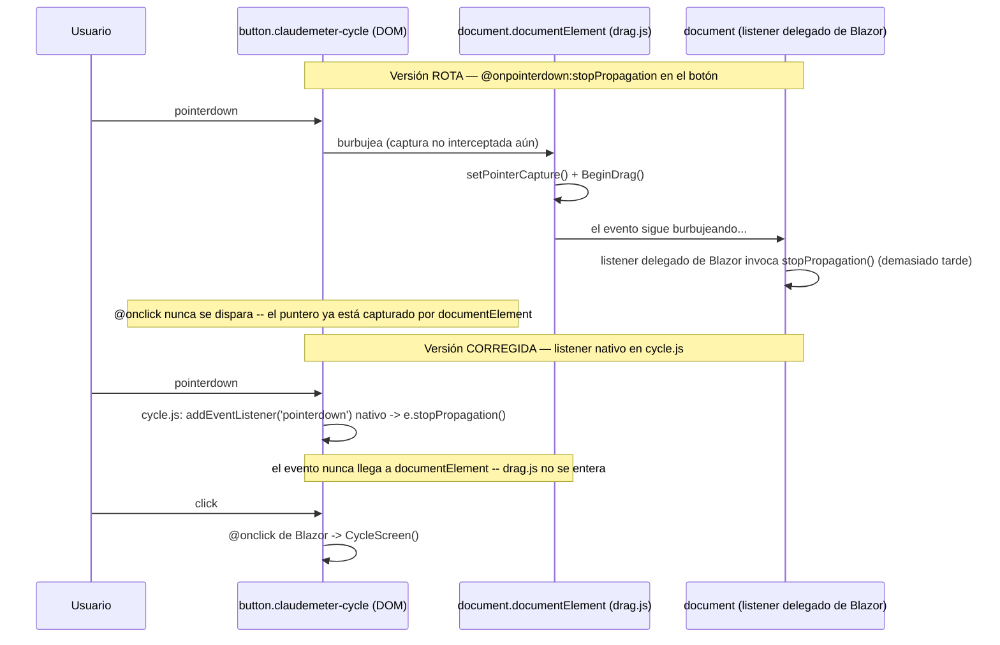
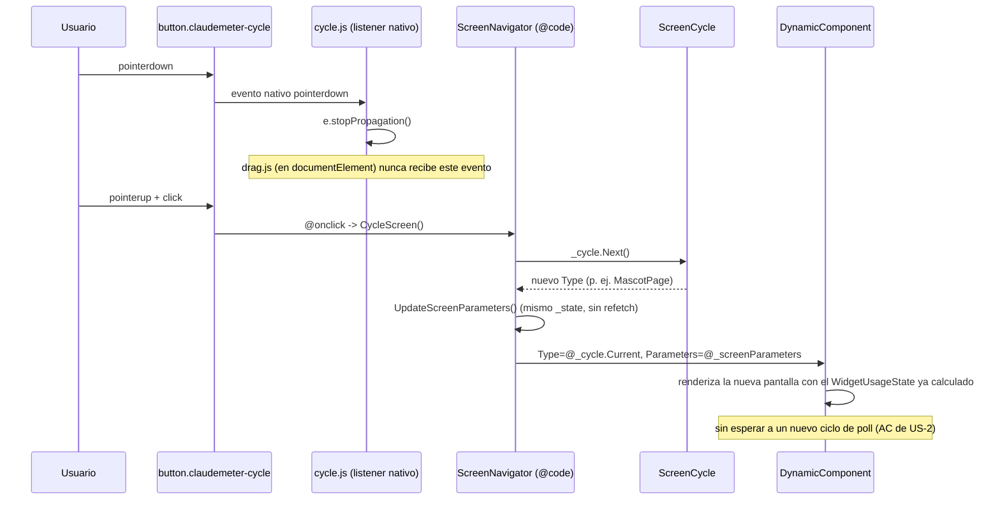
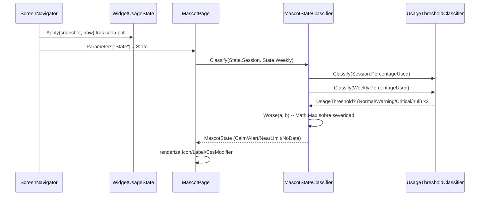

# F3 — UX + página Mascota, Ciclo C — Documentación Técnica

## Overview

Este ciclo cierra el milestone F3. Introduce un mecanismo genérico de
navegación entre pantallas del widget (US-1, issue #18: `ScreenNavigator` +
`IWidgetScreen`) y la primera pantalla adicional que lo consume, la mascota
"Clawd" (US-2, issue #19: `MascotPage.razor` + `MascotState` en Domain).
`ScreenNavigator` pasa a ser el nuevo `RootComponent` real de
`BlazorWebView` — el único componente Razor garantizado vivo durante toda la
vida de la aplicación — absorbiendo todo lo que hasta el Ciclo B gestionaba
`UsagePage.razor` (polling, chime, tema, y los tres `DotNetObjectReference`
de drag/resize/close vía JS interop). `UsagePage` y `MascotPage` quedan como
componentes puramente presentacionales, ambos dirigidos por el mismo
`[Parameter] WidgetUsageState`.

Este documento también recoge **dos correcciones manuales aplicadas después
de `sdlc-development`**, no reflejadas en su resumen de implementación: un
bugfix de event ordering en el botón `.claudemeter-cycle` y un reposicionamiento
visual del mismo botón. Ambas están ya presentes en el código real
inspeccionado para este documento (`wwwroot/js/cycle.js`,
`Navigation/ScreenNavigator.razor`, `wwwroot/css/app.css`).

## Architecture

`ScreenNavigator` centraliza los cuatro servicios de ciclo de vida
(`WindowDragService`, `WindowResizeService`, `WindowCloseService`,
`PollingControlService`) que hasta el Ciclo B vivían en `UsagePage`. La
razón no es estética: es la única forma de garantizar una única fuente de
verdad para `(Session, Weekly, Status, IsStale)` compartida por ambas
pantallas sin duplicar llamadas HTTP, y de que los gestos sobre la ventana
completa (arrastre, cierre) no dependan de qué `IWidgetScreen` esté visible
en cada momento.

```mermaid
flowchart TD
    subgraph Root["ScreenNavigator (RootComponent real)"]
        UPC["UsagePollingCoordinator"]
        PCS_IN["PollingControlService (inyectado)"]
        State["WidgetUsageState (_session, _weekly, _status, _isStale)"]
        Cycle["ScreenCycle (lógica pura de índice)"]
        DragRef["DotNetObjectReference&lt;WindowDragService&gt;"]
        ResizeRef["DotNetObjectReference&lt;WindowResizeService&gt;"]
        CloseRef["DotNetObjectReference&lt;WindowCloseService&gt;"]
    end

    subgraph Screens["Pantallas (puramente presentacionales)"]
        Usage["UsagePage.razor\n[Parameter] State\nIWidgetScreen(\"usage\")"]
        Mascot["MascotPage.razor\n[Parameter] State\nIWidgetScreen(\"mascot\")"]
    end

    subgraph DomainLayer["Domain"]
        MSC["MascotStateClassifier.Classify(Session, Weekly)"]
        UTC["UsageThresholdClassifier (reutilizado)"]
    end

    UPC -->|SnapshotReceived| State
    State -->|Apply| Cycle
    Cycle -->|DynamicComponent Type=Current| Usage
    Cycle -->|DynamicComponent Type=Current| Mascot
    Mascot --> MSC
    MSC --> UTC

    DragRef -. "claudeMeterDrag.init" .-> JSDrag["drag.js\n(document.documentElement)"]
    CloseRef -. "claudeMeterClose.init" .-> JSClose["close.js\n(pointerdown nativo sobre .claudemeter-close)"]
    ResizeRef -. "claudeMeterResize.init" .-> JSResize["resize.js"]
    Root -. "claudeMeterCycle.init (sin DotNetObjectReference)" .-> JSCycle["cycle.js\n(pointerdown nativo sobre .claudemeter-cycle)"]
```

## Key Components

- **`Domain/Usage/MascotState.cs`** (nuevo) — enum de 4 valores
  (`Calm`/`Alert`/`NearLimit`/`NoData`) + `MascotStateClassifier.Classify(RateLimitWindow
  session, RateLimitWindow weekly)`, función pura sin E/S. Reutiliza
  `UsageThresholdClassifier` sobre cada ventana y aplica la regla de "peor
  caso" (`Worse`, basada en `Math.Max` sobre los valores enteros de
  `UsageThreshold`, declarado `Normal=0 < Warning=1 < Critical=2`). Devuelve
  `NoData` únicamente cuando ninguna de las dos ventanas tiene porcentaje
  interpretable — no cuando solo una de las dos lo tiene.

- **`Desktop/Navigation/IWidgetScreen.cs`** (nuevo) — contrato mínimo
  (`string ScreenId { get; }`). `ScreenNavigator` nunca conoce el interior de
  una pantalla concreta; el tipo se identifica solo por `typeof(...)`.

- **`Desktop/Navigation/ScreenCycle.cs`** (nuevo) — ciclado por índice sobre
  `IReadOnlyList<Type>`, sin ninguna dependencia de Blazor/WPF (mismo
  criterio de separación que `WindowPositionResolver` frente a
  `MainWindow`). Con una única pantalla registrada, `Next()` nunca lanza y
  siempre devuelve el mismo tipo.

- **`Desktop/Navigation/WidgetUsageState.cs`** (nuevo) — `record` compartido
  (`Session`, `Weekly`, `Status`, `IsStale`) pasado como único `[Parameter]`
  a la pantalla activa vía `DynamicComponent.Parameters` (un
  `IDictionary<string, object>` por nombre de clave — un único parámetro
  evita mantener sincronizados varios nombres de clave en dos ficheros
  distintos).

- **`Desktop/Navigation/ScreenNavigator.razor`** (nuevo) — nuevo
  `RootComponent` real. Posee el `UsagePollingCoordinator`, se adjunta a
  `PollingControlService`, registra los tres `DotNetObjectReference` de
  drag/resize/close en `OnAfterRenderAsync` (una única vez en toda la vida
  de la app), renderiza `.claudemeter-close`, el botón `.claudemeter-cycle`
  condicional (`_cycle.ScreenCount > 1`) y el `<DynamicComponent Type="@_cycle.Current"
  Parameters="@_screenParameters" />`. Corrige además la rama `Unauthorized`
  de `Apply()`: resetea `_session`/`_weekly` a `RateLimitWindow.Unavailable`
  (antes, heredado de F2, conservaba el último valor parseado con éxito —
  invisible para `UsagePage`, que ya ignoraba esos campos en ese estado, pero
  necesario para que `MascotStateClassifier` resuelva `NoData`).

- **`Pages/UsagePage.razor`** (modificado en profundidad) — ahora
  `[Parameter, EditorRequired] WidgetUsageState State`, `@implements
  IWidgetScreen`, renderiza `UsageBar`x2 o `ReauthNotice` según
  `State.Status`. Sin inyección de servicios de polling/ventana.

- **`Pages/MascotPage.razor`** (nuevo) — mismo patrón: `[Parameter,
  EditorRequired] WidgetUsageState State`, `@implements IWidgetScreen`.
  `CurrentState` es una propiedad calculada (`MascotStateClassifier.Classify(State.Session,
  State.Weekly)`), recalculada en cada render — nunca se conserva entre
  ciclos, cumpliendo la restricción de `CLAUDE.md` de "driven only by the
  current snapshot, no history dependency". Renderiza icono + etiqueta según
  4 combinaciones de `CssModifier`/`Icon`/`Label`.

- **`MainWindow.xaml`** — `RootComponent.ComponentType` pasa de `{x:Type
  pages:UsagePage}` a `{x:Type navigation:ScreenNavigator}`. Sin cambios en
  `MainWindow.xaml.cs`/`App.xaml.cs`: los cuatro servicios ya estaban
  registrados como singleton desde los Ciclos A/B, este ciclo solo mueve
  quién los inyecta.

## Corrección post-development 1: event ordering del botón `.claudemeter-cycle`

**Síntoma detectado en validación manual:** el botón `⇄` no respondía al
clic de ratón — solo funcionaba activándolo con teclado (Espacio/Enter con
el botón enfocado).

**Causa raíz.** La primera versión usaba el modificador de Blazor
`@onpointerdown:stopPropagation="true"` directamente en el marcado del
botón, exactamente el mismo patrón usado para resolver este problema en
`.claudemeter-close` en el Ciclo B — pero ese patrón depende de un detalle
que no se cumple aquí: `close.js` resuelve el problema con un listener
**nativo** de `pointerdown` registrado directamente sobre el elemento del
botón, mientras que el modificador `@onpointerdown:stopPropagation` de
Blazor no es un listener nativo sobre el botón — es Blazor quien despacha
el evento delegando desde un único listener nativo que registra en
`document`. En el burbujeo real del evento DOM, `document` se alcanza
**después** que `document.documentElement`, que es donde `drag.js` escucha
`pointerdown` (ver `wwwroot/js/drag.js`, línea 15) y llama a
`root.setPointerCapture(e.pointerId)` de forma síncrona. Es decir: para
cuando el evento llega al listener delegado de Blazor en `document` y este
podría invocar `stopPropagation()`, `drag.js` ya ha capturado el puntero y
ya ha iniciado un arrastre — el clic nunca llega a disparar `@onclick` sobre
el botón porque el propio navegador ha redirigido la captura de puntero al
elemento raíz.



**Corrección aplicada.** Mismo patrón ya usado por `.claudemeter-close`
desde el Ciclo B: un listener **nativo** de JavaScript registrado
directamente sobre el elemento del botón, en un fichero nuevo dedicado
(`wwwroot/js/cycle.js`, registrado en `wwwroot/index.html` junto a
`drag.js`/`resize.js`/`close.js`):

```javascript
// wwwroot/js/cycle.js
window.claudeMeterCycle = {
    init: function () {
        const button = document.querySelector('.claudemeter-cycle');
        if (!button) return;
        button.addEventListener('pointerdown', function (e) {
            e.stopPropagation();
        });
    }
};
```

Se inicializa desde `ScreenNavigator.OnAfterRenderAsync` (`firstRender`),
igual que los otros tres registros de interop, vía `JS.InvokeVoidAsync("claudeMeterCycle.init")`
— sin `DotNetObjectReference`, porque a diferencia de `close.js` este
listener no necesita invocar ningún método `[JSInvokable]` en .NET: el
`@onclick="CycleScreen"` de Blazor sobre el propio botón sigue gestionando
el cambio de pantalla normalmente una vez que `drag.js` deja de robarle el
gesto. El modificador `@onpointerdown:stopPropagation="true"` se retiró del
marcado del botón en `ScreenNavigator.razor` (ya no aporta nada, sustituido
por el listener nativo de `cycle.js`).

## Corrección post-development 2: reposicionamiento visual de `.claudemeter-cycle`

El botón `.claudemeter-cycle` se movió de la esquina superior izquierda
(`top: 4px; left: 4px`) a la esquina superior derecha (`top: 4px; right:
26px`), quedando agrupado junto a `.claudemeter-close` (`right: 4px`) en la
misma barra de controles superior — `right: 26px` corresponde a los 18px de
ancho de `.claudemeter-close` más 4px de separación más los 4px de margen
de `.claudemeter-close` respecto al borde. Cambio puramente de CSS
(`wwwroot/css/app.css`), sin ningún efecto sobre `ScreenNavigator.razor` ni
sobre la lógica de ciclado — ambos botones conservan el mismo tratamiento
visual (opacidad 0 salvo hover/foco sobre `.claudemeter-root`).

## Data Flow / Sequence

Flujo de cambio de pantalla con el botón `⇄`, ya con la corrección aplicada:



Flujo de derivación de `MascotState` en cada render de `MascotPage`:



## Edge Cases & Error Handling

- **Una única pantalla registrada:** `ScreenCycle` no lanza y `Next()`
  siempre devuelve el mismo tipo; `ScreenNavigator` no renderiza el botón
  `.claudemeter-cycle` en absoluto (`_cycle.ScreenCount > 1`) — decisión de
  UX, no un requisito de la AC (que solo exige que ciclar no falle).
- **Snapshot `Unauthorized`:** `Apply()` resetea `_session`/`_weekly` a
  `RateLimitWindow.Unavailable` (corrección de este ciclo). `MascotStateClassifier.Classify(Unavailable,
  Unavailable)` resuelve `NoData` (`UsageThresholdClassifier.Classify(null)` devuelve
  `null` para ambas ventanas). `UsagePage` ya ignoraba estos campos en este
  estado (renderiza `ReauthNotice`), así que la corrección es invisible para
  esa pantalla.
- **Una ventana sin dato individual, la otra con dato real:** `Worse(a, b)`
  usa la que sí tiene dato sin penalizar — no cae a `NoData` salvo que
  ambas sean `null`.
- **Registro de `claudeMeterCycle.init` falla (interop JS):** mismo patrón
  defensivo que los otros tres registros — `try/catch` con `PageLogger.LogError`,
  no interrumpe el resto de `OnAfterRenderAsync`.
- **Carrera benigna en `OnSnapshotReceived`:** `MainWindow` cerrado mientras
  una respuesta HTTP está en vuelo — `catch (Exception ex) when (ex is
  ObjectDisposedException or InvalidOperationException)`, gap de cobertura
  ya aceptado en ciclos anteriores (heredado de `UsagePage`, F1-F3).
- **`DynamicComponent` recreando la pantalla saliente al ciclar:** ni
  `UsagePage` ni `MascotPage` tienen estado interno propio que perder — ambas
  son funciones puras de `State` recalculadas en cada render.

## Extension points

Añadir una pantalla nueva (p. ej. `PeakOffPeakPage` en F4) requiere
únicamente: implementar `IWidgetScreen`, aceptar `[Parameter, EditorRequired]
WidgetUsageState State`, y añadir su `typeof(...)` al array
`ScreenNavigator.DefaultScreens` — sin tocar `ScreenCycle`, sin tocar la
lógica de ciclado, sin tocar `UsagePage`/`MascotPage`.

## Estado de tests y validación manual

Según `docs/sdlc/testing/f3-ux-mascota-ciclo-c.md`: 335/335 tests en verde
en `dotnet test ClaudeMeter.sln`, con `MascotStateClassifier` al
100%/100% de cobertura línea/rama y `ScreenNavigator`/`ScreenCycle` por
encima del 70% objetivo (gaps aceptados y documentados). Las dos
correcciones manuales de este documento son posteriores a esa fase de
testing y a `sdlc-development`: no existe todavía un test automatizado que
verifique el `stopPropagation()` nativo de `cycle.js` (el mismo gap ya
aceptado para el `stopPropagation()` de `close.js` en el Ciclo B — requiere
un evento `pointerdown` real del sistema operativo, no reproducible de
forma determinista en bUnit). La validación manual pendiente en la
Definition of Done de Requirements/Design/Testing queda, con estas dos
correcciones, confirmada para el gesto de clic sobre `.claudemeter-cycle`;
el resto de la Definition of Done (comportamiento correcto de los 4 estados
de `MascotPage`, ausencia de regresión en Ciclos A/B) sigue pendiente de
confirmación manual explícita por el usuario, fuera del alcance de este
pipeline de agentes.
