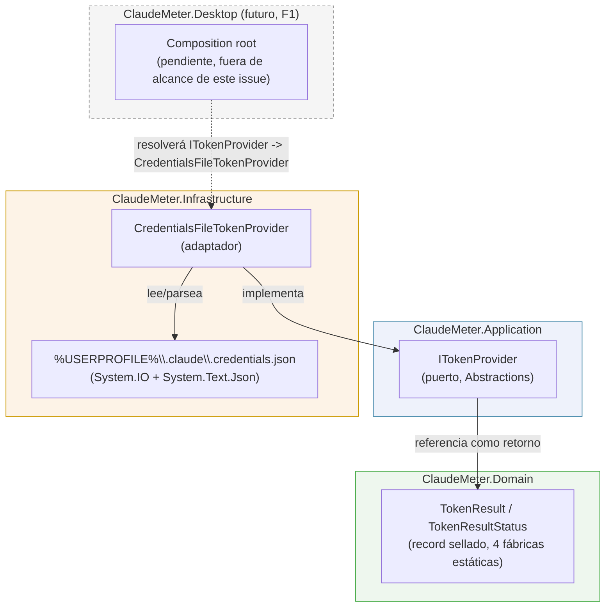
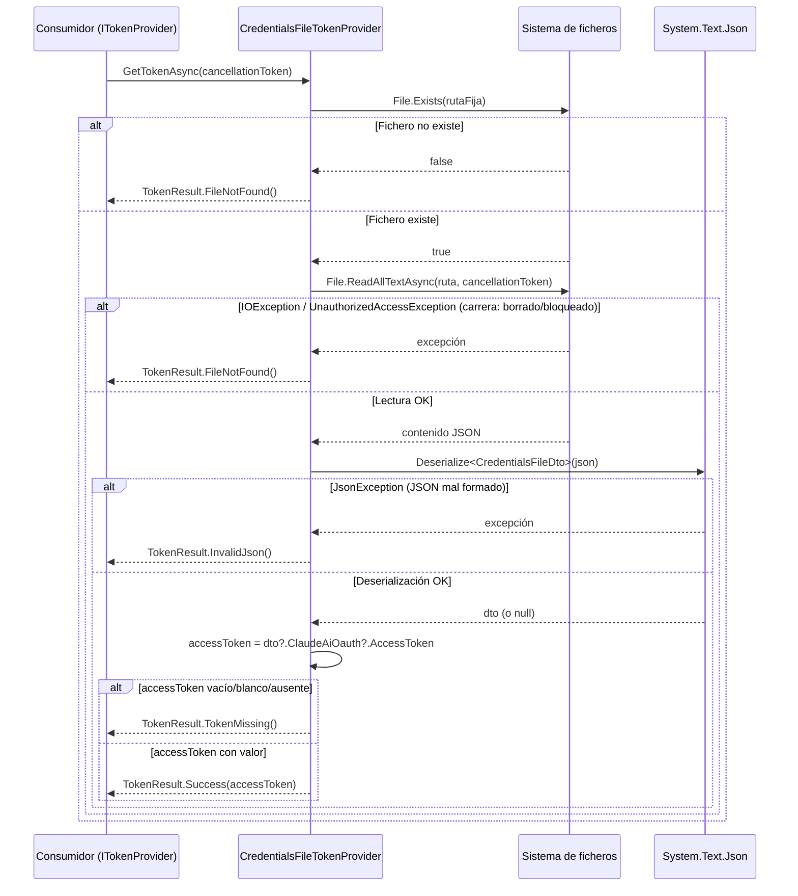

# [F0] Leer token desde .credentials.json — Documentación Técnica

## Overview

Este componente resuelve la primera pieza crítica del roadmap F0 de ClaudeMeter:
obtener el token OAuth que el CLI de Claude Code ya ha generado y guardado en
disco, para que el resto de la aplicación (llamadas a la API, cálculo de rate
limits, renderizado) pueda usarlo sin conocer dónde vive ni cómo está
serializado.

Se compone de tres tipos nuevos, uno por capa de Clean Architecture:

- `ClaudeMeter.Domain.Authentication.TokenResult` / `TokenResultStatus` (Domain).
- `ClaudeMeter.Application.Abstractions.ITokenProvider` (Application, puerto).
- `ClaudeMeter.Infrastructure.Authentication.CredentialsFileTokenProvider`
  (Infrastructure, adaptador).

No incluye llamadas HTTP, cálculo de countdown/porcentajes de rate limit, ni
refresco de OAuth: esas responsabilidades permanecen en clases separadas de
fases posteriores (F1/F2), conforme a la regla de `CLAUDE.md` de no colapsar
"leer el token", "llamar a la API", "calcular el countdown" y "renderizar" en
una sola clase.

## Architecture

El flujo de dependencias respeta Clean Architecture: Infrastructure depende de
Application, Application depende solo de Domain, y Domain no depende de nada.



Puntos clave de diseño preservados:

- `ClaudeMeter.Domain` no conoce `ITokenProvider` ni `CredentialsFileTokenProvider`;
  solo expone el value object `TokenResult`, sin dependencias de paquete NuGet
  ni de E/S.
- `ClaudeMeter.Application` define `ITokenProvider` y lo tipa con `TokenResult`
  (Domain) como retorno; no referencia `System.IO`, `System.Text.Json` ni
  ningún tipo de `ClaudeMeter.Infrastructure`.
- `ClaudeMeter.Infrastructure` es la única capa que toca el sistema de
  ficheros y el parseo JSON.
- El cableado DI (`ITokenProvider` → `CredentialsFileTokenProvider`) en el
  composition root de Desktop **no existe todavía**: queda fuera del alcance
  de este issue y llegará con F1.

## Key Components

### `TokenResult` / `TokenResultStatus` (`src/ClaudeMeter.Domain/Authentication/TokenResult.cs`)

Value object del dominio que modela el resultado de intentar obtener el
token como un tipo explícito, en vez de `string?` o un `Result<T>` genérico.

- `TokenResultStatus` (enum): `Success`, `FileNotFound`, `InvalidJson`,
  `TokenMissing`.
- `TokenResult` (record sellado, constructor privado): expone `Status`,
  `AccessToken` (`string?`, solo relleno en `Success`) e `IsSuccess`
  (`Status == TokenResultStatus.Success`).
- Cuatro fábricas estáticas — `Success(string accessToken)`, `FileNotFound()`,
  `InvalidJson()`, `TokenMissing()` — son el único modo de construir una
  instancia. Esto hace imposible representar un estado inconsistente (p. ej.
  `Success` sin token) y da nombres autoexplicativos a los consumidores/tests.
- Sin dependencias externas: es núcleo de dominio puro.

### `ITokenProvider` (`src/ClaudeMeter.Application/Abstractions/ITokenProvider.cs`)

Puerto pequeño de Application (no un `IUsageService` monolítico), con un
único método:

```csharp
public interface ITokenProvider
{
    Task<TokenResult> GetTokenAsync(CancellationToken cancellationToken = default);
}
```

Es asíncrono por dos motivos documentados en el diseño: (1) el resto de
Application se construye sobre MediatR con handlers asíncronos, y un puerto
síncrono forzaría a los consumidores a bloquear un hilo; (2) deja la puerta
abierta a una futura implementación (p. ej. Windows Credential Manager) que sí
necesite E/S realmente asíncrona, sin romper la firma del puerto.

### `CredentialsFileTokenProvider` (`src/ClaudeMeter.Infrastructure/Authentication/CredentialsFileTokenProvider.cs`)

Único adaptador de `ITokenProvider` en esta fase. Su responsabilidad se
limita estrictamente a leer y parsear el fichero de credenciales — no realiza
llamadas HTTP ni calcula rate limits.

**Localización del fichero**: constructor público sin parámetros que resuelve
siempre la ruta fija `%USERPROFILE%\.claude\.credentials.json` vía
`Environment.GetFolderPath(Environment.SpecialFolder.UserProfile)` combinado
con `.claude\.credentials.json`. La ruta está hardcodeada a propósito en F0
(no hay configurabilidad de ruta hasta F2 con `config.json`). Existe además un
constructor `internal` que acepta la ruta explícitamente, habilitado para
`ClaudeMeter.Infrastructure.Tests` mediante:

```xml
<InternalsVisibleTo Include="ClaudeMeter.Infrastructure.Tests" />
```

en `src/ClaudeMeter.Infrastructure/ClaudeMeter.Infrastructure.csproj`. Este
constructor no forma parte de la superficie pública del ensamblado y existe
únicamente para que los tests apunten a un fichero de fixture temporal, nunca
a la ruta real de producción.

**Parseo**: se deserializa el JSON con `System.Text.Json` contra dos DTOs
privados que mapean los nombres `camelCase` del fichero real:

```csharp
private sealed record CredentialsFileDto(
    [property: JsonPropertyName("claudeAiOauth")] OAuthSectionDto? ClaudeAiOauth);

private sealed record OAuthSectionDto(
    [property: JsonPropertyName("accessToken")] string? AccessToken);
```

El acceso a `dto?.ClaudeAiOauth?.AccessToken` usa encadenamiento
null-conditional, por lo que un JSON válido pero con forma inesperada (p. ej.
el literal `null`, un array, o un objeto sin `claudeAiOauth`) nunca lanza —
simplemente produce `accessToken == null`, que cae en `TokenMissing()`.

## Data Flow / Sequence

Secuencia de `GetTokenAsync` y sus cuatro ramas de resultado posibles:



`OperationCanceledException` por cancelación cooperativa del
`CancellationToken` se deja propagar sin capturar (convención estándar de
.NET); no se mapea a ningún estado de `TokenResult` porque no es un caso de
"sin datos" del dominio.

## Edge Cases & Error Handling

Catálogo exacto de excepciones capturadas y su mapeo (no hay ningún
`catch (Exception)` genérico — un catch-all ocultaría fallos de programación
reales bajo un estado de dominio que no les corresponde):

| Punto en el código | Excepción capturada | Estado resultante |
|---|---|---|
| `File.Exists` (no lanza) | — | `FileNotFound()` si devuelve `false` |
| `File.ReadAllTextAsync` | `IOException`, `UnauthorizedAccessException` | `FileNotFound()` (condición de carrera: el fichero existía en el check pero dejó de ser accesible) |
| `JsonSerializer.Deserialize<CredentialsFileDto>` | `JsonException` | `InvalidJson()` |
| `accessToken` nulo/vacío/blanco (`dto` nulo, `ClaudeAiOauth` nulo, o `AccessToken` nulo/`IsNullOrWhiteSpace`) | — (sin excepción, vía null-conditional) | `TokenMissing()` |
| Cancelación del `CancellationToken` | `OperationCanceledException` | Se propaga sin capturar (no es un estado de `TokenResult`) |

Consideraciones de seguridad: en ningún estado de fallo (`FileNotFound`,
`InvalidJson`, `TokenMissing`) se incluye el contenido del fichero ni
fragmentos del JSON; el token nunca se registra en logs ni en mensajes de
excepción propagados. El fichero se lee en texto plano (sin Windows
Credential Manager, según el roadmap F0); no se añade cifrado adicional en
este issue.

No hay reintentos en esta clase — el retry con backoff planeado para F2
aplica a las llamadas HTTP a la API, no a esta lectura local.

### Desviación respecto al diseño: colisión de namespace en `App.xaml.cs`

Al introducir el namespace `ClaudeMeter.Application.Abstractions` (exigido
por el diseño y por `CLAUDE.md`), `ClaudeMeter.Desktop` —que ya referenciaba
`ClaudeMeter.Application.csproj` desde el scaffolding F0— dejó de compilar.
`src/ClaudeMeter.Desktop/App.xaml.cs` declaraba `public partial class App :
Application`, y el compilador empezó a resolver el identificador
`Application` contra el namespace `ClaudeMeter.Application` (visible a través
de la referencia de proyecto) en vez de la clase `System.Windows.Application`,
produciendo el error `CS0118`.

Es un efecto colateral inevitable de introducir el namespace que el propio
diseño exige, no una decisión de diseño alternativa. La corrección aplicada
fue cualificar completamente el tipo base en el único punto afectado:

```csharp
public partial class App : System.Windows.Application
```

sin tocar ninguna otra lógica de Desktop. Los ficheros `.xaml` generados
(`App.g.cs`/`MainWindow.g.cs`) ya cualificaban `System.Windows.Application`
explícitamente y no se vieron afectados.

**Nota para mantenedores**: este tipo de colisión puede repetirse si se
añaden más namespaces raíz en Application/Infrastructure que coincidan con
tipos comunes de WPF (`Application`, `Window`, `Application.Current`, etc.).
Al añadir un nuevo namespace bajo `ClaudeMeter.Application` o
`ClaudeMeter.Infrastructure`, conviene compilar `ClaudeMeter.Desktop` como
parte de la verificación, no solo los proyectos directamente modificados.

## Testing Strategy / Cobertura

- **Ubicación de los tests**: `test/ClaudeMeter.Infrastructure.Tests/Authentication/CredentialsFileTokenProviderTests.cs`
  y `test/ClaudeMeter.Domain.Tests/Authentication/TokenResultTests.cs`.
- **Cómo se simula el fichero**: cada test de `CredentialsFileTokenProviderTests`
  genera una ruta única bajo `Path.GetTempPath()`
  (`claudemeter-tests-{Guid.NewGuid()}.json`), usa el constructor `internal`
  (habilitado vía `InternalsVisibleTo`) para apuntar `CredentialsFileTokenProvider`
  a ese fichero, y lo borra en `Dispose()` (la clase de test implementa
  `IDisposable`). Nunca se usa la ruta real de producción ni un token real —
  el valor de fixture es la constante `"fake-access-token-for-tests"`.
- **Casos cubiertos** (8 métodos de test, 11 casos ejecutados en Infrastructure):
  éxito con token exacto, fichero ausente, fichero bloqueado por otro proceso
  (`IOException` forzada con `FileShare.None`, condición de carrera), JSON mal
  formado, JSON válido sin `accessToken`, `accessToken` vacío/en blanco
  (`[Theory]`), `IsSuccess` uniforme sobre los tres estados de fallo
  (`[Theory]`), y el caso límite de JSON literal `null`.
- **`TokenResultTests`** (Domain, 5 métodos / 7 casos): verifica que cada
  fábrica estática produce el `Status`/`AccessToken`/`IsSuccess` esperado, sin
  E/S.
- **No se usa `IFileSystem`/`System.IO.Abstractions`**: se rechazó
  deliberadamente por YAGNI — escribir un fichero temporal real es
  determinista y evita una indirección nueva para una única clase que lee un
  único fichero.

**Resultado medido** (`dotnet test --collect:"XPlat Code Coverage"`, formato
Cobertura vía `coverlet.collector`):

| Fichero | Líneas | Ramas |
|---|---|---|
| `TokenResult.cs` | 100% (12/12) | 100% |
| `CredentialsFileTokenProvider.cs` (ensamblado) | 85.4% (41/48) | 100% (8/8) |
| `GetTokenAsync` (método con la lógica de negocio) | 100% | 100% |

Objetivo de `testingCoverage` (`.claude/sdlc.config.yaml`): 70%. Ambos
ficheros lo superan holgadamente. El hueco del 85.4% a nivel de ensamblado
corresponde deliberadamente al **constructor público sin parámetros** y a
`GetDefaultCredentialsFilePath()`: ejercitarlos implicaría tocar la ruta real
de producción, lo que las reglas del proyecto prohíben explícitamente ("nunca
un token real en tests", "nunca la ruta real de producción"). Es un hueco
documentado y aceptado, no una omisión.

`dotnet test ClaudeMeter.sln`: 18/18 tests correctos (11 en Infrastructure, 7
en Domain; `Application.Tests` y `Desktop.Tests` siguen vacíos, fuera de
alcance de este issue). `dotnet build -c Release`: 0 advertencias, 0 errores
(Roslyn analyzers + warnings-as-errors).

## Extension points

- Una futura implementación de `ITokenProvider` (p. ej. integración con
  Windows Credential Manager, prevista para fases posteriores) debe seguir
  devolviendo `TokenResult` con los mismos cuatro estados semánticos en vez de
  lanzar para los casos esperados, preservando el contrato de sustituibilidad
  tipo Liskov ya fijado aquí.
- El `catch (JsonException)` es el único punto de inserción necesario para
  que F2 añada logging estructurado (Serilog) del caso `InvalidJson` sin
  rediseñar la clase — F0 no incorpora ningún framework de logging todavía.
- El cableado DI (`ITokenProvider` → `CredentialsFileTokenProvider`) en el
  composition root de `ClaudeMeter.Desktop` queda pendiente para F1.
