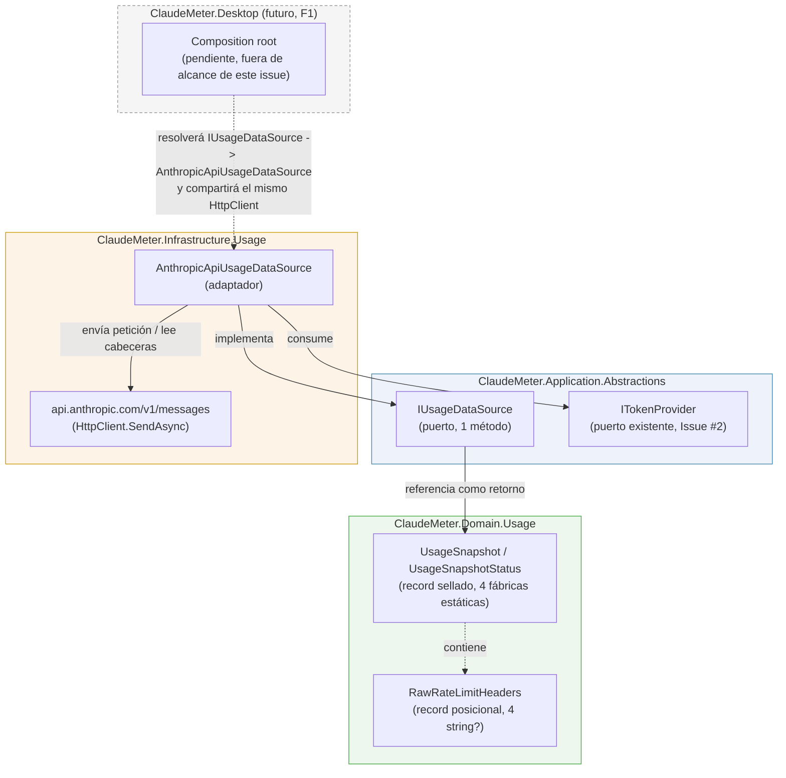
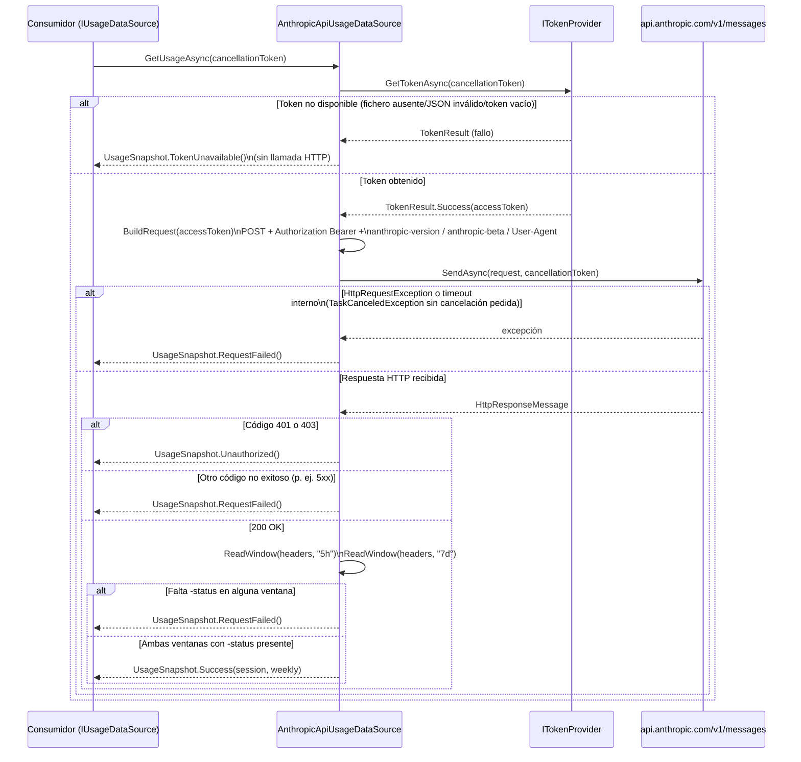

# [F0] Llamada HTTP con headers OAuth correctos — Documentación Técnica

## Overview

Este componente resuelve la segunda pieza crítica del roadmap F0 de ClaudeMeter:
llamar a la API de Anthropic (`POST /v1/messages`) usando el token OAuth ya
obtenido por `ITokenProvider` (Issue #2) y exponer, en crudo, las cabeceras
`anthropic-ratelimit-unified-5h-*`/`-7d-*` de la respuesta. No calcula
countdowns, minutos ni porcentajes — esa responsabilidad queda para una fase
posterior (F1), consumidora de este tipo.

Se compone de tres tipos nuevos, uno por capa de Clean Architecture,
exactamente el mismo patrón ya usado en Issue #2:

- `ClaudeMeter.Domain.Usage.UsageSnapshot` / `UsageSnapshotStatus` /
  `RawRateLimitHeaders` (Domain).
- `ClaudeMeter.Application.Abstractions.IUsageDataSource` (Application,
  puerto).
- `ClaudeMeter.Infrastructure.Usage.AnthropicApiUsageDataSource`
  (Infrastructure, adaptador).

No incluye: parseo de las cabeceras a minutos/porcentaje, refresco de OAuth
propio ante 401/403 (nunca se implementa en este proyecto, por regla de
`CLAUDE.md`), reintentos ante fallos transitorios (F2), polling periódico
(F1) ni el cableado del composition root de `ClaudeMeter.Desktop` (tampoco
F1 — no existe todavía ningún contenedor DI en `App.xaml.cs`).

## Architecture

El flujo de dependencias respeta Clean Architecture: Infrastructure depende
de Application, Application depende solo de Domain, y Domain no depende de
nada externo. `AnthropicApiUsageDataSource` **consume** `ITokenProvider`
(Issue #2) en vez de leer el fichero de credenciales directamente.



Puntos clave de diseño preservados:

- `ClaudeMeter.Domain` no conoce `IUsageDataSource` ni
  `AnthropicApiUsageDataSource`; solo expone los value objects
  `UsageSnapshot`/`RawRateLimitHeaders`, sin dependencia de paquete NuGet
  ni de E/S.
- `ClaudeMeter.Application` define `IUsageDataSource` tipado con
  `UsageSnapshot` (Domain) como retorno; no referencia `System.Net.Http`,
  `System.Text.Json` ni ningún tipo de `ClaudeMeter.Infrastructure`.
- No se introduce ningún `IUsageService` monolítico — `IUsageDataSource` es
  un puerto pequeño y de responsabilidad única, tal y como exige
  `CLAUDE.md`.
- `AnthropicApiUsageDataSource` es la única pieza que construye/envía la
  petición HTTP; delega la obtención del token en `ITokenProvider` en vez
  de leer `.credentials.json` directamente, preservando la regla de
  `CLAUDE.md` de mantener "leer el token", "llamar a la API", "calcular el
  countdown" y "renderizar" como clases separadas.
- El cableado DI (`IUsageDataSource` → `AnthropicApiUsageDataSource`, con
  el `HttpClient` singleton compartido) en el composition root de Desktop
  **no existe todavía**: queda fuera del alcance de este issue y llegará
  con F1.

## Key Components

### `UsageSnapshot` / `UsageSnapshotStatus` / `RawRateLimitHeaders` (`src/ClaudeMeter.Domain/Usage/UsageSnapshot.cs`)

Value object del dominio que modela el resultado de intentar obtener el
snapshot de uso como un tipo explícito, análogo a `TokenResult` (Issue #2).

- `UsageSnapshotStatus` (enum): `Success`, `TokenUnavailable`,
  `Unauthorized`, `RequestFailed`.
- `RawRateLimitHeaders` (record posicional): `Status`, `Utilization`,
  `Remaining`, `Reset` — los cuatro sufijos de cabecera por ventana, todos
  `string?` nullable porque el nombre exacto de la cabecera "cantidad"
  (`utilization` vs `remaining`) no está confirmado oficialmente por
  Anthropic. Se usa una instancia para la ventana de sesión (5h) y otra
  para la semanal (7d).
- `UsageSnapshot` (record sellado, constructor privado): expone `Status`,
  `Session`/`Weekly` (`RawRateLimitHeaders?`, solo rellenas en `Success`) e
  `IsSuccess` (`Status == UsageSnapshotStatus.Success`).
- Cuatro fábricas estáticas — `Success(session, weekly)`,
  `TokenUnavailable()`, `Unauthorized()`, `RequestFailed()` — son el único
  modo de construir una instancia, haciendo imposible representar un
  estado inconsistente (p. ej. `Success` sin `Session`/`Weekly`).
- Sin dependencias externas: es núcleo de dominio puro.

### `IUsageDataSource` (`src/ClaudeMeter.Application/Abstractions/IUsageDataSource.cs`)

Puerto pequeño de Application, con un único método:

```csharp
public interface IUsageDataSource
{
    Task<UsageSnapshot> GetUsageAsync(CancellationToken cancellationToken = default);
}
```

Firma idéntica en espíritu a `ITokenProvider.GetTokenAsync` (asíncrona,
`CancellationToken` opcional, devuelve un tipo de dominio explícito en vez
de `HttpResponseMessage`/`Result<T>` genérico). Nunca lanza para los casos
esperados de "sin datos" (sin token, no autorizado, fallo de la petición) —
esos casos se representan en el `UsageSnapshot` devuelto, de forma que
cualquier implementación futura (simulada, `BleUsageSink` de F7) sea
sustituible sin cambiar el comportamiento observable del contrato
(sustituibilidad tipo Liskov).

### `AnthropicApiUsageDataSource` (`src/ClaudeMeter.Infrastructure/Usage/AnthropicApiUsageDataSource.cs`)

Único adaptador de `IUsageDataSource` en esta fase.

**Inyección de dependencias**: constructor público
`(ITokenProvider tokenProvider, HttpClient httpClient)`. No usa
`IHttpClientFactory`: `ClaudeMeter.Desktop` todavía no tiene ningún
contenedor DI (`App.xaml.cs` sigue siendo la plantilla WPF por defecto),
por lo que introducir `Microsoft.Extensions.Http` solo para registrar un
único `HttpClient` con nombre habría sido una indirección desproporcionada
para el alcance de F0. El problema clásico que resuelve
`IHttpClientFactory` (agotamiento de sockets por crear un `HttpClient`
nuevo en cada petición) no aplica: se espera un único `HttpClient`,
construido una vez en el futuro composition root y reutilizado en cada
ciclo de polling (60 s en F1). El riesgo de staleness de DNS de un
`HttpClient` singleton de larga vida se mitiga configurando
`SocketsHttpHandler.PooledConnectionLifetime` en el composition root (no
en esta clase). Este diseño también simplifica los tests: un `HttpClient`
inyectado se construye trivialmente como `new HttpClient(stubHandler)`.

**Constantes de la petición**:

| Constante | Valor | Notas |
|---|---|---|
| `MessagesEndpoint` | `https://api.anthropic.com/v1/messages` | |
| `AnthropicVersion` | `2023-06-01` (header `anthropic-version`) | |
| `AnthropicBetaOAuth` | `oauth-2025-04-20` (header `anthropic-beta`) | |
| `PingModel` | `claude-haiku-4-5-20251001` (campo `model` del body) | Modelo más barato/rápido disponible, para minimizar la cuota real consumida por cada llamada; valor provisional a confirmar en la validación manual pendiente. |
| `UserAgentValue` | `claude-code/0.1.0` (header `User-Agent`) | Formato `claude-code/<versión>` confirmado como obligatorio; número de versión hardcodeado hasta que F6 introduzca `Nerdbank.GitVersioning`. |

`GetUsageAsync` obtiene el token vía `ITokenProvider.GetTokenAsync`; si no
tiene éxito, devuelve `UsageSnapshot.TokenUnavailable()` **sin construir ni
enviar ninguna petición HTTP**. Con token, `BuildRequest` construye un
`POST` con `Authorization: Bearer <token>` (vía `AuthenticationHeaderValue`,
nunca concatenado en texto libre), los tres headers anteriores, y un cuerpo
JSON mínimo (`max_tokens: 1`, un único mensaje `{"role":"user","content":"ping"}`)
serializado con `System.Text.Json` a través de los DTOs privados
`CreateMessageRequestDto`/`MessageDto`.

La respuesta se traduce así:

- 401 o 403 → `Unauthorized()` — nunca se intenta refrescar el token
  (regla de `CLAUDE.md`).
- Cualquier otro código no exitoso (p. ej. 5xx) → `RequestFailed()`.
- 200 sin `anthropic-ratelimit-unified-5h-status` **y**
  `anthropic-ratelimit-unified-7d-status` presentes → `RequestFailed()`.
  Es el único sufijo exigido como condición de éxito: el resto
  (`-utilization`, `-remaining`, `-reset`) se capturan si están presentes
  pero quedan `null` si no vienen, para no arriesgar clasificar como fallo
  una respuesta real solo porque usa un sufijo de "cantidad" distinto al
  esperado.
- 200 con ambos `-status` presentes → `Success(session, weekly)` con las
  cabeceras crudas exactas leídas por `ReadWindow`/`GetHeaderValue`.

## Data Flow / Sequence

Secuencia de `GetUsageAsync` y los cinco caminos de resultado posibles,
mapeados a los GIVEN-WHEN-THEN del documento de requisitos:



`OperationCanceledException` por cancelación cooperativa genuina del
`CancellationToken` (pedida por el propio consumidor, no un timeout interno
de `HttpClient`) se deja propagar sin capturar — mismo criterio ya aplicado
en `CredentialsFileTokenProvider` (Issue #2).

## Edge Cases & Error Handling

Catálogo exacto del único `try/catch` de la clase (no hay `catch (Exception)`
genérico — ocultaría fallos de programación reales bajo un estado de
dominio que no les corresponde):

| Punto en el código | Excepción capturada | Estado resultante |
|---|---|---|
| `_tokenProvider.GetTokenAsync` sin éxito | — (sin excepción, vía `TokenResult.IsSuccess`) | `TokenUnavailable()`, sin llamada HTTP |
| `_httpClient.SendAsync` | `HttpRequestException` (red/DNS/conexión) | `RequestFailed()` |
| `_httpClient.SendAsync` | `TaskCanceledException` filtrada `when (!cancellationToken.IsCancellationRequested)` (timeout interno de `HttpClient.Timeout`) | `RequestFailed()` |
| Respuesta 401/403 | — | `Unauthorized()` (nunca se refresca el token) |
| Respuesta no exitosa distinta de 401/403 | — | `RequestFailed()` |
| Respuesta 200 sin `-5h-status`/`-7d-status` | — | `RequestFailed()` |
| Cancelación genuina del `CancellationToken` | `OperationCanceledException` | Se propaga sin capturar (no es un estado de `UsageSnapshot`) |

Consideraciones de seguridad: el token nunca se registra ni se incluye en
mensajes de excepción propagados; ninguno de los estados de fallo
(`TokenUnavailable`, `Unauthorized`, `RequestFailed`) lleva el valor del
token ni el cuerpo de la respuesta de la API. El header `Authorization` se
construye con `AuthenticationHeaderValue`. F0 no incorpora todavía ningún
framework de logging (Serilog llega en F2).

No hay reintentos en esta clase — el retry con backoff de F2 se añadirá
alrededor de ella (o de su consumidor), no dentro, para no adelantar
alcance de F2. Cada llamada consume una cantidad mínima de cuota real
(`max_tokens: 1`, modelo más barato disponible) — riesgo aceptado
explícitamente por el documento de requisitos, no mitigable dentro de esta
clase (no existe endpoint de "solo estado").

## Testing Strategy / Cobertura

- **Ubicación de los tests**:
  `test/ClaudeMeter.Domain.Tests/Usage/UsageSnapshotTests.cs` y
  `test/ClaudeMeter.Infrastructure.Tests/Usage/AnthropicApiUsageDataSourceTests.cs`,
  con tres test doubles reutilizables en el mismo directorio de
  Infrastructure: `StubHttpMessageHandler` (respuesta pre-configurada +
  captura de la última petición/cuerpo enviados), `ThrowingHttpMessageHandler`/
  `TimeoutHttpMessageHandler` (fuerzan `HttpRequestException`/
  `TaskCanceledException` sin cancelación) y `FakeTokenProvider`
  (`ITokenProvider` mínimo que devuelve un `TokenResult` fijo).
- **Nunca token real ni red real**: cada test de
  `AnthropicApiUsageDataSourceTests` inyecta un `FakeTokenProvider` y un
  `HttpClient` construido sobre un `HttpMessageHandler` test double, sin
  librería de mocking (mismo criterio que Issue #2).
- **Casos cubiertos** (11 métodos / 13 casos ejecutados en Infrastructure,
  contando `[Theory]`): éxito con las 8 cabeceras `unified-5h-*`/`unified-7d-*`;
  `TokenUnavailable` para los tres estados de fallo de `ITokenProvider`
  (`[Theory]`, verificando que el handler nunca se invoca); 401; 403; 500;
  200 sin ninguna cabecera `unified-*`; 200 con solo la cabecera de 5h (caso
  límite: falta la ventana de 7d); `HttpRequestException`; timeout interno
  (`TaskCanceledException` sin cancelación pedida); forma exacta de los
  headers de la petición (`Authorization`, `anthropic-version`,
  `anthropic-beta`, `User-Agent`, `Content-Type`); método/URL/payload del
  `POST`.
- **`UsageSnapshotTests`** (Domain, 6 métodos / 9 casos): cada fábrica
  estática produce el `Status`/`Session`/`Weekly`/`IsSuccess` esperado,
  `IsSuccess` uniforme sobre los tres estados de fallo (`[Theory]`), y el
  caso límite de `RawRateLimitHeaders` con todos los sufijos `null`.

**Resultado medido** (`dotnet test --collect:"XPlat Code Coverage"`, formato
Cobertura vía `coverlet.collector`):

| Fichero / miembro | Líneas | Ramas |
|---|---|---|
| `UsageSnapshot.cs` (incl. `RawRateLimitHeaders`) | 100% | 100% |
| `AnthropicApiUsageDataSource` — clase contenedora (ctor, `BuildRequest`, `ReadWindow`, `GetHeaderValue`) | 100% | 100% |
| `GetUsageAsync` (máquina de estados async) | 100% | 100% |
| DTOs privados `CreateMessageRequestDto`/`MessageDto` | 100% | 100% |

Objetivo de `testingCoverage` (`.claude/sdlc.config.yaml`): 70%. Los tres
tipos de producción de este issue quedan al 100% de líneas y ramas.
`dotnet test ClaudeMeter.sln`: **39/39 correctos** en total
(`ClaudeMeter.Domain.Tests`: 15/15 — 7 de Issue #2 + 8 nuevos;
`ClaudeMeter.Infrastructure.Tests`: 24/24 — 11 de Issue #2 + 13 nuevos;
`ClaudeMeter.Application.Tests`/`ClaudeMeter.Desktop.Tests` siguen vacíos,
fuera de alcance). `dotnet build -c Release`: 0 advertencias, 0 errores
(Roslyn analyzers + warnings-as-errors).

## Gaps / pendiente

- **Validación manual contra la API real** (paso 8 del Implementation Plan
  del diseño): confirmar con un token OAuth real que la API responde 200
  con las cabeceras `anthropic-ratelimit-unified-5h-*`/`-7d-*` esperadas, y
  anotar si el sufijo real de "cantidad" es `utilization` o `remaining` (o
  ambos), y el formato exacto de `reset`. Es obligatoria antes de cerrar el
  issue original según el Acceptance Criteria heredado, pero **nunca**
  forma parte de la suite automatizada (las reglas del proyecto prohíben
  usar un token real en tests). Queda pendiente para que el usuario la
  ejecute con su propio `.credentials.json`.
- Las cabeceras `anthropic-ratelimit-unified-*` no son un contrato oficial
  documentado por Anthropic — su nombre, presencia o formato exacto pueden
  diferir de lo aquí documentado; el resultado de la validación manual
  prevalece sobre este documento si hay discrepancias.

## Extension points

- Una futura implementación de `IUsageDataSource` (fuente simulada para
  desarrollo/demo, o el `BleUsageSink` de F7) debe seguir devolviendo
  `UsageSnapshot` con los mismos cuatro estados semánticos en vez de lanzar
  para los casos esperados, preservando el contrato de sustituibilidad tipo
  Liskov ya fijado aquí — sin ningún cambio en Domain/Application.
- El cableado DI (`IUsageDataSource` → `AnthropicApiUsageDataSource`, con el
  `HttpClient` compartido y `SocketsHttpHandler.PooledConnectionLifetime`
  configurado) en el composition root de `ClaudeMeter.Desktop` queda
  pendiente para F1.
- El retry con backoff ante fallos transitorios (F2) debe envolver esta
  clase (o a su consumidor) desde fuera, sin modificar su único `try/catch`
  actual.
- El parseo de `RawRateLimitHeaders` a minutos/porcentaje/countdown (F1) es
  un consumidor nuevo de `UsageSnapshot`, no una modificación de este tipo.
