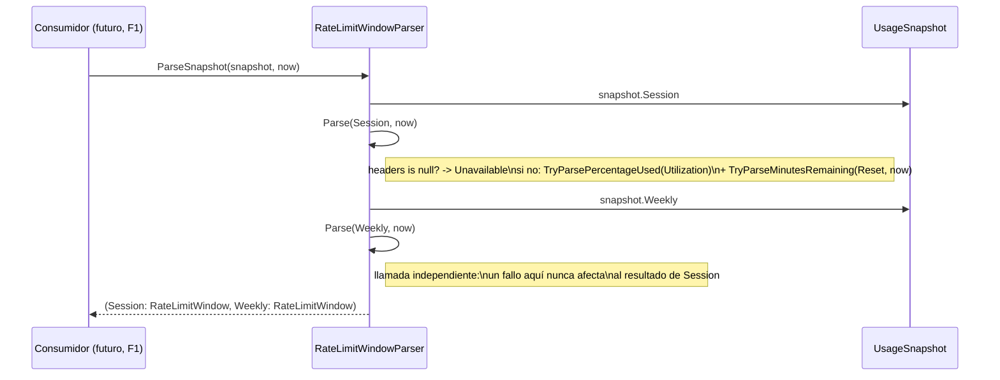
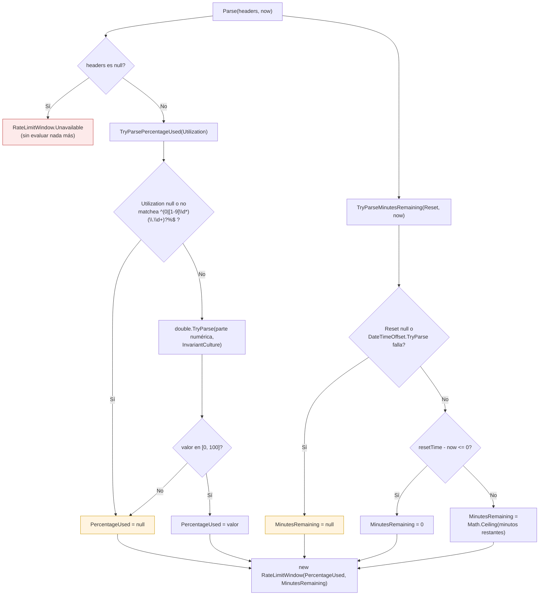

# [F0] Parsear headers anthropic-ratelimit-* a minutos/porcentaje — Documentación Técnica

## Overview

Este componente cierra la tercera pieza del roadmap F0 de ClaudeMeter: convertir
las cabeceras crudas de rate-limit ya obtenidas por `AnthropicApiUsageDataSource`
(Issue #3) en un modelo de dominio mínimo y ya calculado — porcentaje consumido
y minutos restantes hasta el reset — que el resto de la aplicación (UI de F1)
pueda consumir directamente, sin manipular strings de headers HTTP.

Vive íntegramente en `ClaudeMeter.Domain.Usage` (mismo sub-namespace que
`UsageSnapshot`/`RawRateLimitHeaders`, Issue #3) y se compone de dos tipos en un
único fichero nuevo:

- `RateLimitWindow` — record posicional sellado, value object con solo dos
  campos (`PercentageUsed`, `MinutesRemaining`).
- `RateLimitWindowParser` — clase estática con la lógica de conversión, pura y
  determinista (sin HTTP, sin E/S, sin leer el reloj del sistema).

No incluye: ningún `IRequestHandler`/`Query` de MediatR que invoque el parser
desde Application (llega en F1), ningún cambio en `AnthropicApiUsageDataSource`
ni en `UsageSnapshot`/`RawRateLimitHeaders` (ninguno de los dos se modifica),
countdown animado ni colores por umbral (F1/F3).

## Architecture

`RateLimitWindowParser` es una transformación pura `Domain → Domain`: no
necesita ningún puerto de `ClaudeMeter.Application.Abstractions` ni ninguna
`ProjectReference` nueva. Deliberadamente **no** vive en Application ni se
invoca desde `AnthropicApiUsageDataSource` — ver rationale en "Edge Cases &
Error Handling" y en el documento de diseño, sección "Por qué
`AnthropicApiUsageDataSource` NO debe invocar este parser".

```mermaid
flowchart TD
    subgraph Domain["ClaudeMeter.Domain.Usage"]
        RH["RawRateLimitHeaders\n(Issue #3, sin cambios)"]
        US["UsageSnapshot\n(Issue #3, sin cambios)"]
        RLW["RateLimitWindow\n(record sellado, nuevo)\nPercentageUsed / MinutesRemaining"]
        RLP["RateLimitWindowParser\n(clase estática, nueva)\nParse / ParseSnapshot"]
        US -.contiene.-> RH
        RLP -- lee --> RH
        RLP -- lee Session/Weekly --> US
        RLP -- produce --> RLW
    end

    subgraph Analyzer["Blindaje en tiempo de compilación"]
        BSA["Microsoft.CodeAnalysis.BannedApiAnalyzers\n+ BannedSymbols.txt"]
    end

    subgraph FutureApp["ClaudeMeter.Application (futuro, F1)"]
        QH["GetCurrentUsageQueryHandler\n(no existe todavía)"]
    end

    subgraph FutureInfra["ClaudeMeter.Infrastructure (Issue #3, sin cambios)"]
        AAUDS["AnthropicApiUsageDataSource"]
    end

    BSA -. prohíbe DateTime.Now/UtcNow\nDateTimeOffset.Now/UtcNow\nsolo dentro de Domain .-> RLP
    QH -. capturará DateTimeOffset.UtcNow\nen el borde de la app y llamará\na ParseSnapshot .-> RLP
    AAUDS -. NUNCA invoca .-x RLP

    style Domain fill:#eef7ee,stroke:#4a4
    style Analyzer fill:#fdf3e7,stroke:#c90
    style FutureApp fill:#f5f5f5,stroke:#999,stroke-dasharray: 4 3
    style FutureInfra fill:#f5f5f5,stroke:#999,stroke-dasharray: 4 3
```

Puntos clave de diseño preservados:

- `ClaudeMeter.Domain` sigue sin ninguna `ProjectReference`: `Parse`/
  `ParseSnapshot` usan únicamente `System.Text.RegularExpressions` y
  `System.Globalization` del BCL de .NET 8.
- La fecha de referencia ("ahora") se recibe siempre como parámetro explícito
  `DateTimeOffset now` — nunca se lee del reloj del sistema dentro de Domain.
  Esto no queda solo como convención: se hace cumplir en tiempo de
  compilación (ver más abajo).
- `AnthropicApiUsageDataSource` (la clase que **llama a la API**) y
  `RateLimitWindowParser` (la clase que **calcula el countdown/porcentaje**)
  se mantienen como clases separadas, preservando la regla de `CLAUDE.md`:
  *"Reading the token, calling the API, computing the countdown, and
  rendering are separate classes — don't collapse them."*
- El cableado real desde Application (`GetCurrentUsageQuery`/
  `GetCurrentUsageQueryHandler` capturando `DateTimeOffset.UtcNow` en el
  borde de la aplicación) queda fuera de alcance de este issue — es trabajo
  de F1.

## Key Components

### `RateLimitWindow` (`src/ClaudeMeter.Domain/Usage/RateLimitWindow.cs`)

```csharp
public sealed record RateLimitWindow(double? PercentageUsed, int? MinutesRemaining)
{
    public static readonly RateLimitWindow Unavailable = new(PercentageUsed: null, MinutesRemaining: null);
}
```

- Record posicional simple (sin patrón fábricas-estáticas + constructor
  privado, a diferencia de `UsageSnapshot`): no hay ningún estado
  inconsistente que prevenir, ya que cualquier combinación de `null`/valor en
  los dos campos es válida y con significado propio.
- `PercentageUsed` (`double?`, escala 0-100, no 0-1): `null` cuando
  `Utilization` está ausente, no es interpretable, o cae fuera de `[0, 100]`.
- `MinutesRemaining` (`int?`, nunca negativo, mínimo 0): `null` cuando `Reset`
  está ausente o no es interpretable.
- No expone el `Reset` crudo ni ningún otro campo — deliberadamente mínimo
  (Acceptance Criteria del Issue #4).
- `Unavailable` es la instancia compartida usada cuando no hay
  `RawRateLimitHeaders` de la que partir en absoluto (p. ej. `UsageSnapshot`
  en un estado distinto de `Success`).

### `RateLimitWindowParser` (mismo fichero)

Dos métodos públicos:

```csharp
public static RateLimitWindow Parse(RawRateLimitHeaders? headers, DateTimeOffset now)

public static (RateLimitWindow Session, RateLimitWindow Weekly) ParseSnapshot(
    UsageSnapshot snapshot, DateTimeOffset now)
```

- `Parse` acepta `RawRateLimitHeaders?` **nullable** para tratar de forma
  uniforme tanto "la ventana venía con campos `null`" como "la ventana ni
  siquiera existía" — si `headers is null`, devuelve `RateLimitWindow.Unavailable`
  directamente, sin evaluar `Utilization`/`Reset`.
- `ParseSnapshot` es azúcar sintáctico: llama a `Parse(snapshot.Session, now)`
  y `Parse(snapshot.Weekly, now)` de forma independiente — cada llamada es
  aislada y sin estado compartido, por lo que un fallo de parseo en una
  ventana nunca contamina el resultado de la otra.
- Todas las conversiones usan variantes `TryParse`/`IsMatch` — **no hay ningún
  `catch` en esta clase** porque no existe ninguna operación que pueda lanzar
  una excepción esperada.

**Cálculo de `PercentageUsed`** (`TryParsePercentageUsed`, privado):

- Fuente autoritativa: **exclusivamente** `RawRateLimitHeaders.Utilization`.
  `Remaining` se ignora por completo — no hay ninguna validación cruzada
  entre ambos, ni siquiera cuando sus valores no son complementarios (p. ej.
  `Utilization="10%"` y `Remaining="80%"`, que no suman 100%).
- Regex estricta y compilada: `^(0|[1-9]\d*)(\.\d+)?%$`
  (`RegexOptions.Compiled`), evaluada sobre el string completo sin recortar
  espacios antes de validar.
- Si matchea, se quita el `%` final y se parsea con
  `double.TryParse(numericPart, NumberStyles.AllowDecimalPoint, CultureInfo.InvariantCulture, out value)`.
- Rango válido: `value is >= 0 and <= 100`; fuera de rango (p. ej. `"150%"`)
  ⇒ `null`, mismo tratamiento que un formato inválido — nunca se recorta
  (`clamp`) a `[0, 100]`, para no enmascarar silenciosamente un dato corrupto.

**Cálculo de `MinutesRemaining`** (`TryParseMinutesRemaining`, privado):

- `DateTimeOffset.TryParse(reset, CultureInfo.InvariantCulture, DateTimeStyles.None, out resetTime)`
  — nunca lanza; tolerante a variantes ISO-8601/RFC 3339 válidas (a diferencia
  de `Utilization`, aquí no se exige un formato exacto vía `ParseExact`,
  porque el Acceptance Criteria no lo pide).
- `remaining = resetTime - now`; si `remaining <= TimeSpan.Zero` ⇒ `0`
  (nunca negativo); en otro caso, `(int)Math.Ceiling(remaining.TotalMinutes)`
  — redondeo **hacia arriba**, deliberado: sobreestimar ligeramente el tiempo
  restante es más seguro que subestimarlo (evita que una futura UI sugiera
  reintentar antes de que el rate-limit realmente se libere).

### `BannedSymbols.txt` + `Microsoft.CodeAnalysis.BannedApiAnalyzers` (`src/ClaudeMeter.Domain/`)

Refuerzo de la pureza determinista, **en tiempo de compilación** y no solo por
convención de código:

- `ClaudeMeter.Domain.csproj` añade `PackageReference
  Include="Microsoft.CodeAnalysis.BannedApiAnalyzers" Version="5.6.0"`
  (`PrivateAssets=all`, analizador puro — no se distribuye en el binario) y
  registra `BannedSymbols.txt` como `AdditionalFiles`.
- `BannedSymbols.txt` prohíbe, **únicamente dentro de `ClaudeMeter.Domain`**,
  los cuatro símbolos que leen el reloj del sistema: `DateTime.Now`,
  `DateTime.UtcNow`, `DateTimeOffset.Now`, `DateTimeOffset.UtcNow`, cada uno
  con un mensaje explicando que la hora de referencia debe recibirse siempre
  como parámetro explícito `DateTimeOffset now`.
- Efecto: cualquier uso de estos símbolos dentro de `ClaudeMeter.Domain`
  produce el diagnóstico `RS0030` — warning en `Debug`, **error de
  compilación en `Release`** (gracias a `TreatWarningsAsErrors`, ya activo en
  `Directory.Build.props`).
- Alcance deliberadamente limitado a `Domain`: no se añade a
  `Application`/`Infrastructure`/`Desktop`, porque el futuro composition root
  de F1 sí necesita capturar `DateTimeOffset.UtcNow` legítimamente en el
  borde de la aplicación.
- Versión del paquete: `5.6.0` (última estable en NuGet.org en el momento de
  implementar), no `3.11.0` como sugería el ejemplo del documento de diseño —
  desviación documentada en el resumen de implementación.

## Data Flow / Sequence

`ParseSnapshot` delegando en `Parse` para cada ventana de forma independiente:



Decisión interna de `Parse` para una única ventana (detalle de
`TryParsePercentageUsed`/`TryParseMinutesRemaining`):



## Edge Cases & Error Handling

Contrato "nunca excepción no controlada" garantizado estructuralmente — toda
conversión usa `TryParse`/`IsMatch`, nunca `Parse`/lanzar-y-capturar; **no hay
ningún `catch`** en el código porque no hay ninguna operación que pueda
lanzar.

| Entrada | Resultado |
|---|---|
| `headers` es `null` (p. ej. `UsageSnapshot` en `TokenUnavailable`/`Unauthorized`/`RequestFailed`) | `RateLimitWindow.Unavailable` — sin evaluar `Utilization`/`Reset` |
| `Utilization="10%"`, `Remaining="90%"` (complementarios) | `PercentageUsed = 10.0` — calculado solo desde `Utilization` |
| `Utilization="10%"`, `Remaining="80%"` (no complementarios) | `PercentageUsed = 10.0` — idéntico; `Remaining` nunca se lee, sin error ni advertencia |
| `Utilization="0%"` | `PercentageUsed = 0.0` |
| `Utilization="100%"`, `Reset` ya pasado respecto a `now` | `PercentageUsed = 100.0`, `MinutesRemaining = 0` (nunca negativo) |
| `Utilization: null` | `PercentageUsed = null`; `MinutesRemaining` se calcula con normalidad si `Reset` es válido |
| `Reset: null` | `MinutesRemaining = null`; `PercentageUsed` se calcula con normalidad si `Utilization` es válido |
| `Utilization="0.1"` (fracción sin `%`) | `PercentageUsed = null` (no matchea la regex) |
| `Utilization="10,5%"` (separador decimal distinto de `.`) | `PercentageUsed = null` |
| `Utilization=" 10% "` (espacios extra) | `PercentageUsed = null` |
| `Utilization="abc%"` (no numérico) | `PercentageUsed = null` |
| `Utilization="150%"` (sintácticamente válido, fuera de `[0,100]`) | `PercentageUsed = null` — nunca se recorta a 100 |
| `Utilization=""` (cadena vacía) | `PercentageUsed = null` |
| `Reset="not-a-date"` / `Reset=""` | `MinutesRemaining = null`, sin afectar a `PercentageUsed` |
| Reset exactamente igual a `now` | `MinutesRemaining = 0` |
| Minutos restantes fraccionarios (p. ej. 4 min 10 s) | Se redondea hacia arriba (`Math.Ceiling`) a 5, nunca se trunca a 4 |
| `UsageSnapshot` con `Session` completa y `Weekly` con campos ausentes | `Session` totalmente calculada; `Weekly` con los campos afectados en `null` — sin contaminación cruzada |

Riesgos heredados y aceptados explícitamente (documento de requisitos/diseño,
sin mitigación adicional en este issue):

- El formato de `anthropic-ratelimit-unified-*` no está documentado
  oficialmente por Anthropic y puede cambiar sin aviso; un cambio futuro
  degradaría de forma segura a `null` (nunca a una excepción), pero dejaría
  de calcularse el dato real hasta actualizar la regex/parseo.
- Un `Utilization` corrupto mientras `Remaining` es correcto no se detecta,
  por diseño explícito (no hay validación cruzada entre ambos campos).

## Testing Strategy / Cobertura

Ubicación: `test/ClaudeMeter.Domain.Tests/Usage/RateLimitWindowParserTests.cs`.
Al ser lógica 100% pura, los tests son `[Fact]`/`[Theory]` directos sin fakes
ni test doubles: se construyen `RawRateLimitHeaders`/`UsageSnapshot` a mano y
un `DateTimeOffset` literal fijo (`2026-09-16T10:00:00Z`) como "ahora" —
**nunca** `DateTimeOffset.UtcNow` — para que sean deterministas.

14 métodos de test (22 casos ejecutados contando variantes `[Theory]`), con
cobertura 1:1 sobre la tabla de casos límite anterior: caso feliz con
`Utilization`/`Reset` válidos; `Remaining` no complementario ignorado; 0% y
100% (con `Reset` pasado, e igual a `now`); redondeo hacia arriba con minutos
fraccionarios; `Reset`/`Utilization` ausentes por separado; `headers` `null`;
seis formatos inesperados de `Utilization` vía `[Theory]`/`InlineData`
(`"0.1"`, `"10,5%"`, `" 10% "`, `"abc%"`, `"150%"`, `""`); dos formatos
inesperados de `Reset`; los tres estados de fallo de `UsageSnapshot` vía
`[Theory]`; `ParseSnapshot` con ambas ventanas completas; y `ParseSnapshot`
con `Session` completa y `Weekly` con campos ausentes, verificando
explícitamente que no hay contaminación cruzada entre ventanas.

Ningún test requiere mocking/test doubles (a diferencia de
`AnthropicApiUsageDataSourceTests`, que sí necesita `StubHttpMessageHandler`/
`FakeTokenProvider`) — el código de producción cubierto son ~35 líneas
ejecutables sin ramas no alcanzables, más que suficiente para superar el 70%
de `testingCoverage` configurado en `.claude/sdlc.config.yaml` en esta área.

## Extension points

- El consumidor real de `RateLimitWindowParser` llegará en F1: un
  `GetCurrentUsageQuery`/`GetCurrentUsageQueryHandler` de MediatR en
  `ClaudeMeter.Application` que (1) obtiene un `UsageSnapshot` vía
  `IUsageDataSource.GetUsageAsync()` (ya existente, sin cambios), (2) captura
  `now` como `DateTimeOffset.UtcNow` en el borde de la aplicación, y (3) llama
  a `RateLimitWindowParser.ParseSnapshot(snapshot, now)` para exponer ambas
  ventanas a `UsagePage.razor`.
- `AnthropicApiUsageDataSource` **nunca** debe invocar este parser
  directamente — colapsaría "llamar a la API" y "calcular el countdown" en la
  misma clase, violando la regla explícita de `CLAUDE.md`.
- Un futuro cambio de formato en las cabeceras (p. ej. de `%` a fracción
  decimal) solo requiere actualizar la regex/parseo de
  `TryParsePercentageUsed`/`TryParseMinutesRemaining` — el contrato público
  (`RateLimitWindow`, `Parse`, `ParseSnapshot`) no necesita cambiar.
- `BannedSymbols.txt` es el mecanismo a extender si en el futuro se detecta
  otra forma de leer el reloj del sistema dentro de `ClaudeMeter.Domain` que
  deba prohibirse igualmente.
