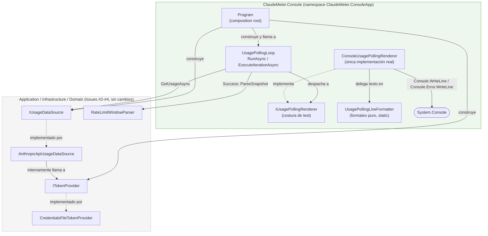

# [F0] Bucle de polling con salida por consola cada 60s — Documentación Técnica

## Overview

Este componente cierra el roadmap **F0 — Núcleo de validación** de ClaudeMeter:
un proyecto ejecutable nuevo, `src/ClaudeMeter.Console` (namespace de código
`ClaudeMeter.ConsoleApp`), que orquesta el pipeline ya existente
(`ITokenProvider` → `IUsageDataSource` → `RateLimitWindowParser`, Issues #2-#4)
en un bucle infinito que imprime por consola, cada ~60 segundos, el porcentaje
de uso y los minutos restantes de la ventana de sesión y de la semanal — o un
mensaje de error claro y distinguible si algo falla, sin terminar el proceso.

Es un **arnés de validación desechable, exclusivo de F0**: no lo reutiliza
ningún proyecto futuro. F1 (`ClaudeMeter.Desktop`) reutilizará directamente
los mismos puertos de `ClaudeMeter.Application`/`ClaudeMeter.Infrastructure`
(`IUsageDataSource`, `RateLimitWindowParser`), no este proyecto de consola.

No modifica ningún fichero existente de `ClaudeMeter.Domain`,
`ClaudeMeter.Application` ni `ClaudeMeter.Infrastructure` — el core se
consume tal cual.

## Architecture

Cuatro clases nuevas, cada una con una única responsabilidad, reflejando en la
estructura de carpetas la regla de `CLAUDE.md` ("reading the token, calling
the API, computing the countdown, and rendering are separate classes"):

| Clase | Namespace | Fichero | Responsabilidad |
|---|---|---|---|
| `Program` | `ClaudeMeter.ConsoleApp` | `Program.cs` | Composition root — construye a mano los colaboradores y arranca el bucle |
| `UsagePollingLoop` | `ClaudeMeter.ConsoleApp.Polling` | `Polling/UsagePollingLoop.cs` | Orquesta el bucle y el despacho por estado |
| `IUsagePollingRenderer` / `ConsoleUsagePollingRenderer` | `ClaudeMeter.ConsoleApp.Rendering` | `Rendering/ConsoleUsagePollingRenderer.cs` | Costura de test + I/O real de consola |
| `UsagePollingLineFormatter` | `ClaudeMeter.ConsoleApp.Rendering` | `Rendering/UsagePollingLineFormatter.cs` | Formateo puro de texto, sin tocar `Console` |



Puntos clave de este flujo:

- `UsagePollingLoop` **nunca** llama directamente a `ITokenProvider`: pasa
  siempre por `IUsageDataSource.GetUsageAsync()`, que ya resuelve el token
  internamente (`AnthropicApiUsageDataSource`). Console solo necesita
  **construir** `CredentialsFileTokenProvider` para inyectarlo, no invocarlo.
- Como consecuencia, el bucle nunca distingue entre `TokenResultStatus.FileNotFound`/
  `InvalidJson`/`TokenMissing`: los tres colapsan en
  `UsageSnapshotStatus.TokenUnavailable` antes de llegar a Console — un único
  mensaje genérico, sin cambios en Infrastructure.
- `RateLimitWindowParser.ParseSnapshot` solo se invoca cuando
  `UsageSnapshotStatus.Success`; en cualquier otro estado, `Session`/`Weekly`
  son `null` por contrato y el renderer de error correspondiente se llama
  directamente.
- `DateTimeOffset.UtcNow` se captura una única vez al principio de
  `ExecuteIterationAsync`, tanto para el parser como para el timestamp
  mostrado — evita dos lecturas de reloj ligeramente distintas dentro de la
  misma iteración.

### El "gotcha" `RootNamespace` vs. `System.Console`

El nombre de proyecto/carpeta/ensamblado exigido por el documento de
requisitos es literalmente `ClaudeMeter.Console`. Si el **namespace** de C#
fuera también `ClaudeMeter.Console`, cualquier código dentro de ese namespace
que escriba `Console.WriteLine(...)` fallaría en compilación con
`CS0118: 'Console' is a namespace but is used like a type`: la resolución de
nombres de C# encuentra primero el namespace anidado `ClaudeMeter.Console`
(miembro de `ClaudeMeter`) antes de considerar el tipo `System.Console`
traído por `using System;`, porque la búsqueda por namespaces encerrantes
tiene prioridad sobre los `using` de tipos.

**Solución adoptada**: `<RootNamespace>ClaudeMeter.ConsoleApp</RootNamespace>`
en `ClaudeMeter.Console.csproj`, dejando `AssemblyName` (por defecto, igual al
nombre del `.csproj`) como `ClaudeMeter.Console`. Todo el código fuente usa
`namespace ClaudeMeter.ConsoleApp;`, de forma que `Console.WriteLine`/
`Console.Error.WriteLine` siguen refiriéndose sin ambigüedad a
`System.Console`.

Alternativa rechazada: mantener el namespace `ClaudeMeter.Console` y
cualificar cada uso como `System.Console.WriteLine(...)` (o un alias
`using Console = System.Console;` por fichero) — descartada por ser ruido
repetido y un error fácil de cometer en un fichero nuevo (un desarrollador
escribe `Console.WriteLine` sin pensarlo, obtiene un error confuso, y pierde
tiempo diagnosticando algo que un `RootNamespace` distinto evita de raíz).

Verificación: `ConsoleUsagePollingRenderer.cs` y `Program.cs` usan
`Console.WriteLine`/`Console.Error.WriteLine` sin cualificar y compilan sin
error, tanto en `Debug` como en `Release` (`TreatWarningsAsErrors` activo vía
`Directory.Build.props`).

## Key Components

### `Program` (`src/ClaudeMeter.Console/Program.cs`)

Composition root minimalista, sin contenedor de DI (coherente con que ningún
proyecto del repo usa hoy `Microsoft.Extensions.DependencyInjection`):

```csharp
private static readonly TimeSpan PollInterval = TimeSpan.FromSeconds(60);

private static async Task Main()
{
    using var httpClient = new HttpClient();

    ITokenProvider tokenProvider = new CredentialsFileTokenProvider();
    IUsageDataSource usageDataSource = new AnthropicApiUsageDataSource(tokenProvider, httpClient);
    IUsagePollingRenderer renderer = new ConsoleUsagePollingRenderer();

    var loop = new UsagePollingLoop(usageDataSource, renderer, PollInterval);
    await loop.RunAsync(CancellationToken.None);
}
```

- Un único `HttpClient` de larga vida, compartido durante toda la vida del
  proceso — evita el agotamiento de sockets de crear uno nuevo por iteración
  (mismo patrón que ya asume `AnthropicApiUsageDataSource`).
- `CancellationToken.None`: F0 no requiere apagado controlado (decisión ya
  fijada por el documento de requisitos); el proceso corre hasta que se mate
  manualmente (Ctrl+C / cierre de la ventana).

### `UsagePollingLoop` (`Polling/UsagePollingLoop.cs`)

Constructor `(IUsageDataSource, IUsagePollingRenderer, TimeSpan interval)`.
No lee el token ni llama a la API directamente, y no formatea ni imprime
texto — únicamente coordina.

- `RunAsync(CancellationToken)` — bucle público, `while(true)`:
  `ExecuteIterationAsync` → `Task.Delay(interval, ct)` → repetir.
- `internal Task ExecuteIterationAsync(CancellationToken)` — una única
  iteración (una llamada al core + un render):
  1. captura `DateTimeOffset.UtcNow` una vez;
  2. llama a `IUsageDataSource.GetUsageAsync(ct)`;
  3. despacha por `UsageSnapshot.Status` (ver "Data Flow / Sequence");
  4. envuelve la llamada + despacho en un único
     `try/catch (Exception ex) when (ex is not OperationCanceledException)`,
     que invoca `RenderUnexpectedError` — una `OperationCanceledException`
     genuina se deja propagar (mismo criterio que
     `AnthropicApiUsageDataSource`).

`ExecuteIterationAsync` es `internal` exclusivamente para que
`ClaudeMeter.Console.Tests` pueda invocarlo vía `InternalsVisibleTo`
(declarado en `ClaudeMeter.Console.csproj`) sin esperar 60s reales por caso de
test.

### `IUsagePollingRenderer` / `ConsoleUsagePollingRenderer` (`Rendering/ConsoleUsagePollingRenderer.cs`)

`IUsagePollingRenderer` existe **exclusivamente como costura de test** (una
sola implementación real): permite testear la lógica de despacho de
`UsagePollingLoop` con un doble de test (`SpyUsagePollingRenderer`), sin
capturar `Console.Out`/`Console.Error` reales.

`ConsoleUsagePollingRenderer` delega todo el texto en
`UsagePollingLineFormatter` y añade únicamente la I/O:

- `RenderSuccess` → `Console.WriteLine` (stdout).
- `RenderTokenUnavailable` / `RenderUnauthorized` / `RenderRequestFailed` /
  `RenderUnexpectedError` → `Console.Error.WriteLine` (stderr).

Separar éxito/error por stream permite además redirigir/filtrar cada uno por
separado al ejecutar el harness manualmente (p. ej.
`ClaudeMeter.Console.exe 2> errores.log`).

### `UsagePollingLineFormatter` (`Rendering/UsagePollingLineFormatter.cs`)

Clase estática de formateo puro — nunca toca `Console`. Cinco métodos
públicos (`FormatSuccessLine`, `FormatTokenUnavailableLine`,
`FormatUnauthorizedLine`, `FormatRequestFailedLine`,
`FormatUnexpectedErrorLine`) más los helpers privados `FormatTimestamp`
(hora local `HH:mm:ss`, `CultureInfo.InvariantCulture`), `FormatWindow`,
`FormatPercentage` y `FormatMinutes` (ambos con el literal
`"no disponible"` cuando el campo correspondiente de `RateLimitWindow` es
`null`).

El token OAuth **nunca** aparece en ninguna línea — ningún formato incluye
`TokenResult.AccessToken` ni datos crudos de `RawRateLimitHeaders` distintos
de `Utilization`/`Reset` ya parseados. El mensaje de `Unauthorized` refuerza
explícitamente, también de cara al usuario que lea la consola, la regla de
`CLAUDE.md` de no reintentar refrescar el token ("no se intentará
refrescarlo automáticamente").

Ejemplos de línea producida:

| Escenario | Línea |
|---|---|
| Éxito, ambas ventanas con datos | `[14:32:07] Sesión: 42% (23 min) | Semana: 10% (620 min)` |
| Éxito, un campo ausente | `[14:32:07] Sesión: 42% (23 min) | Semana: 10% (no disponible)` |
| `TokenUnavailable` | `[14:33:07] ERROR - Token no disponible: no se pudo leer un token OAuth válido desde .credentials.json.` |
| `Unauthorized` (401/403) | `[14:34:07] ERROR - Token inválido/expirado (401/403): la API rechazó el token; no se intentará refrescarlo automáticamente.` |
| `RequestFailed` | `[14:35:07] ERROR - Fallo de conexión con la API: no se pudo completar la petición (red, timeout, error 5xx o cabeceras de rate-limit ausentes).` |
| Excepción no controlada | `[14:36:07] ERROR - Fallo inesperado: InvalidOperationException: <mensaje>` |

## Data Flow / Sequence

Una iteración completa (`ExecuteIterationAsync`) y el despacho por
`UsageSnapshot.Status`:

```mermaid
sequenceDiagram
    participant Loop as UsagePollingLoop
    participant DS as IUsageDataSource
    participant Parser as RateLimitWindowParser
    participant Rend as IUsagePollingRenderer

    loop cada ~60s (delay-after)
        Loop->>Loop: now = DateTimeOffset.UtcNow
        Loop->>DS: GetUsageAsync(ct)
        alt Success
            DS-->>Loop: UsageSnapshot(Status=Success, Session, Weekly)
            Loop->>Parser: ParseSnapshot(snapshot, now)
            Parser-->>Loop: (session, weekly)
            Loop->>Rend: RenderSuccess(now, session, weekly)
        else TokenUnavailable
            DS-->>Loop: UsageSnapshot(Status=TokenUnavailable)
            Loop->>Rend: RenderTokenUnavailable(now)
        else Unauthorized
            DS-->>Loop: UsageSnapshot(Status=Unauthorized)
            Loop->>Rend: RenderUnauthorized(now)
        else RequestFailed
            DS-->>Loop: UsageSnapshot(Status=RequestFailed)
            Loop->>Rend: RenderRequestFailed(now)
        else Excepción no controlada
            DS--xLoop: throw Exception (no OperationCanceledException)
            Loop->>Rend: RenderUnexpectedError(now, ex)
        end
        Loop->>Loop: Task.Delay(60s, ct)
    end
```

Mecánica del bucle (`RunAsync`): `while(true)` con `Task.Delay` **entre**
iteraciones (delay-after, no fixed-rate). El ciclo total es
`duración_de_la_llamada + 60s`, autocorrectivo ante una llamada lenta — nunca
se solapan dos iteraciones. Se descartó `PeriodicTimer` (tick a intervalo fijo
de pared) porque su semántica no encaja con el criterio de aceptación
("transcurren 60 segundos desde la última impresión") y permitiría, en
teoría, que una iteración empezase antes de que la anterior hubiera terminado
de imprimir.

## Edge Cases & Error Handling

Cuatro categorías explícitas y mutuamente excluyentes, ninguna termina el
proceso — el único `try/catch` de todo el proyecto vive en
`ExecuteIterationAsync`, envolviendo la llamada a `GetUsageAsync` + el
despacho; el formateo es aritmética/string pura, sin I/O, y no puede lanzar.

| Estado / evento | Origen | Tratamiento |
|---|---|---|
| `UsageSnapshotStatus.Success` | `AnthropicApiUsageDataSource` | `RateLimitWindowParser.ParseSnapshot` + `RenderSuccess` |
| `UsageSnapshotStatus.TokenUnavailable` | `.credentials.json` ausente/ilegible/`TokenMissing` (colapsa `FileNotFound`/`InvalidJson`/`TokenMissing`) | `RenderTokenUnavailable`, mensaje genérico único |
| `UsageSnapshotStatus.Unauthorized` | API responde 401/403 | `RenderUnauthorized`, aclara explícitamente que no hay refresco automático |
| `UsageSnapshotStatus.RequestFailed` | red/timeout/5xx/200 sin headers de rate-limit esperados | `RenderRequestFailed` |
| Excepción no controlada (no `OperationCanceledException`) | cualquier capa inferior que lanzase de forma inesperada | capturada en `ExecuteIterationAsync` → `RenderUnexpectedError(now, ex)` |
| `OperationCanceledException` genuina | cancelación real de `ct` | se propaga sin renderizar nada (mismo criterio que `AnthropicApiUsageDataSource`) |
| Campo `PercentageUsed`/`MinutesRemaining` en `null` dentro de una ventana `Success` | formato de header no interpretable | `UsagePollingLineFormatter` muestra `"no disponible"` para ese campo, sin afectar al resto de la línea |

Riesgos operativos aceptados (heredados, no bloquean esta entrega):

- **Coste de quota real**: `AnthropicApiUsageDataSource` (sin cambios)
  realiza una llamada real `POST /v1/messages` con `max_tokens: 1` en cada
  iteración exitosa; correr el harness horas consume quota real cada 60s.
- **Cadencia no estrictamente periódica bajo red lenta**: el `Task.Delay(60s)`
  corre después de que la llamada HTTP complete (incluyendo un posible
  timeout de 100s de `HttpClient`), estirando el ciclo total por encima de
  60s en vez de solapar iteraciones — comportamiento aceptado, no hay AC que
  exija precisión de reloj de pared.
- **Formato de `anthropic-ratelimit-unified-*` no documentado oficialmente**:
  cualquier cambio futuro degrada de forma segura a `"no disponible"` vía
  `RateLimitWindowParser`, ya existente, sin excepción.

## Testing Strategy / Cobertura

`test/ClaudeMeter.Console.Tests` cubre exactamente el alcance que el diseño
define como testeable, con dobles de test propios
(`test/ClaudeMeter.Console.Tests/Polling/FakeUsageDataSource.cs`,
`SpyUsagePollingRenderer.cs`):

- **`UsagePollingLineFormatterTests`** (`Rendering/`) — 13 métodos de test
  (14 casos con `[Theory]`): línea de éxito con ambas ventanas completas, con
  decimales, con campos parcialmente `null` en una sola ventana, con una o
  ambas ventanas `RateLimitWindow.Unavailable`; las cuatro líneas de error
  verificadas carácter a carácter; `FormatUnexpectedErrorLine` con distintos
  tipos de excepción; extremos `0%`/`100%`. Todas las aserciones de timestamp
  recalculan `ToLocalTime().ToString("HH:mm:ss", InvariantCulture)` en el
  propio test para ser deterministas en cualquier zona horaria.
- **`UsagePollingLoopTests`** (`Polling/`) — 6 métodos invocando
  `ExecuteIterationAsync` directamente vía `InternalsVisibleTo`: los cuatro
  `UsageSnapshotStatus` (verificando despacho exclusivo al método de render
  correcto), una excepción no controlada capturada y no propagada
  (`RenderUnexpectedError` recibe la misma instancia), y una
  `OperationCanceledException` genuina que se propaga sin renderizar nada.

Resultado (fase `sdlc-testing`): **19/19 tests correctos**, cobertura
**100%** sobre `UsagePollingLineFormatter` (9/9 líneas) y sobre
`UsagePollingLoop.Render` + `ExecuteIterationAsync` (29/29 líneas
combinadas) — muy por encima del `testingCoverage: 70` configurado en
`.claude/sdlc.config.yaml`. Suite completa de la solución:
**80/80 tests correctos** (37 `ClaudeMeter.Domain.Tests` + 24
`ClaudeMeter.Infrastructure.Tests` + 19 `ClaudeMeter.Console.Tests`).

### Exclusiones deliberadas de la cobertura automática

Documentadas explícitamente por el diseño (no son huecos accidentales):

- **`UsagePollingLoop.RunAsync`** (0% de cobertura) — el bucle infinito real
  (`while(true)` + `Task.Delay(60s)`) no aporta señal adicional sobre
  `ExecuteIterationAsync`, ya cubierto al 100%; testearlo exigiría esperar
  60s reales por test o introducir una abstracción de tiempo
  (`IDelayProvider`/reloj virtual) no contemplada por el diseño.
- **`Program.cs`** (0% de cobertura) — composition root trivial (`new`
  directo de cuatro colaboradores + una llamada a `RunAsync`), sin lógica
  propia que testear de forma significativa.
- **`ConsoleUsagePollingRenderer`** (0% de cobertura) — capa de I/O trivial
  (cinco métodos de una línea, cada uno delegando el texto ya cubierto en
  `UsagePollingLineFormatter` y añadiendo solo `Console.WriteLine`/
  `Console.Error.WriteLine`); testearla exigiría capturar `Console.Out`/
  `Console.Error` reales, justo el enfoque que `IUsagePollingRenderer` existe
  para evitar.

Ambos casos de `RunAsync`/`Program.cs` quedan cubiertos únicamente por la
**validación manual de extremo a extremo** (`dotnet run --project
src/ClaudeMeter.Console` con un `.credentials.json` real durante 2-3
iteraciones, ~2-3 minutos): comprobar que (a) la primera línea aparece de
inmediato, (b) las siguientes cada ~60s, (c) renombrar temporalmente
`.credentials.json` produce el error "Token no disponible" sin terminar el
proceso, y restaurar el fichero vuelve a mostrar éxito en la siguiente
iteración. Esta validación **queda pendiente de ejecutarse** por quien revise
el cambio — requiere un token OAuth real y consume quota real de la cuenta,
riesgo ya aceptado y documentado en el diseño.

## Extension points

- F1 (`ClaudeMeter.Desktop`) reutilizará directamente `IUsageDataSource` y
  `RateLimitWindowParser` desde su propio composition root (probablemente vía
  MediatR, `GetCurrentUsageQuery`/`Handler`) — no este proyecto de consola,
  que se descarta tras F0.
- Un futuro `BleUsageSink` (F7) u otra fuente de datos deberá seguir
  implementando `IUsageDataSource` con el mismo contrato "no data" en vez de
  excepciones, sin tocar `UsagePollingLoop` ni `IUsagePollingRenderer`.
- Reintentos con backoff, `config.json` (intervalo/posición/chime) y logging
  estructurado con Serilog son alcance de F2 (issues #11/#12) — no de este
  componente.
